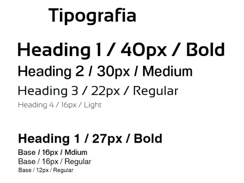

# Capítulo III: Solution UI/UX Design
## 3.1. Product design
### 3.1.1. Style Guidelines
Un "style guideline" o guía de estilo es un conjunto de reglas y pautas que establecen la forma en que se deben escribir, diseñar o presentar documentos, contenido web, software, o cualquier otro tipo de trabajo creativo. A continuación, se otorga especificación a los parámetros implementados en la estructura del proyecto:

#### 3.1.1.1. General Style Guidelines
**Branding**

StockWise es una marca pensada para ofrecer confianza, cercanía y eficiencia a pequeñas y medianas empresas, especialmente bodegas de barrio y emprendimientos. El branding refleja accesibilidad, modernidad y calidez. El enfoque está en facilitar la transformación digital de la gestión de inventarios con una interfaz clara, amigable y funcional.

**Logotipo**

El logo combina una bodega estilizada con colores cálidos y un código de barras, representando tanto la esencia física del negocio como la modernización a través de tecnología.

- La palabra "Stock" en rojo (#BC162A) resalta la acción y lo esencial del inventario.
- La palabra "Wise" en marrón oscuro (#302325) sugiere inteligencia y fiabilidad.

El código de barras integrado representa la gestión estructurada y la automatización del stock.

  

 

**Tono de comunicación** 

Nos comunicamos como lo haría un buen amigo del barrio, claro, sin complicaciones, y con buena onda.  Queremos transmitir una sensación de seguridad y eficiencia, mientras mantenemos una comunicación cercana y amigable.

**Lenguaje (Language):**

Usamos términos fáciles de entender: “productos”, “alertas”, “entradas/salidas”, “usuarios”. Evitamos jerga técnica innecesaria o anglicismos si no son esenciales.

**Colores**

La paleta de colores de StockWise ha sido cuidadosamente seleccionada para transmitir profesionalismo, confianza y accesibilidad.

- #F5E1A4 (Fondo cálido claro): 	Fondo general de la app o materiales 
- #BC162A (Rojo intenso): Este tono vibrante servirá para destacar llamadas a la acción (CTA), botones y elementos interactivos. Representa dinamismo y urgencia, incentivando a los usuarios a actuar.
- #EE7F27 (Naranja vibrante): íconos o llamados a la acción secundarios
- #302325 (Marrón oscuro / gris cálido): texto general, íconos y texto principal
- #D9D593 (Gris suave): Elementos secundarios, bordes, fondos suaves

  

 

**Tipografía**

La elección tipográfica para StockWise es un componente esencial que complementa la identidad visual de la marca. Se han seleccionado dos familias tipográficas que juntas ofrecen versatilidad y coherencia, asegurando que la comunicación sea clara y efectiva en todos los medios.

Escala:

- Base: 16px
- Tipografía: Nunito e Inter 
- Interlineado: 1.1
- Weights: Bold - Medium - Regular - Light

  

 

### 3.1.2. Information Architecture
#### 3.1.2.1. Organization Systems
#### 3.1.2.2. Labelling Systems
#### 3.1.2.3. SEO Tags and Meta Tags
#### 3.1.2.4. Searching Systems
#### 3.1.2.5. Navigation Systems
### 3.1.3. Landing Page UI Design
#### 3.1.3.1. Landing Page Wireframe
#### 3.1.3.2. Landing Page Mock-up
### 3.1.4. Mobile Applications UX/UI Design
#### 3.1.4.1. Mobile Applications Wireframes
#### 3.1.4.2. Mobile Applications Wireflow Diagrams
#### 3.1.4.3. Mobile Applications Mock-ups
#### 3.1.4.4. Mobile Applications User Flow Diagrams
#### 3.1.4.5. Mobile Applications Prototyping
