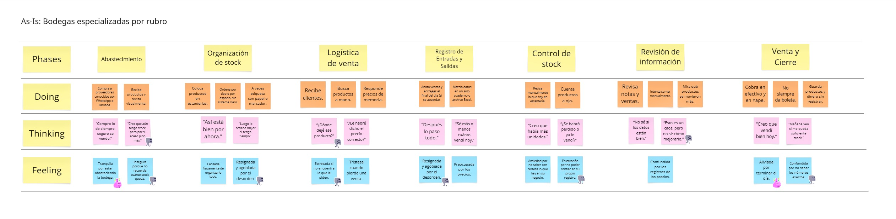
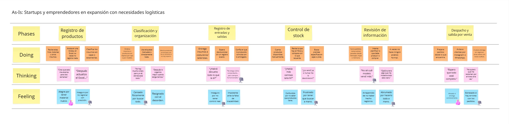

# Capítulo II: Requirements Development and Software Solution Design
## 2.1. Competidores
### 2.1.1. Análisis competitivo
 # Análisis Competitivo

## Competitive Analysis Landscape

| **Objetivo del análisis:** Identificar el posicionamiento competitivo de StockWise en el mercado de aplicaciones móviles de gestión de inventarios para pymes, entendiendo las ventajas diferenciales y oportunidades de mejora. |  |  |  |
|---|---|---|---|
|  | **StockWise** | **Zoho Inventory** | **Odoo Inventory** | **TradeGecko** |
| **PERFIL** | **Overview** | Solución móvil integral especializada en gestión de inventarios para pymes y emprendedores | Suite de negocio completa con módulo de inventario como parte de su ecosistema | Software de gestión open-source con módulo de inventario personalizable | Plataforma de gestión de inventario centrada en comercio electrónico y retail |
|  | **Ventaja competitiva** | Especialización móvil, interfaz intuitiva, planes funcionales específicos (voz, GPS, IA) y enfoque en pymes | Integración completa con ecosistema Zoho y terceros, robustez funcional | Flexibilidad y personalización por ser open-source | Fuerte integración con canales de e-commerce y plataformas de venta |
| **PERFIL DE MARKETING** | **Mercado objetivo** | Pymes, emprendedores, startups y bodegas especializadas | Medianas empresas y pymes en crecimiento | Empresas de todos los tamaños que buscan personalización | Negocios de e-commerce y retail |
|  | **Estrategias de marketing** | Marketing digital, ASO, comunidades de emprendedores, modelo freemium | Marketing B2B, fuerza de ventas, contenido educativo | Comunidad open-source, partners de implementación | Marketing especializado en e-commerce, ferias sectoriales |
| **PERFIL DE PRODUCTO** | **Productos & Servicios** | App móvil con: gestión inventory, alertas, reportes, boletas, planes voz/GPS/IA/scanner | Software web y móvil con: inventory, órdenes venta, envíos, facturación | Suite modular web/móvil con: inventory, manufactura, ventas, CRM | Plataforma web/móvil: inventory, pedidos, logística, analytics |
|  | **Precios & Costos** | Modelo freemium con planes premium escalables por funcionalidad | Planes por volumen de órdenes, desde gratis hasta enterprise | Freemium modular, costos de implementación y personalización | Planes premium por volumen de ventas y usuarios |
|  | **Canales de distribución** | Móvil (iOS/Android) | Web y móvil (iOS/Android) | Web y móvil (iOS/Android) | Web y móvil (iOS/Android) |

## Análisis SWOT

| **Análisis SWOT** | **StockWise** | **Zoho Inventory** | **Odoo Inventory** | **TradeGecko** |
|---|---|---|---|---|
| **Fortalezas** | - Especialización móvil nativa - Interfaz intuitiva - Funcionalidades innovadoras (voz, GPS, IA) - Enfoque específico en pymes | - Ecosistema integrado - Solución completa - Reconocimiento de marca - Escalabilidad | - Flexibilidad y personalización - Comunidad activa - Modelo open-source - Múltiples módulos integrados | - Especialización en e-commerce - Integraciones con plataformas de venta - Analytics avanzado |
| **Debilidades** | - Marca desconocida - Ecosistema limitado vs competidores - Recursos limitados vs grandes competidores | - Curva de aprendizaje más pronunciada - Puede ser complejo para pymes muy pequeñas - Costo elevado para planes avanzados | - Requiere personalización para funcionar óptimamente - Soporte puede ser limitado en versión community | - Enfoque muy específico en e-commerce - Menos adaptable a otros modelos de negocio - Precios elevados |
| **Oportunidades** | - Crecimiento mercado pymes digitales - Tendencia hacia soluciones móviles - Expansión a Latinoamérica - Alianzas con comunidades de emprendedores | - Expansión a nuevos mercados - Desarrollo de más integraciones - Consolidación como suite integral | - Crecimiento de la comunidad de desarrolladores - Expansión de funcionalidades móviles - Alianzas con implementadores | - Crecimiento del e-commerce global - Expansión a nuevos verticales de retail - Desarrollo de analytics predictivo |
| **Amenazas** | - Entrada de competidores establecidos al mercado móvil - Commoditización de funcionalidades básicas - Dificultad para captar usuarios frente a alternativas gratuitas | - Competencia de soluciones más especializadas - Precios más competitivos de alternativas - Cambios en regulaciones internacionales | - Fragmentación de la comunidad - Calidad variable de implementaciones - Competencia de soluciones SaaS más pulidas | - Competencia de plataformas de e-commerce con módulos nativos - Cambios en APIs de plataformas de venta - Consolidación del mercado |

### 2.1.2. Estrategias y tácticas frente a competidores
## Estrategias Generales de Posicionamiento

### 1. Especialización en Experiencia Móvil
**Objetivo:** Diferenciarnos como la solución móvil nativa más intuitiva del mercado.

**Tácticas:**
- Desarrollar funcionalidades exclusivas móviles (voz, GPS, escaneo por cámara)
- Optimizar la interfaz para uso táctil con gestos intuitivos
- Garantizar funcionamiento offline para operaciones críticas
- Implementar notificaciones push contextuales y personalizables

### 2. Enfoque en Usabilidad para PYMES
**Objetivo:** Ofrecer la curva de aprendizaje más corta del mercado.

**Tácticas:**
- Crear sistema de onboarding guiado dentro de la aplicación
- Desarrollar tutoriales interactivos por funcionalidad
- Implementar asistente inteligente para tareas complejas
- Diseñar plantillas preconfiguradas por tipo de negocio

## Estrategias Ofensivas frente a Competidores

### 1. Contra Zoho Inventory
**Debilidad a explotar:** Complejidad para PYMES pequeñas

**Tácticas:**
- Campañas comparativas destacando simplicidad vs complejidad
- Programa de migración asistida desde Zoho
- Planes precio más competitivos para segmento pequeño-mediano
- Funcionalidades "justo lo necesario" sin sobrecarga de opciones

### 2. Contra Odoo Inventory
**Debilidad a explotar:** Requiere personalización e implementación

**Tácticas:**
- Mensajería centrada en "funciona desde el día 1"
- Precios transparentes sin costos ocultos de implementación
- Casos de éxito de implementación en menos de 24 horas
- Servicio de configuración inicial incluido en planes premium

### 3. Contra TradeGecko
**Debilidad a explotar:** Enfoque limitado a e-commerce

**Tácticas:**
- Posicionamiento como solución multi-canal integral
- Funcionalidades para negocios físicos + digitales
- Campañas dirigidas a retail tradicional con interés en digitalizarse
- Precios más accesibles para negocios mixtos

## Estrategias Defensivas

### 1. Ante posible commoditización
**Tácticas:**
- Desarrollo continuo de funcionalidades innovadoras (voz, IA, realidad aumentada)
- Programa de fidelización con beneficios escalables
- Integraciones exclusivas con proveedores locales
- Comunidad de usuarios para feedback y co-creación

### 2. Protección frente a entrada de grandes competidores
**Tácticas:**
- Alianzas estratégicas con asociaciones de PYMES
- Contratos a largo plazo con precios congelados
- Desarrollo de especialización vertical por industria
- Branding fuerte centrado en el enfoque PYME

## 2.2. Entrevistas
La finalidad de realizar entrevistas es obtener un alcance más completo sobre las experiencias, perspectivas y opiniones de los segmentos de mercado definidos. Nuestro objetivo es recolectar información valiosa que nos permita conocer mejor a nuestro público objetivo. Con estas entrevistas se tendrá una visión más clara de las necesidades y expectativas de nuestros usuarios.
### 2.2.1. Diseño de entrevistas
**Segmento #1: Bodegas especializadas por rubro**

**Preguntas principales**

1. ¿Podrías contarme cómo gestionas actualmente el inventario de tu bodega?
2. ¿Cuáles son los mayores retos que enfrentas al momento de organizar tus productos?
3. ¿Has tenido pérdidas o problemas por errores en el inventario? ¿Cómo los resolviste?
4. ¿Qué tan importante es para ti tener un control en tiempo real de tu stock?
5. ¿Utilizas algún sistema o herramienta digital? ¿Cuál y cómo te va con ella?

**Preguntas complementarias**
1. ¿Cómo te enteras cuando falta un producto o está a punto de vencerse?
2. ¿Qué tipo de reportes o información te gustaría tener sobre tu inventario?
3. ¿Qué dispositivos usas más en tu trabajo (laptop, celular, tablet)?
4. ¿Cómo crees que una plataforma digital podría ayudarte a mejorar tu operación?

**Segmento #2: Startups y emprendedores en expansión con necesidades logísticas**

**Preguntas principales**
1. ¿Cómo manejas actualmente el inventario de tu negocio?
2. ¿En qué momentos has sentido que el control del stock te limita o te hace perder tiempo?
3. ¿Cómo llevas el registro de entradas y salidas de productos?
4. ¿Qué te gustaría mejorar de tu proceso logístico actual?
5. ¿Has considerado usar alguna plataforma para gestionar tu inventario? ¿Por qué sí o por qué no?
   
**Preguntas complementarias**
1. ¿Qué herramientas digitales usas en tu negocio actualmente?
2. ¿Dónde almacenas tus productos?
3. ¿Qué tan seguido necesitas revisar el stock?
4. ¿Qué redes sociales o canales digitales usas para vender?

### 2.2.2. Registro de entrevistas
**Segmento 1: Bodegas especializadas por rubro**

<table border="1">
  <tr>
    <th>Entrevista</th>
    <td>1</td>
    <th>Nombre</th>
    <td>Milagros Almerco</td>
  </tr>
  <tr>
    <th>Edad</th>
    <td>28</td>
    <th>Distrito</th>
    <td>San Martín de Porres</td>
  </tr>
  <tr>
    <th>Captura de la entrevista: </th>
    <td colspan="3">
        En la entrevista, la estudiante Milagros Almerco comenta que lleva el control de su bodega en un cuaderno, anotando manualmente las ventas y compras. Reconoce que su sistema es básico y que a veces se olvida de registrar productos, lo que dificulta llevar un control claro del inventario. Además, le resulta complicado encontrar información específica entre tantas hojas. Señala como uno de sus principales problemas la falta de control sobre las fechas de vencimiento, lo que ha ocasionado pérdidas por productos que no logró vender a tiempo. También menciona que no siempre actualiza los cambios de precio. Para prevenir esto, trata de revisar los estantes y adelantar los productos por vencer. Respecto a herramientas digitales, indica que usa el celular y la calculadora por practicidad. Pero le gustaría contar con un sistema que le avise qué productos están por vencer, cuáles debe reponer y cómo están cambiando los precios. Además, considera importante poder visualizar su inventario en tiempo real. Le gustaría recibir alertas y reportes que le ayuden a organizar mejor su negocio.
    </td>
  </tr>
  <tr>
    <th>URL de la grabación</th>
    <td colspan="3">
      <a href="https://upcedupe-my.sharepoint.com/:v:/g/personal/u202310210_upc_edu_pe/EcdO_7IMHslJvnfLQriZz-ABm7y1EeoaVKtpaloN3Upm4A?e=2MviFe&nav=eyJyZWZlcnJhbEluZm8iOnsicmVmZXJyYWxBcHAiOiJTdHJlYW1XZWJBcHAiLCJyZWZlcnJhbFZpZXciOiJTaGFyZURpYWxvZy1MaW5rIiwicmVmZXJyYWxBcHBQbGF0Zm9ybSI6IldlYiIsInJlZmVycmFsTW9kZSI6InZpZXcifX0%3D">
        Ver grabación
      </a>
    </td>
  </tr>
  <tr>
   <th>Timing</th>
    <td colspan="3">
        05:24 -11:12
    </td>
  </tr>
</table>
 

<table border="1">
  <tr>
    <th>Entrevista</th>
    <td>2</td>
    <th>Nombre</th>
    <td>Elvis Aranga Mesa</td>
  </tr>
  <tr>
    <th>Edad</th>
    <td>31</td>
    <th>Distrito</th>
    <td>Santiago de Surco</td>
  </tr>
  <tr>
    <th>Captura de la entrevista: </th>
    <td colspan="3">
        Elvis Aranga Meza, de 31 años y encargado de la administración en su bodega en Santiago de Surco, gestiona el inventario de forma manual, sin un sistema digital, basándose en el control visual y el registro de ventas totales. Reconoce que esta falta de control sistematizado dificulta hacer proyecciones, identificar los productos con mayor rotación o margen de ganancia, y manejar adecuadamente las mermas, especialmente en productos perecibles como frutas y abarrotes. Ha enfrentado pérdidas por productos vencidos y robos, y señala la necesidad de implementar un sistema digital para actualizar precios en tiempo real, controlar vencimientos y facilitar la gestión por parte del personal. Considera que una plataforma digital mejoraría la eficiencia, permitiría delegar tareas y evitar errores en la rotación y precios, aportando mayor libertad y control en la operación diaria.
    </td>
  </tr>
  <tr>
    <th>URL de la grabación</th>
    <td colspan="3">
      <a href="https://upcedupe-my.sharepoint.com/:v:/g/personal/u202310210_upc_edu_pe/EcdO_7IMHslJvnfLQriZz-ABm7y1EeoaVKtpaloN3Upm4A?e=2MviFe&nav=eyJyZWZlcnJhbEluZm8iOnsicmVmZXJyYWxBcHAiOiJTdHJlYW1XZWJBcHAiLCJyZWZlcnJhbFZpZXciOiJTaGFyZURpYWxvZy1MaW5rIiwicmVmZXJyYWxBcHBQbGF0Zm9ybSI6IldlYiIsInJlZmVycmFsTW9kZSI6InZpZXcifX0%3D">
        Ver grabación
      </a>
    </td>
  </tr>
  <tr>
   <th>Timing</th>
    <td colspan="3">
        11:12 - 17:11
    </td>
  </tr>
</table>

<table border="1">
  <tr>
    <th>Entrevista</th>
    <td>3</td>
    <th>Nombre</th>
    <td>xx</td>
  </tr>
  <tr>
    <th>Edad</th>
    <td>xx</td>
    <th>Distrito</th>
    <td>xx</td>
  </tr>
  <tr>
    <th>Captura de la entrevista: </th>
    <td colspan="3">
        xxx
    </td>
  </tr>
  <tr>
    <th>URL de la grabación</th>
    <td colspan="3">
      <a href="">
        Ver grabación
      </a>
    </td>
  </tr>
  <tr>
   <th>Timing</th>
    <td colspan="3">
        xx
    </td>
  </tr>
</table>

**Segmento 2: Startups y emprendedores en expansión con necesidades logísticas**

<table border="1">
  <tr>
    <th>Entrevista</th>
    <td>4</td>
    <th>Nombre</th>
    <td>Juan Carlos Ramírez</td>
  </tr>
  <tr>
    <th>Edad</th>
    <td>49</td>
    <th>Distrito</th>
    <td>Surquillo</td>
  </tr>
  <tr>
    <th>Captura de la entrevista: </th>
    <td colspan="3">
        Juan Carlos Ramírez, emprendedor de 49 años, gestiona su inventario principalmente de forma manual, registrando entradas y salidas mediante boletas y facturas sin un control digital completo. Actualmente está en proceso de digitalizar su sistema con un programa y una máquina POS que escanea códigos de barra, aunque aún no emite boletas ni facturas electrónicas. La revisión del stock se realiza visualmente y las ventas se gestionan principalmente por WhatsApp con entrega a domicilio. Busca mejorar la eficiencia y liberar tiempo mediante la implementación de herramientas digitales más integradas.
    </td>
  </tr>
  <tr>
    <th>URL de la grabación</th>
    <td colspan="3">
      <a href="https://upcedupe-my.sharepoint.com/:v:/g/personal/u202310210_upc_edu_pe/EcdO_7IMHslJvnfLQriZz-ABm7y1EeoaVKtpaloN3Upm4A?e=2MviFe&nav=eyJyZWZlcnJhbEluZm8iOnsicmVmZXJyYWxBcHAiOiJTdHJlYW1XZWJBcHAiLCJyZWZlcnJhbFZpZXciOiJTaGFyZURpYWxvZy1MaW5rIiwicmVmZXJyYWxBcHBQbGF0Zm9ybSI6IldlYiIsInJlZmVycmFsTW9kZSI6InZpZXcifX0%3D">
        Ver grabación
      </a>
    </td>
  </tr>
  <tr>
   <th>Timing</th>
    <td colspan="3">
        17:11 - 20:45
    </td>
  </tr>
</table>

<table border="1">
  <tr>
    <th>Entrevista</th>
    <td>5</td>
    <th>Nombre</th>
    <td>xx</td>
  </tr>
  <tr>
    <th>Edad</th>
    <td>xx</td>
    <th>Distrito</th>
    <td>xx</td>
  </tr>
  <tr>
    <th>Captura de la entrevista: </th>
    <td colspan="3">
        xxx
    </td>
  </tr>
  <tr>
    <th>URL de la grabación</th>
    <td colspan="3">
      <a href="">
        Ver grabación
      </a>
    </td>
  </tr>
  <tr>
   <th>Timing</th>
    <td colspan="3">
        xx
    </td>
  </tr>
</table>

<table border="1">
  <tr>
    <th>Entrevista</th>
    <td>6</td>
    <th>Nombre</th>
    <td>xx</td>
  </tr>
  <tr>
    <th>Edad</th>
    <td>xx</td>
    <th>Distrito</th>
    <td>xx</td>
  </tr>
  <tr>
    <th>Captura de la entrevista: </th>
    <td colspan="3">
        xxx
    </td>
  </tr>
  <tr>
    <th>URL de la grabación</th>
    <td colspan="3">
      <a href="">
        Ver grabación
      </a>
    </td>
  </tr>
  <tr>
   <th>Timing</th>
    <td colspan="3">
        xx
    </td>
  </tr>
</table>

### 2.2.3. Análisis de entrevistas

## 2.3. Needfinding

En el siguiente apartado, analizaremos a nuestros segmentos objetivos para identificar sus necesidades y en base a esto ofrecerles soluciones óptimas a sus problemas.

### 2.3.1. User Personas

**Segmento 1: Bodegas especializadas por rubro**

*Imagen (N°2). Elaboración propia. Realizado en UXPressia*

**Segmento 2: Startups y emprendedores en expansión con necesidades logísticas**

*Imagen (N°3). Elaboración propia. Realizado en UXPressia*
  <!-- Esto agrega espacio visual en algunas plataformas -->
  <!-- Esto agrega espacio visual en algunas plataformas -->
  <!-- Esto agrega espacio visual en algunas plataformas -->

### 2.3.2. User Task Matrix

**Segmento 1: Bodegas especializadas por rubro**

| **Task Matrix**                                                     | **Frecuencia** | **Importancia** |
|----------------------------------------------------------------------|----------------|------------------|
| Supervisar el stock y revisar niveles de inventario                 | Alta           | Alta             |
| Realizar conteos físicos o auditorías manuales                      | Media          | Alta             |
| Negociar precios y coordinar con proveedores                        | Alta           | Alta             |
| Revisar reportes de ventas, rotación y márgenes                     | Media          | Alta             |
| Ingresar datos en Excel o sistemas básicos de control               | Media          | Media            |
| Delegar tareas a sus asistentes o empleados                         | Media          | Alta             |
| Atender clientes en tienda                                          | Alta           | Alta             |
| Coordinar pedidos con mayoristas o distribuidores                   | Alta           | Alta             |
| Capacitarse en nuevas herramientas tecnológicas                     | Baja           | Media            |
| Resolver errores de inventario (*sobrestock*, productos vencidos)  | Alta           | Alta             |

  <!-- Esto agrega espacio visual en algunas plataformas -->

**Segmento 2: Startups y emprendedores en expansión con necesidades logísticas**

| **Task Matrix**                                                                       | **Frecuencia** | **Importancia** |
|---------------------------------------------------------------------------------------|----------------|------------------|
| Supervisar la producción (propia o con talleres externos)                             | Alta           | Alta             |
| Gestionar inventario de insumos y productos terminados (telas, hilos, prendas)        | Alta           | Alta             |
| Registrar entradas, salidas y devoluciones de productos                               | Media          | Alta             |
| Coordinar pedidos con clientes o puntos de venta                                      | Alta           | Alta             |
| Diseñar nuevas piezas o adaptar modelos a la demanda                                  | Alta           | Alta             |
| Publicar contenido y gestionar redes sociales                                         | Alta           | Media            |
| Empaquetar productos y organizar despachos                                            | Media          | Alta             |
| Analizar qué productos se venden más y qué insumos se usan más                        | Media          | Alta             |
| Actualizar listas de precios, catálogos o colecciones                                 | Media          | Media            |
| Registrar ventas y organizar información contable o administrativa                    | Media          | Alta             |
| Aprender herramientas nuevas para mejorar su operativa (apps, control, automatización)| Media          | Alta             |

### 2.3.3. User Journey Mapping

**Segmento 1: Bodegas especializadas por rubro**

*Imagen (N°4). Elaboración propia. Realizado en UXPressia*

**Segmento 2: Startups y emprendedores en expansión con necesidades logísticas**

*Imagen (N°5). Elaboración propia. Realizado en UXPressia*
  <!-- Esto agrega espacio visual en algunas plataformas -->
  <!-- Esto agrega espacio visual en algunas plataformas -->

### 2.3.4. Empathy Mapping

**Segmento 1: Bodegas especializadas por rubro**

*Imagen (N°6). Elaboración propia. Realizado en UXPressia*

**Segmento 2: Startups y emprendedores en expansión con necesidades logísticas**

*Imagen (N°7). Elaboración propia. Realizado en UXPressia*
  <!-- Esto agrega espacio visual en algunas plataformas -->
  <!-- Esto agrega espacio visual en algunas plataformas -->

### 2.3.5. Ubiquitous Language

**Segmento 1: Bodegas especializadas por rubro**

*Imagen (N°8). Elaboración propia. Realizado en LucidChart*

**Segmento 2: Startups y emprendedores en expansión con necesidades logísticas**

*Imagen (N°9). Elaboración propia. Realizado en LucidChart*
  <!-- Esto agrega espacio visual en algunas plataformas -->
  <!-- Esto agrega espacio visual en algunas plataformas -->

## 2.4. Requirements specification
El siguiente glosario presenta los términos clave utilizados a lo largo del desarrollo del proyecto StockWise. Este lenguaje común busca asegurar que todos los miembros del equipo (tanto técnicos como no ténicos) compartan una compresnión unificada de los conceptos centrales del sistema, facilitando así la comunicación y el diseño colaborativo.

1. **Landing Page:** Página de presentación a la que llegan los usuarios cuando visitan el sitio oficial de stockwise.
2. **Inventario:** Conjunto de productos almacenados en una bodega. Incluye información como cantidad disponible, ubicación, fecha de vencimiento, entre otros.
3. **Producto:** Bien que se registra en la plataforma, con atributos específicos como nombre, descripción, stock mínimo, unidades, fecha de vencimiento, y categoría.
4. **Stock:** Cantidad disponible de un producto exacto en el inventario
5. **Stock bajo:** Estado de un producto que ha superado la mínima cantidad definida por el usuario. 
6. **Panel de Control:** Interfaz principal de la plataforma donde el usuario puede visualizar métricas clave del inventario, movimientos y reportes
7. **Movimiento de Inventario:** Registro de cualquier cambio en la cantidad de productos: entrada (nueva compra), salida (venta o pérdida), ajuste manual, etc.
8. **Reporte:** Documento visual o estadístico que resume información clave del inventario
9. **Bodega:** Negocio pequeños donde se venden productos de primera necesidad, como alimentos y bebidas.
10. **Usuario Administrador:** Persona que tiene acceso total a la plataforma, puede crear usuarios, modificar configuraciones y visualizar todos los datos.
11. **Emprendedor:** Usuario que está en proceso de expansión de su negocio, y busca profesionalizar su gestión
12. **Dueña de bodega:** Usuario generalmente con experiencia en el rubro comercial que busca optimizar su gestión operativa con herramientas digitales
13. **Versión Freemium:** Modelo de negocio que permite a los usuarios acceder a funciones básicas de forma gratuita, con la posibilidad de pagar por funciones premium.
14. **Onboarding:** Proceso de bienvenida y guía para nuevos usuarios que les enseña cómo usar la plataforma y aprovechar sus funcionalidades.
15. **MVP (Producto Mínimo Viable):** Versión inicial de la plataforma con las funciones mínimas necesarias para validar hipótesis clave con usuarios reales.

### 2.4.1. User Stories

<table border="1" cellspacing="0" cellpadding="8">
  <thead>
    <tr>
      <th>Story ID</th>
      <th>Título</th>
      <th>Descripción técnica</th>
      <th>Criterios de Aceptación</th>
      <th>Relacionado con (Epic ID)</th>
    </tr>
  </thead>
  <tbody>
    <tr>
      <td>US01</td>
      <td>Registra producto nuevo</td>
      <td>Como usuario, quiero registrar un nuevo producto en mi inventario, para tener un control detallado de su existencia desde el comienzo.</td>
      <td>
       <strong>Escenario 01:Registro exitoso de producto</strong> 
        <strong>Dado</strong> que el usuario está en el formulario de “Nuevo producto”, 
        <strong>Cuando</strong> completa correctamente todos los campos obligatorios 
        <strong>Y</strong> le da clic a “Guardar” 
        <strong>Entonces</strong> el producto se registra en la base 
        <strong>Y</strong> aparece en el inventario 
        <strong>Escenario 02: Interno de registro en campos vacíos</strong> 
        <strong>Dado</strong> que el usuario está en el formulario de “Nuevo producto” 
        <strong>Cuando</strong> completa correctamente todos los campos obligatorios 
        <strong>Cuando</strong> dejas campos obligatorios vacíos 
        <strong>Y</strong> hace clic a “Guardar” 
        <strong>Entonces</strong> el sistema muestra un mensaje de error en los campos que se deben corregir 
      </td>
      <td>US01</td>
    </tr>
    <tr>
      <td>US02</td>
      <td>Editar información de producto</td>
      <td><strong>Como</strong> usuario, <strong>quiero</strong> editar la información de un producto registrado, <strong>para</strong> corregir o actualizar datos.</td>
      <td>
        <strong>Escenario 01: Edición con éxito</strong> 
        <strong>Dado que</strong> el usuario ya tiene un producto en el inventario 
        <strong>Cuando</strong> modifica campos de información del producto 
        <strong>Y</strong> le da clic a “Guardar” 
        <strong>Entonces</strong> el sistema guarda los cambios  
        <strong>Escenario 02: Edición con datos inválidos</strong> 
        <strong>Dado que</strong> el usuario está editando información de un producto 
        <strong>Cuando</strong> ingrese datos inválidos 
        <strong>Entonces</strong> el sistema le muestra los errores 
        <strong>Y</strong> no se guardan los cambios
      </td>
      <td>EP01</td>
    </tr>
    <tr>
      <td>US03</td>
      <td>Registrar salida de producto</td>
      <td><strong>Como</strong> usuario, <strong>quiero</strong> registrar la salida de productos del inventario, <strong>para</strong> mantener actualizado el stock en tiempo real.</td>
      <td>
        <strong>Escenario 01: Registro válido de salida de stock</strong> 
        <strong>Dado que</strong> un producto tiene suficiente stock disponible 
        <strong>Cuando</strong> el usuario ingresa una cantidad válida de salida 
        <strong>Entonces</strong> el sistema descuenta esa cantidad del stock total 
        <strong>Y</strong> guarda el movimiento  
        <strong>Escenario 02: Intento de salida mayor al stock disponible</strong> 
        <strong>Dado que</strong> un producto tiene un stock exacto 
        <strong>Cuando</strong> el usuario ingresa una cantidad mayor al stock actual 
        <strong>Entonces</strong> el sistema le muestra un mensaje de error 
        <strong>Y</strong> no permite registrar la salida
        </td>
      <td>EP01</td>
    </tr>
   <tr>
    <td>US04</td>
      <td>Ver historial de movimientos</td>
      <td>
        <strong>Como</strong> usuario, 
        <strong>quiero</strong> ver el historial de entrada y salida de mis productos, 
        <strong>para</strong> rastrear los cambios y movimientos en el inventario.
      </td>
      <td>
        <strong>Escenario 01: Visualización del historial completo</strong> 
        <strong>Dado que</strong> el usuario está en la sección historial de un producto 
        <strong>Cuando</strong> este producto tiene movimientos registrados 
        <strong>Entonces</strong> el sistema muestra una lista con toda la información del producto  
        <strong>Escenario 02: Producto sin historial de movimientos</strong> 
        <strong>Dado que</strong> el usuario accede al historial de un producto nuevo o sin registro 
        <strong>Cuando</strong> no hay datos previos 
        <strong>Entonces</strong> el sistema muestra un mensaje indicando que no hay movimientos registrados
      </td>
      <td>EP01 - Gestión de Inventario</td>
    </tr>
    <tr>
      <td>US05</td>
      <td>Generar alertas por bajo stock</td>
      <td>
        <strong>Como</strong> usuario, 
        <strong>quiero</strong> recibir alertas cuando un producto está debajo del stock mínimo, 
        <strong>para</strong> re-abastecerse a tiempo.
      </td>
      <td>
        <strong>Escenario 01: Activación automática de alerta por stock bajo</strong> 
        <strong>Dado que</strong> un producto tiene un límite mínimo configurado 
        <strong>Cuando</strong> su stock baja por debajo del mínimo 
        <strong>Entonces</strong> el sistema genera una alerta visual 
        <strong>Y</strong> notifica al usuario  
        <strong>Escenario 02: Personalización de la alerta</strong> 
        <strong>Dado que</strong> el usuario desea configurar alertas específicas 
        <strong>Cuando</strong> accede a la edición del producto 
        <strong>Y</strong> define un nuevo valor de stock mínimo 
        <strong>Entonces</strong> el sistema guarda la alerta y la activa con el nuevo valor
      </td>
      <td>EP01 - Gestión de Inventario</td>
    </tr>
    <tr>
    <td>US06</td>
      <td>Buscar productos en inventarios</td>
      <td>
        <strong>Como</strong> usuario, 
        <strong>quiero</strong> buscar productos en el inventario por nombre o categoría, 
        <strong>para</strong> encontrarlo de manera rápida y fácil.
      </td>
      <td>
        <strong>Escenario 01: Búsqueda por nombre o código</strong> 
        <strong>Dado que</strong> el usuario está en la sección “Inventario” 
        <strong>Cuando</strong> ingresa el nombre o código de un producto en el buscador 
        <strong>Entonces</strong> se muestran los productos que coinciden con los términos de búsqueda  
        <strong>Escenario 02: Búsqueda sin coincidencias</strong> 
        <strong>Dado que</strong> el usuario realiza una búsqueda con término no registrado 
        <strong>Cuando</strong> presione “Buscar” 
        <strong>Entonces</strong> el sistema le muestra un mensaje “No se encontraron los resultados”
      </td>
      <td>EP01 - Gestión de Inventario</td>
    </tr>
    <tr>
      <td>US07</td>
      <td>Añadir etiquetas para productos</td>
      <td>
        <strong>Como</strong> usuario 
        <strong>quiero</strong> poder clasificar los productos mediante etiquetas 
        <strong>para</strong> organizar el stock y agilizar búsquedas.
      </td>
      <td>
        <strong>Escenario 01: Añadir etiqueta correctamente</strong> 
        <strong>Dado que</strong> el usuario está en el formulario de “Nuevo producto” 
        <strong>Cuando</strong> escribe una o varias etiquetas personalizadas 
        <strong>Y</strong> hace clic en “Guardar” 
        <strong>Entonces</strong> las etiquetas se registran con el producto 
        <strong>Y</strong> son visibles en el detalle del producto  
        <strong>Escenario 02: Usar etiquetas existentes</strong> 
        <strong>Dado que</strong> el usuario comienza a escribir una etiqueta 
        <strong>Cuando</strong> ya existe una similar en el sistema 
        <strong>Entonces</strong> el sistema sugiere etiquetas existentes para evitar duplicados  
        <strong>Escenario 03: Filtrar por etiquetas</strong> 
        <strong>Dado que</strong> el usuario está en el módulo de inventario 
        <strong>Cuando</strong> selecciona una etiqueta desde el filtro 
        <strong>Entonces</strong> se muestran solo los productos que contienen esa etiqueta
      </td>
      <td>EP01 - Gestión de Inventario</td>
    </tr>
    <tr>
      <td>US08</td>
      <td>Estadística de productos más vendidos</td>
      <td>
        <strong>Como</strong> usuario 
        <strong>quiero</strong> ver un listado con los productos más vendidos durante un periodo de tiempo, 
        <strong>para</strong> poder identificar qué modelos tienen mayor demanda y así planificar mejor.
      </td>
      <td>
        <strong>Escenario 01: Ver productos más vendidos en un periodo</strong> 
        <strong>Dado que</strong> el usuario accede al módulo de estadísticas 
        <strong>Cuando</strong> selecciona un rango de fechas 
        <strong>Entonces</strong> el sistema muestra un ranking de productos más vendidos 
        <strong>Y</strong> permite ordenarlos por unidades o ingresos  
        <strong>Escenario 02: Exportar reporte de productos más vendidos</strong> 
        <strong>Dado que</strong> el usuario ya visualiza el listado 
        <strong>Cuando</strong> hace clic en “Exportar” 
        <strong>Entonces</strong> el sistema genera un archivo PDF o Excel con el ranking
      </td>
      <td>EP01 - Gestión de Inventario</td>
    </tr>
    <tr>
      <td>US09</td>
      <td>Estadística de categoría más vendida</td>
      <td>
        <strong>Como</strong> usuario 
        <strong>quiero</strong> visualizar qué categorías o líneas de productos son las que más se venden, 
        <strong>para</strong> saber cuál promocionar o reducir del catálogo.
      </td>
      <td>
        <strong>Escenario 01: Ver categorías más vendidas</strong> 
        <strong>Dado que</strong> el usuario accede al módulo de estadísticas 
        <strong>Cuando</strong> selecciona un rango de fechas 
        <strong>Entonces</strong> se muestra un gráfico con la participación de cada categoría en las ventas  
        <strong>Escenario 02: Ver detalle de productos por categoría</strong> 
        <strong>Dado que</strong> el usuario visualiza las categorías más vendidas 
        <strong>Cuando</strong> hace clic sobre una categoría 
        <strong>Entonces</strong> se muestra una lista con los productos que la componen y sus respectivas ventas
      </td>
      <td>EP01 - Gestión de Inventario</td>
    </tr>
    <tr>
    <td>US10</td>
      <td>Ticket promedio</td>
      <td>
        <strong>Como</strong> usuario 
        <strong>quiero</strong> conocer el ticket promedio de mis ventas 
        <strong>para</strong> entender cuánto gasta en promedio cada cliente y evaluar la efectividad de los precios.
      </td>
      <td>
        <strong>Escenario 01: Visualizar ticket promedio</strong> 
        <strong>Dado que</strong> el usuario accede al módulo de estadísticas 
        <strong>Cuando</strong> selecciona un rango de fechas 
        <strong>Entonces</strong> se muestra el ticket promedio, el total de ingresos y número de ventas  
        <strong>Escenario 02: Comparar ticket con periodo anterior</strong> 
        <strong>Dado que</strong> el usuario ve el ticket promedio actual 
        <strong>Cuando</strong> habilita la opción de comparación 
        <strong>Entonces</strong> el sistema muestra la variación respecto al periodo anterior
      </td>
      <td>EP01 - Gestión de Inventario</td>
    </tr>
    <tr>
      <td>US11</td>
      <td>Estadística de stock promedio</td>
      <td>
        <strong>Como</strong> usuario 
        <strong>quiero</strong> visualizar el promedio de stock disponible 
        <strong>para</strong> identificar si mantengo niveles óptimos de inventario y evitar tanto quiebres como exceso de stock.
      </td>
      <td>
        <strong>Escenario 01: Visualizar stock promedio</strong> 
        <strong>Dado que</strong> el usuario accede al módulo de estadísticas 
        <strong>Cuando</strong> seleccionan un producto o categoría y un rango de fechas 
        <strong>Entonces</strong> se muestra el promedio de stock disponible en ese periodo  
        <strong>Escenario 02: Detectar stock por fuera del rango óptimo</strong> 
        <strong>Dado que</strong> el usuario ve el reporte de stock promedio 
        <strong>Cuando</strong> el valor está por debajo o por encima del stock ideal 
        <strong>Entonces</strong> el sistema resalta los productos con riesgo de quiebre o sobrestock 
        Y puede mostrar sugerencias de acción (reposición, liquidación, etc.)
      </td>
      <td>EP01 - Gestión de Inventario</td>
    </tr>
    <tr>
      <td>US12</td>
      <td>Generar reportes de inventario</td>
      <td>
        <strong>Como</strong> usuario 
        <strong>quiero</strong> generar reportes detallados del inventario, 
        <strong>para</strong> analizar el estado general y tomar decisiones informadas.
      </td>
      <td>
        <strong>Escenario 01: Generar reporte completo</strong> 
        <strong>Dado que</strong> el usuario accede al módulo de reportes 
        <strong>Cuando</strong> selecciona parámetros como fecha, información solicitada, categorías o stock mínimo 
        <strong>Entonces</strong> el sistema genera un reporte con esa información  
        <strong>Escenario 02: Exportar reporte</strong> 
        <strong>Dado que</strong> el usuario visualiza el reporte generado 
        <strong>Cuando</strong> hace clic en “Exportar” 
        <strong>Entonces</strong> el sistema descarga el reporte en formato PDF o Excel
      </td>
      <td>EP01 - Gestión de Inventario</td>
    </tr>
    <tr>
      <td>US13</td>
      <td>Controlar productos caducados</td>
      <td>
        <strong>Como</strong> usuario 
        <strong>quiero</strong> identificar productos próximos a caducar o ya caducados, 
        <strong>para</strong> evitar pérdidas y mantener la calidad del inventario.
      </td>
      <td>
        <strong>Escenario 01: Visualizar productos próximos a caducar</strong> 
        <strong>Dado que</strong> el usuario accede al módulo de inventario 
        <strong>Cuando</strong> filtra por fecha de caducidad próxima 
        <strong>Entonces</strong> el sistema muestra una lista con los productos que caducan pronto  
        <strong>Escenario 02: Alerta de productos caducados</strong> 
        <strong>Dado que</strong> un producto está caducado 
        <strong>Cuando</strong> el usuario accede al inventario 
        <strong>Entonces</strong> el sistema muestra una alerta visual destacando esos productos
      </td>
      <td>EP01 - Gestión de Inventario</td>
    </tr>
    <tr>
      <td>US14</td>
      <td>Registrar devolución de productos</td>
      <td>
        <strong>Como</strong> usuario 
        <strong>quiero</strong> registrar devoluciones de productos al inventario, 
        <strong>para</strong> mantener el stock actualizado y controlar incidencias.
      </td>
      <td>
        <strong>Escenario 01: Registro de devolución válida</strong> 
        <strong>Dado que</strong> un producto fue devuelto por un cliente 
        <strong>Cuando</strong> el usuario ingresa la cantidad devuelta y la razón 
        <strong>Y</strong> confirma el registro 
        <strong>Entonces</strong> el sistema incrementa el stock del producto 
        <strong>Y</strong> guarda el movimiento de devolución  
        <strong>Escenario 02: Devolución con cantidad inválida</strong> 
        <strong>Dado que</strong> el usuario intenta registrar una devolución con cantidad negativa o mayor a la vendida 
        <strong>Cuando</strong> hace clic en “Guardar” 
        <strong>Entonces</strong> el sistema muestra un mensaje de error y no registra la devolución
      </td>
      <td>EP01 - Gestión de Inventario</td>
    </tr>
    <tr>
      <td>US15</td>
      <td>Configurar roles y permisos de usuario</td>
      <td>
        <strong>Como</strong> usuario 
        <strong>quiero</strong> definir roles y permisos 
        <strong>para</strong> los usuarios del sistema,
      </td>
      <td>
        <strong>Escenario 01: Crear nuevo rol con permisos específicos</strong> 
        <strong>Dado que</strong> el administrador accede a la sección de configuración de usuarios 
        <strong>Cuando</strong> crea un nuevo rol y asigna permisos detallados 
        <strong>Entonces</strong> el rol se guarda y puede ser asignado a usuarios  
        <strong>Escenario 02: Asignar rol a usuario</strong> 
        <strong>Dado que</strong> el administrador selecciona un usuario existente 
        <strong>Cuando</strong> asigna un rol específico 
        <strong>Entonces</strong> el sistema muestra los permisos correspondientes al rol asignado
      </td>
      <td>EP01 - Gestión de Inventario</td>
    </tr>
    <tr>
      <td>US16</td>
      <td>Gestionar proveedores</td>
      <td>
        <strong>Como</strong> usuario 
        <strong>quiero</strong> registrar y gestionar la información de proveedores, 
        <strong>para</strong> mantener un control actualizado de los contactos y facilitar la reposición de productos.
      </td>
      <td>
        <strong>Escenario 01: Registro exitoso de proveedor</strong> 
        <strong>Dado que</strong> el usuario está en el formulario de “Nuevo proveedor” 
        <strong>Cuando</strong> completa correctamente todos los campos obligatorios 
        <strong>Y</strong> hace clic en “Guardar” 
        <strong>Entonces</strong> el proveedor se registra en la base de datos 
        <strong>Y</strong> aparece en la lista de proveedores  
        <strong>Escenario 02: Edición de datos de proveedor</strong> 
        <strong>Dado que</strong> el usuario selecciona un proveedor existente 
        <strong>Cuando</strong> modifica la información y guarda los cambios 
        <strong>Entonces</strong> el sistema actualiza los datos del proveedor
      </td>
      <td>EP01 - Gestión de Inventario</td>
    </tr>
    <tr>
      <td>US17</td>
      <td>Registrar lote de productos</td>
      <td>
        <strong>Como</strong> usuario 
        <strong>quiero</strong> registrar productos por lote, 
        <strong>para</strong> controlar el ingreso masivo con un mismo proveedor, fecha y condiciones.
      </td>
      <td>
        <strong>Escenario 01: Registro de lote con múltiples productos</strong> 
        <strong>Dado que</strong> el usuario accede al formulario de “Nuevo lote” 
        <strong>Cuando</strong> añade varios productos con fecha de ingreso, proveedor y condiciones 
        <strong>Entonces</strong> el sistema guarda el lote completo 
        <strong>Y</strong> vincula los productos con ese lote  
        <strong>Escenario 02: Visualizar lote registrado</strong> 
        <strong>Dado que</strong> el usuario visualiza la lista de productos 
        <strong>Cuando</strong> selecciona “Ver lote” 
        <strong>Entonces</strong> se muestra la información común de ese grupo de productos
      </td>
      <td>EP01 - Gestión de Inventario</td>
    </tr>
    <tr>
    <td>US18</td>
      <td>Visualizar historial de stock</td>
      <td>
        <strong>Como</strong> usuario 
        <strong>quiero</strong> ver el historial de stock de un producto, 
        <strong>para</strong> analizar su comportamiento en el tiempo y tomar mejores decisiones de compra.
      </td>
      <td>
        <strong>Escenario 01: Visualizar historial por producto</strong> 
        <strong>Dado que</strong> el usuario accede a la ficha de un producto 
        <strong>Cuando</strong> selecciona la opción 'Ver historial' 
        <strong>Entonces</strong> se muestra una gráfica con las variaciones de stock a lo largo del tiempo  
        <strong>Escenario 02: Filtro por periodo</strong> 
        <strong>Dado que</strong> el usuario visualiza el historial de stock 
        <strong>Cuando</strong> aplica un filtro por rango de fechas 
        <strong>Entonces</strong> la gráfica se actualiza mostrando solo los datos del periodo seleccionado
      </td>
      <td>EP01 - Gestión de Inventario</td>
    </tr>
    <tr>
      <td>US19</td>
      <td>Configurar alertas de stock mínimo</td>
      <td>
        <strong>Como</strong> usuario 
        <strong>quiero</strong> configurar alertas cuando un producto alcance su stock mínimo, 
        <strong>para</strong> poder reabastecerme a tiempo.
      </td>
      <td>
        <strong>Escenario 01: Configurar stock mínimo</strong> 
        <strong>Dado que</strong> el usuario accede a la configuración de productos 
        <strong>Cuando</strong> establece un valor de stock mínimo por producto 
        <strong>Entonces</strong> el sistema guarda ese valor y lo considera para alertas  
        <strong>Escenario 02: Alerta de bajo stock</strong> 
        <strong>Dado que</strong> un producto llega o baja del stock mínimo configurado 
        <strong>Cuando</strong> el usuario accede al panel principal o al módulo de inventario 
        <strong>Entonces</strong> se muestra una alerta visual indicando que se debe reponer el producto
      </td>
      <td>EP01 - Gestión de Inventario</td>
    </tr>
    <tr>
      <td>US20</td>
      <td>Añadir etiquetas a productos</td>
      <td>
        <strong>Como</strong> usuario 
        <strong>quiero</strong> añadir etiquetas personalizadas a los productos, 
        <strong>para</strong> facilitar su clasificación y búsqueda dentro del inventario.
      </td>
      <td>
        <strong>Escenario 01: Etiquetado desde el formulario del producto</strong> 
        <strong>Dado que</strong> el usuario está registrando o editando un producto 
        <strong>Cuando</strong> escribe nuevas etiquetas o selecciona existentes 
        <strong>Entonces</strong> las etiquetas se asocian al producto guardado  
        <strong>Escenario 02: Buscar productos por etiqueta</strong> 
        <strong>Dado que</strong> el usuario está en el módulo de búsqueda o lista de productos 
        <strong>Cuando</strong> ingresa el nombre de una etiqueta en el buscador 
        <strong>Entonces</strong> se filtran los productos asociados a dicha etiqueta
      </td>
      <td>EP01 - Gestión de Inventario</td>
    </tr>
    <tr>
      <td>US21</td>
      <td>Buscar productos en inventario</td>
      <td>
        <strong>Como</strong> usuario 
        <strong>quiero</strong> buscar productos en el inventario por nombre o categoría, 
        <strong>para</strong> encontrarlos de forma rápida y eficiente.
      </td>
      <td>
        <strong>Escenario 01: Búsqueda por nombre</strong> 
        <strong>Dado que</strong> el usuario accede al buscador 
        <strong>Cuando</strong> ingresa parte del nombre del producto 
        <strong>Entonces</strong> se muestran resultados coincidentes en tiempo real  
        <strong>Escenario 02: Búsqueda por categoría</strong> 
        <strong>Dado que</strong> el usuario está en el buscador 
        <strong>Cuando</strong> selecciona una categoría del filtro 
        <strong>Entonces</strong> se muestran solo productos de esa categoría
      </td>
      <td>EP01 - Gestión de Inventario</td>
    </tr>
    <tr>
      <td>US22</td>
      <td>Generar alertas por productos caducados</td>
      <td>
        <strong>Como</strong> usuario 
        <strong>quiero</strong> recibir alertas automáticas de productos caducados, 
        <strong>para</strong> poder retirarlos del inventario a tiempo.
      </td>
      <td>
        <strong>Escenario 01: Activar alertas automáticas</strong> 
        <strong>Dado que</strong> el usuario accede a configuración de alertas 
        <strong>Cuando</strong> activa la opción de alerta por caducidad 
        <strong>Entonces</strong> el sistema enviará notificaciones cuando haya productos vencidos  
        <strong>Escenario 02: Visualización de productos vencidos</strong> 
        <strong>Dado que</strong> hay productos caducados en el inventario 
        <strong>Cuando</strong> el usuario accede al sistema 
        <strong>Entonces</strong> se muestra un panel o lista resaltando estos productos
      </td>
      <td>EP01 - Gestión de Inventario</td>
    </tr>
    <tr>
      <td>US23</td>
      <td>Registrar ingreso de productos</td>
      <td>
        <strong>Como</strong> usuario 
        <strong>quiero</strong> registrar el ingreso de productos al inventario, 
        <strong>para</strong> mantener actualizado el stock disponible.
      </td>
      <td>
        <strong>Escenario 01: Ingreso individual de producto</strong> 
        <strong>Dado que</strong> el usuario accede al formulario de ingreso 
        <strong>Cuando</strong> registra los datos del producto y la cantidad recibida 
        <strong>Entonces</strong> el sistema actualiza el stock del producto  
        <strong>Escenario 02: Ingreso masivo por archivo</strong> 
        <strong>Dado que</strong> el usuario cuenta con un archivo de productos 
        <strong>Cuando</strong> carga el archivo en el sistema 
        <strong>Entonces</strong> se actualiza el inventario con los productos del archivo
      </td>
      <td>EP01 - Gestión de Inventario</td>
    </tr>
    <tr>
      <td>US24</td>
      <td>Visualizar resumen de stock por categoría</td>
      <td>
        <strong>Como</strong> usuario 
        <strong>quiero</strong> ver un resumen del stock agrupado por categoría, 
        <strong>para</strong> conocer el estado general del inventario de forma ordenada.
      </td>
      <td>
        <strong>Escenario 01: Visualización del resumen por categoría</strong> 
        <strong>Dado que</strong> el usuario accede al módulo de inventario 
        <strong>Cuando</strong> selecciona 'Resumen por categoría' 
        <strong>Entonces</strong> se muestra una tabla con cada categoría, cantidad total de productos y stock promedio  
        <strong>Escenario 02: Acceso al detalle desde resumen</strong> 
        <strong>Dado que</strong> el usuario está visualizando el resumen por categoría 
        <strong>Cuando</strong> hace clic en una categoría 
        <strong>Entonces</strong> se despliega la lista de productos que la conforman
      </td>
      <td>EP01 - Gestión de Inventario</td>
    </tr>
    <tr>
      <td>US25</td>
      <td>Comparar ventas entre periodos</td>
      <td>
        <strong>Como</strong> usuario 
        <strong>quiero</strong> comparar las ventas entre dos periodos, 
        <strong>para</strong> identificar tendencias y evaluar el impacto de promociones.
      </td>
      <td>
        <strong>Escenario 01: Comparación de periodos seleccionados</strong> 
        <strong>Dado que</strong> el usuario accede al módulo de estadísticas 
        <strong>Cuando</strong> selecciona dos periodos a comparar 
        <strong>Entonces</strong> se muestra una gráfica con la diferencia de ventas  
        <strong>Escenario 02: Comparación por categoría o producto</strong> 
        <strong>Dado que</strong> el usuario está visualizando la comparación general 
        <strong>Cuando</strong> filtra por categoría o producto específico 
        <strong>Entonces</strong> la gráfica se actualiza mostrando solo los datos seleccionados
      </td>
      <td>EP01 - Gestión de Inventario</td>
    </tr>
  </tbody>
</table>

En esta sección se describen las historias técnicas que desarrollamos para implementar las funcionalidades clave de StockWise. Cada historia define tareas específicas que el equipo de desarrollo debe realizar, como crear endpoints, manejar validaciones, controlar el stock, generar reportes, entre otros. 

### Technical Stories
<table border="1" cellspacing="0" cellpadding="8">
  <thead>
    <tr>
      <th>Story ID</th>
      <th>Título</th>
      <th>Descripción técnica</th>
      <th>Criterios de Aceptación</th>
      <th>Relacionado con (Epic ID)</th>
    </tr>
  </thead>
  <tbody>
    <tr>
      <td>TS01</td>
      <td>POST sign up</td>
      <td>Como desarrollador, Quiero tener un endpoint para permitir el registro de nuevos usuarios, Para que los datos se almacenen correctamente en el backend.</td>
      <td>
        <strong>Escenario 1:</strong> 
        Dado que tengo acceso al endpoint de registro de usuarios, 
        Cuando envío una solicitud con datos válidos de un nuevo usuario, 
        Entonces el usuario se registra exitosamente en la base de datos y recibo una confirmación.  
        <strong>Escenario 2:</strong> 
        Dado que tengo acceso al endpoint de registro de usuarios, 
        Cuando envío una solicitud con datos inválidos, 
        Entonces la solicitud es rechazada y recibo un mensaje de error adecuado.
      </td>
      <td>US12</td>
    </tr>
    <tr>
      <td>TS02</td>
      <td>POST sign in</td>
      <td>Como desarrollador, Quiero implementar el login de usuarios, Para que accedan de forma segura al sistema.</td>
      <td>
        <strong>Escenario 1</strong> 
        Dado que tengo acceso al endpoint de autenticación, 
        Cuando envío credenciales válidas, 
        Entonces el sistema me devuelve un token de acceso o confirmación de inicio de sesión.  
        <strong>Escenario 2</strong> 
        Dado que tengo acceso al endpoint de autenticación, 
        Cuando envío credenciales inválidas, 
        Entonces el sistema rechaza la autenticación y recibo un mensaje de error adecuado.
      </td>
      <td>US11</td>
    </tr>
    <tr>
      <td>TS03</td>
      <td>POST products</td>
      <td>Como desarrollador, Quiero crear un endpoint para registrar productos, Para que puedan ser almacenados y gestionados en el sistema.</td>
      <td>
        <strong>Escenario 1</strong> 
        Dado que tengo acceso al endpoint de productos, 
        Cuando envío los datos correctos de un nuevo producto, 
        Entonces el producto se guarda correctamente y recibo una confirmacióno.  
        <strong>Escenario 2: </strong> 
        Dado que tengo acceso al endpoint de productos, 
        Cuando envío datos inválidos o incompletos, 
        Entonces recibo un mensaje de error adecuado y el producto no se registra.
      </td>
      <td>US01</td>
    </tr>
    <tr>
      <td>TS04</td>
      <td>GET product</td>
      <td>Como desarrollador, Quiero obtener la lista de productos registrados mediante un endpoint, Para mostrarlos en la aplicación.</td>
      <td>
        <strong>Escenario 1: </strong> 
        Dado que tengo acceso al endpoint de productos, 
        Cuando hago una solicitud, 
        Entonces recibo una lista de productos en el formato esperado.  
        <strong>Escenario 2: </strong> 
        Dado que tengo acceso al endpoint de productos, 
        Cuando no hay productos registrados, 
        Entonces recibo un mensaje indicando que no existen productos.
      </td>
      <td>US01</td>
    </tr>
    <tr>
      <td>TS05</td>
      <td>GET products by category</td>
      <td>Como desarrollador, Quiero obtener productos por categoría mediante un endpoint, Para facilitar búsquedas específicas en la aplicación.</td>
      <td>
        <strong>Escenario 1: </strong> 
        Dado que tengo acceso al endpoint de productos por categoría, 
        Cuando envío una solicitud con una categoría existente, 
        Entonces recibo los productos correspondientes a esa categoría.  
        <strong>Escenario 2: </strong> 
        Dado que tengo acceso al endpoint de productos por categoría, 
        Cuando envío una categoría que no existe, 
        Entonces recibo un mensaje de error o lista vacía.
      </td>
      <td>US01</td>
    </tr>
    <tr>
      <td>TS06</td>
      <td>GET products by tag</td>
      <td>Como desarrollador, Quiero obtener productos por etiqueta (tag) mediante un endpoint, Para mejorar la organización y búsqueda.</td>
      <td>
        <strong>Escenario 1: </strong> 
        Dado que tengo acceso al endpoint de productos por etiqueta, 
        Cuando envío una etiqueta válida, 
        Entonces recibo los productos correspondientes.  
        <strong>Escenario 2: </strong> 
        Dado que tengo acceso al endpoint de productos por etiqueta, 
        Cuando envío una etiqueta inexistente, 
        Entonces recibo un mensaje de que no hay resultados.
      </td>
      <td>US01</td>
    </tr>
    <tr>
      <td>TS07</td>
      <td>POST inventories</td>
      <td>Como desarrollador, Quiero registrar inventario de productos mediante un endpoint, Para mantener el control de stock.</td>
      <td>
        <strong>Escenario 1: </strong> 
        Dado que tengo acceso al endpoint de inventarios, 
        Cuando envío datos válidos de inventario, 
        Entonces el inventario se registra correctamente.  
        <strong>Escenario 2: </strong> 
        Dado que tengo acceso al endpoint de inventarios, 
        Cuando envío datos inválidos, 
        Entonces el registro es rechazado y recibo un mensaje de error.
      </td>
      <td>US12</td>
    </tr>
    <tr>
      <td>TS08</td>
      <td>GET inventories by price/td>
      <td>Como desarrollador, Quiero obtener inventarios filtrados por precio, Para facilitar el análisis de costos.</td>
      <td>
        <strong>Escenario 1: </strong> 
        Dado que tengo acceso al endpoint de inventarios por precio, 
        Cuando consulto con un rango válido, 
        Entonces recibo los inventarios que cumplen con el filtro.  
        <strong>Escenario 2: </strong> 
        Dado que tengo acceso al endpoint de inventarios por precio, 
        Cuando no hay inventarios dentro del rango, 
        Entonces recibo un mensaje indicando que no hay resultados.
      </td>
      <td>US06</td>
    </tr>
    <tr>
      <td>TS09</td>
      <td>GET inventories by product</td>
      <td>Como desarrollador, Quiero obtener el inventario correspondiente a un producto específico, Para conocer su disponibilidad actual.</td>
      <td>
        <strong>Escenario 1: </strong> 
        Dado que tengo acceso al endpoint de inventarios por producto, 
        Cuando envío el ID de un producto existente, 
        Entonces recibo la información del inventario de ese producto en el formato esperado.  
        <strong>Escenario 2: </strong> 
        Dado que tengo acceso al endpoint de inventarios por producto, 
        Cuando envío el ID de un producto que no existe, 
        Entonces recibo un mensaje indicando que no se encontró información de inventario.
      </td>
      <td>US06</td>
    </tr>
    <tr>
      <td>TS10</td>
      <td>GET inventories by entry date</td>
      <td>Como desarrollador, Quiero obtener inventarios filtrados por fecha de ingreso, Para realizar consultas cronológicas del inventario.</td>
      <td>
        <strong>Escenario 1: </strong> 
        Dado que tengo acceso al endpoint de inventarios por fecha de ingreso, 
        Cuando envío una fecha con registros existente, 
        Entonces recibo la lista de inventarios correspondientes a esa fecha.  
        <strong>Escenario 2: </strong> 
        Dado que tengo acceso al endpoint de inventarios por fecha de ingreso, 
        Cuando envío una fecha sin registros, 
        EEntonces recibo un mensaje indicando que no hay resultados para esa fecha.
      </td>
      <td>US06</td>
    </tr>
    <tr>
      <td>TUS11</td>
      <td>GET inventories by quantity </td>
      <td>Como desarrollador, Quiero obtener inventarios que coincidan con una cantidad específica o rango, Para monitorear niveles de stock críticos o excesivos.</td>
      <td>
        <strong>Escenario 1: </strong> 
        Dado que tengo acceso al endpoint de inventarios por cantidad, 
        Cuando envío un valor o rango válido, 
        Entonces recibo los inventarios correspondientes.  
        <strong>Escenario 2: </strong> 
        Dado que tengo acceso al endpoint de inventarios por cantidad, 
        Cuando envío un valor o rango sin coincidencias, 
        Entonces recibo un mensaje de que no hay inventarios con esas cantidades.
      </td>
      <td>US06</td>
    </tr>
    <tr>
      <td>TS12</td>
      <td>GET inventories by  supplier</td>
      <td>Como desarrollador, Quiero obtener el inventario de productos filtrado por proveedor mediante un endpoint, Para consultar qué productos están asociados a cada proveedor.</td>
      <td>
        <strong>Escenario 1: </strong> 
        Dado que tengo acceso al endpoint de inventarios por proveedor, 
        Cuando envío el identificador de un proveedor existente, 
        Entonces recibo la lista de inventarios asociados a ese proveedor en el formato esperado.  
        <strong>Escenario 2: </strong> 
        Dado que tengo acceso al endpoint de inventarios por proveedor, 
        Cuando envío el identificador de un proveedor que no tiene productos, 
        Entonces recibo un mensaje indicando que no se encontraron inventarios para ese proveedor.
      </td>
      <td>US06</td>
    </tr>
    <tr>
      <td>TS13</td>
      <td>POST alerts</td>
      <td>Como desarrollador, Quiero registrar alertas mediante un endpoint, Para notificar situaciones como bajo stock o eventos relevantes del sistema.</td>
      <td>
        <strong>Escenario 1: </strong> 
        Dado que tengo acceso al endpoint de alertas, 
        Cuando envío una alerta con datos válidos, 
        Entonces la alerta se guarda correctamente y recibo confirmación.  
        <strong>Escenario 2: </strong> 
        Dado que tengo acceso al endpoint de alertas, 
        Cuando envío datos inválido, 
        Entonces recibo un mensaje de error y la alerta no se registra.
      </td>
      <td>US19</td>
    </tr>
    <tr>
      <td>TS14</td>
      <td>GET alerts</td>
      <td>Como desarrollador, Quiero obtener el listado de alertas del sistema, Para visualizar y actuar sobre situaciones críticas o inusuales.</td>
      <td>
        <strong>Escenario 1: </strong> 
        Dado que tengo acceso al endpoint de alertas, 
        Cuando realizo una solicitud, 
        Entonces recibo todas las alertas registradas en el formato esperado.  
        <strong>Escenario 2: </strong> 
        Dado que tengo acceso al endpoint de alertas, 
        Cuando no hay alertas registradas, 
        Entonces recibo un mensaje indicando que no existen alertas.
      </td>
      <td>US019</td>
    </tr>
    <tr>
      <td>TS15</td>
      <td>POST combos</td>
      <td>Como desarrollador, Quiero registrar combos de productos (paquetes) mediante un endpoint, Para ofrecerlos como promociones o agrupaciones de productos.</td>
      <td>
        <strong>Escenario 1: </strong> 
        Dado que tengo acceso al endpoint de combos, 
        Cuando envío un combo con datos válidos, 
        Entonces el combo se registra exitosamente y recibo una confirmación.  
        <strong>Escenario 2: </strong> 
        Dado que tengo acceso al endpoint de combos, 
        Cuando envío un combo con datos inválidos, 
        Entonces recibo un mensaje de error y el combo no se registra.
      </td>
      <td>US01</td>
    </tr>
    <tr>
      <td>TS16</td>
      <td>GET combos</td>
      <td>Como desarrollador, Quiero obtener los combos registrados en el sistema, Para mostrarlos como opciones agrupadas de productos.</td>
      <td>
        <strong>Escenario 1: </strong>   
        Dado que tengo acceso al endpoint de combos, 
        Cuando hago una solicitud, 
        Entonces recibo la lista de combos registrados.  
        <strong>Escenario 2: </strong> 
        Dado que tengo acceso al endpoint de combos, 
        Cuando no hay combos registrados, 
        Entonces recibo un mensaje indicando que no existen combos disponibles.
      </td>
      <td>US01</td>
    </tr>
  </tbody>
</table>

### 2.4.2. Impact Mapping

### Segmento Objetivo 1: Bodegas especializadas por rubro

*Imagen (N°12). Elaboración propia. Realizado en UXPRESSIA*

### Segmento Objetivo 2: Startups y emprendedores en expansión con necesidades logísticas

*Imagen (N°13). Elaboración propia. Realizado en UXPRESSIA*

### 2.4.3. Product Backlog

<table>
  <thead>
    <tr>
      <th>#</th>
      <th>User Story ID</th>
      <th>Título</th>
      <th>Descripción</th>
      <th>Story Points</th>
    </tr>
  </thead>
  <tbody>
    <tr><td>1</td><td>US01</td><td>Registra producto nuevo</td><td>Como usuario, quiero registrar un nuevo producto en mi inventario, para tener un control detallado desde el inicio</td><td>5</td></tr>
    <tr><td>2</td><td>US03</td><td>Registrar salida de producto</td><td>Como usuario, quiero registrar la salida de productos, para mantener actualizado el stock en tiempo real</td><td>3</td></tr>
    <tr><td>3</td><td>US05</td><td>Generar alertas por bajo stock</td><td>Como usuario, quiero recibir alertas por bajo stock, para reabastecerme a tiempo</td><td>5</td></tr>
    <tr><td>4</td><td>US02</td><td>Editar información de producto</td><td>Como usuario, quiero editar la información de un producto registrado, para corregir o actualizar datos</td><td>3</td></tr>
    <tr><td>5</td><td>US04</td><td>Ver historial de movimientos</td><td>Como usuario, quiero ver el historial de movimientos, para rastrear los cambios en el inventario</td><td>3</td></tr>
    <tr><td>6</td><td>US12</td><td>Generar reportes de inventario</td><td>Como usuario, quiero generar reportes detallados del inventario para tomar decisiones informadas</td><td>3</td></tr>
    <tr><td>7</td><td>US13</td><td>Controlar productos caducados</td><td>Como usuario, quiero identificar productos caducados para evitar pérdidas</td><td>3</td></tr>
    <tr><td>8</td><td>US06</td><td>Buscar productos en inventario</td><td>Como usuario, quiero buscar productos por nombre o categoría, para encontrarlos rápidamente</td><td>3</td></tr>
    <tr><td>9</td><td>US07</td><td>Añadir etiquetas para productos</td><td>Como usuario, quiero clasificar productos con etiquetas, para organizar el stock y facilitar búsquedas</td><td>5</td></tr>
    <tr><td>10</td><td>US18</td><td>Registrar precios de compra y venta</td><td>Como usuario, quiero registrar precios para calcular márgenes de ganancia</td><td>3</td></tr>
    <tr><td>11</td><td>US08</td><td>Estadística de productos más vendidos</td><td>Como usuario, quiero ver los productos más vendidos para identificar los de mayor demanda</td><td>5</td></tr>
    <tr><td>12</td><td>US09</td><td>Estadística de categoría más vendida</td><td>Como usuario, quiero saber qué categorías son las más vendidas para tomar decisiones comerciales</td><td>5</td></tr>
    <tr><td>13</td><td>US11</td><td>Estadística de stock promedio</td><td>Como usuario, quiero ver el stock promedio para detectar quiebres o sobrestock</td><td>5</td></tr>
    <tr><td>14</td><td>US10</td><td>Ticket promedio</td><td>Como usuario, quiero conocer el ticket promedio para evaluar efectividad de precios</td><td>3</td></tr>
    <tr><td>15</td><td>US14</td><td>Registrar devolución de productos</td><td>Como usuario, quiero registrar devoluciones al inventario para mantener el stock actualizado</td><td>3</td></tr>
    <tr><td>16</td><td>US16</td><td>Gestionar proveedores</td><td>Como usuario, quiero registrar y gestionar proveedores para facilitar la reposición de productos</td><td>3</td></tr>
    <tr><td>17</td><td>US17</td><td>Registrar lote de productos</td><td>Como usuario, quiero registrar productos por lote para facilitar el control masivo</td><td>5</td></tr>
    <tr><td>18</td><td>US15</td><td>Configurar roles y permisos</td><td>Como administrador, quiero definir roles y permisos para proteger la información del sistema</td><td>5</td></tr>
    <tr><td>19</td><td>US20</td><td>Crear kits o combos de productos</td><td>Como usuario, quiero agrupar productos en kits para venderlos como un solo paquete</td><td>5</td></tr>
    <tr><td>20</td><td>US19</td><td>Registrar unidades de medida</td><td>Como usuario, quiero definir unidades de medida para cada producto</td><td>3</td></tr>
    <tr><td>21</td><td>US21</td><td>Agregar ubicación de producto</td><td>Como usuario, quiero registrar la ubicación del producto para facilitar su localización</td><td>3</td></tr>
    <tr><td>22</td><td>US25</td><td>Ver inventario por estantería</td><td>Como usuario, quiero ver inventario por ubicación física para facilitar el control por zonas</td><td>3</td></tr>
    <tr><td>23</td><td>US22</td><td>Personalizar columnas en inventario</td><td>Como usuario, quiero personalizar la vista del inventario según mis necesidades</td><td>3</td></tr>
    <tr><td>24</td><td>US23</td><td>Duplicar ficha de producto</td><td>Como usuario, quiero duplicar productos para registrar variantes fácilmente</td><td>3</td></tr>
    <tr><td>25</td><td>US24</td><td>Añadir notas internas a productos</td><td>Como usuario, quiero añadir comentarios internos para registrar incidencias sin mostrarlas al cliente</td><td>2</td></tr>
  </tbody>
</table>

## 2.5. Strategic-Level Domain-Driven Design
### 2.5.1. EventStorming
#### 2.5.1.1. Candidate Context Discovery
#### 2.5.1.2. Domain Message Flows Modeling
#### 2.5.1.3. Bounded Context Canvases
### 2.5.2. Context Mapping
### 2.5.3. Software Architecture
#### 2.5.3.1. Software Architecture Context Level Diagrams
#### 2.5.3.2. Software Architecture Container Level Diagrams
#### 2.5.3.3. Software Architecture Deployment Diagrams

## 2.6. Tactical-Level Domain-Driven Design
### 2.6.x. Bounded Context: \<Bounded Context Name\>
#### 2.6.x.1. Domain Layer
#### 2.6.x.2. Interface Layer
#### 2.6.x.3. Application Layer
#### 2.6.x.4. Infrastructure Layer
#### 2.6.x.5. Bounded Context Software Architecture Component Level Diagrams
#### 2.6.x.6. Bounded Context Software Architecture Code Level Diagrams
##### 2.6.x.6.1. Bounded Context Domain Layer Class Diagrams
##### 2.6.x.6.2. Bounded Context Database Design Diagram