# Capítulo III: Solution UI/UX Design
## 3.1. Product design
### 3.1.1. Style Guidelines
Un "style guideline" o guía de estilo es un conjunto de reglas y pautas que establecen la forma en que se deben escribir, diseñar o presentar documentos, contenido web, software, o cualquier otro tipo de trabajo creativo. A continuación, se otorga especificación a los parámetros implementados en la estructura del proyecto:

#### 3.1.1.1. General Style Guidelines
**Branding**

StockWise es una marca pensada para ofrecer confianza, cercanía y eficiencia a pequeñas y medianas empresas, especialmente bodegas de barrio y emprendimientos. El branding refleja accesibilidad, modernidad y calidez. El enfoque está en facilitar la transformación digital de la gestión de inventarios con una interfaz clara, amigable y funcional.

**Logotipo**

El logo combina una bodega estilizada con colores cálidos y un código de barras, representando tanto la esencia física del negocio como la modernización a través de tecnología.

- La palabra "Stock" en rojo (#BC162A) resalta la acción y lo esencial del inventario.
- La palabra "Wise" en marrón oscuro (#302325) sugiere inteligencia y fiabilidad.

El código de barras integrado representa la gestión estructurada y la automatización del stock.

<center>  </center>
<br>

**Tono de comunicación** 

Nos comunicamos como lo haría un buen amigo del barrio, claro, sin complicaciones, y con buena onda.  Queremos transmitir una sensación de seguridad y eficiencia, mientras mantenemos una comunicación cercana y amigable.

**Lenguaje (Language):**

Usamos términos fáciles de entender: “productos”, “alertas”, “entradas/salidas”, “usuarios”. Evitamos jerga técnica innecesaria o anglicismos si no son esenciales.

**Colores**

La paleta de colores de StockWise ha sido cuidadosamente seleccionada para transmitir profesionalismo, confianza y accesibilidad.

**Primary Colors:**
- #BC162A (Rojo intenso): Botones principales, acciones críticas, alertas importantes
- #EE7F27 (Naranja vibrante): Botones secundarios, estados activos, notificaciones
- #302325 (Marrón oscuro): Texto principal, headers, elementos de navegación

**Background Colors:**
- #F5E1A4 (Fondo cálido claro): Fondo general de la aplicación
- #D9D593 (Gris suave): Fondos de secciones, cards secundarios

**Functional Colors:**
- #27A300 (Verde éxito): Confirmaciones, estados positivos
- #FFC107 (Amarillo advertencia): Alertas moderadas, advertencias
- #DC3545 (Rojo error): Estados de error, acciones destructivas

<center> 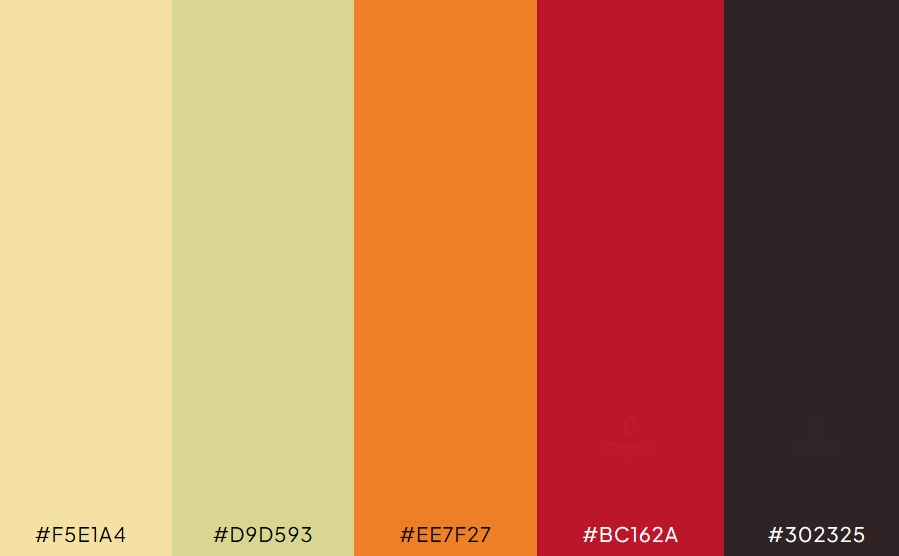 </center>
<br>

**Tipografía**

La elección tipográfica para StockWise es un componente esencial que complementa la identidad visual de la marca. Se han seleccionado dos familias tipográficas que juntas ofrecen versatilidad y coherencia, asegurando que la comunicación sea clara y efectiva en todos los medios.

**Font Families:**
- Inter: Para textos largos, body copy y contenido principal
- Nunito: Para headers, botones y elementos de interfaz

**Font Scale (Mobile First):**
- h1: 24px / 1.1 / Bold
- h2: 20px / 1.1 / SemiBold
- h3: 18px / 1.2 / Medium
- Body Large: 17px / 1.4 / Regular
- Body: 16px / 1.4 / Regular
- Small: 14px / 1.4 / Regular
- Caption: 12px / 1.3 / Regular

**Weights:**
- Bold (700): Títulos principales, acciones críticas
- SemiBold (600): Subtítulos, botones importantes
- Medium (500): Etiquetas, elementos interactivos
- Regular (400): Texto body, contenido principal
- Light (300): Texto secundario, descripciones

**Border Radius:**
- Small: 8px (botones pequeños, inputs)
- Medium: 12px (cards, modales)
- Large: 16px (containers principales)

**Spacing System (8px base):**
- xs: 4px
- sm: 8px
- md: 16px
- lg: 24px
- xl: 32px
- xxl: 48px

**Shadows:**
- Low: 0 2px 4px rgba(48, 35, 37, 0.1)
- Medium: 0 4px 8px rgba(48, 35, 37, 0.15)
- High: 0 8px 16px rgba(48, 35, 37, 0.2)

### 3.1.2. Information Architecture
La arquitectura de la información, también conocida como Information Architecture (IA), implica la organización de la información de manera clara y lógica, de modo que los usuarios puedan comprender su ubicación, lo que han descubierto, qué pueden esperar y qué está disponible a su alrededor. Esto tiene como objetivo permitir a los usuarios encontrar con facilidad lo que están buscando, y a los clientes, comprender las capacidades de la plataforma. Además, la arquitectura de la información posibilita la incorporación de nuevas funciones y la expansión del producto sin generar una estructura compleja o de difícil comprensión (Rosenfeld, Morville & Arango 2015).
#### 3.1.2.1. Organization Systems
La interfaz se divide en módulos bien definidos, accesibles desde un panel de navegación estructurado jerárquicamente. Estos módulos incluyen: Inicio, Home, Inventario y Configuración. Cada sección agrupa funciones específicas según su propósito, permitiendo que las tareas clave estén siempre al alcance del usuario.

# 3.1.2.1. Organization Systems

La arquitectura de organización de StockWise está diseñada siguiendo principios de agrupación lógica y progresiva de la información, permitiendo a los usuarios acceder rápidamente a las funciones necesarias según su rol y contexto de uso.

**Estructura Organizacional Principal**

| Módulo | Descripción | Funciones Principales | Acceso por Rol |
|--------|-------------|---------------------|----------------|
| **Dashboard Principal** | Vista consolidada del estado del inventario y métricas clave | - Resumen ejecutivo de stock<br>- Alertas prioritarias<br>- Acciones rápidas<br>- Métricas en tiempo real | Admin, Encargado |
| **Gestión de Inventario** | Núcleo operativo para administración completa de productos | - Registro y edición de productos<br>- Control de niveles de stock<br>- Categorización y etiquetado<br>- Gestión de ubicaciones físicas | Admin, Encargado, Empleado |
| **Operaciones Diarias** | Módulo para transacciones y movimientos regulares | - Registro de entradas/salidas<br>- Ajustes de inventario<br>- Historial de movimientos<br>- Devoluciones y mermas | Admin, Encargado, Empleado |
| **Reportes y Analytics** | Sistema de generación y visualización de datos | - Reportes personalizados<br>- Análisis de tendencias<br>- Métricas de rendimiento<br>- Exportación de datos | Admin, Encargado |
| **Configuración del Sistema** | Administración de preferencias y usuarios | - Gestión de perfiles de usuario<br>- Configuración de empresa<br>- Preferencias de notificaciones<br>- Backup y seguridad | Admin |

**Principios de Organización Aplicados**

1. **Agrupación por Funcionalidad**
Las características se organizan según su propósito común, facilitando la asociación mental y reduciendo la carga cognitiva.

1. **Jerarquía Visual Progresiva**
La información se presenta desde lo general hacia lo específico, permitiendo drill-down controlado según las necesidades del usuario.

1. **Contextualización Dinámica**
Las opciones disponibles se adaptan según el rol del usuario y el módulo activo, mostrando solo las funciones relevantes.

1. **Consistencia Transversal**
Mismos patrones organizativos se aplican en todos los módulos, creando una experiencia unificada y predecible.

**Organización de Contenido por Módulo**

**Módulo de Inventario**
- **Agrupación Primaria:** Por estado de stock (Normal, Bajo, Crítico)
- **Agrupación Secundaria:** Por categorías de producto
- **Agrupación Terciaria:** Por ubicación física en bodega

**Módulo de Reportes**
- **Agrupación Temporal:** Diario, Semanal, Mensual
- **Agrupación por Métrica:** Ventas, Stock, Rentabilidad
- **Agrupación por Producto:** Individual, Por categoría, Global

#### 3.1.2.2. Labelling Systems
El sistema de etiquetado en StockWise sigue principios de claridad, consistencia y contexto, asegurando que los usuarios comprendan inmediatamente la función de cada elemento.

**Principios de Etiquetado:**

- Lenguaje Natural: Usamos términos del dominio del usuario ("productos", "proveedores", "ventas")
- Consistencia: Mismo término para misma función en toda la aplicación
- Jerarquía Visual: Tamaño y peso tipográfico reflejan importancia
- Contexto: Las etiquetas cambian según el módulo y las acciones disponibles

**Sistema de Iconografía:**

- **Acciones Principales:**
  - ➕ Agregar/Registrar
  - ✏️ Editar/Modificar
  - 🗑️ Eliminar/Descartar
  - 🔍 Buscar/Filtrar
  - 📤 Exportar/Compartir

- **Módulos y Secciones:**
  - 📊 Dashboard - Vista general
  - 📦 Inventario - Gestión de productos
  - 🔄 Movimientos - Entradas y salidas
  - 📈 Reportes - Analytics y métricas
  - ⚙️ Configuración - Ajustes del sistema

- **Estados del Sistema:**
  - ✅ Completado/Éxito
  - ⚠️ Advertencia/Alerta
  - ❌ Error/Problema
  - 🔄 Procesando/En curso

**Microcopy y Mensajes:**

- **Botones de Acción:** "Agregar Producto", "Registrar Entrada", "Generar Reporte"
- **Mensajes de Confirmación:** "¿Estás seguro de eliminar este producto?"
- **Estados Vacíos:** "Aún no tienes productos registrados"
- **Guías Contextuales:** "Usa el código de barras para buscar más rápido"

#### 3.1.2.3. SEO Tags and Meta Tags
**SEO Tags**

SEO (Search Engine Optimization) Tags son elementos de HTML que ayudan a los motores de búsqueda a entender el contenido y la estructura de una página web. Estos tags influyen en cómo los motores de búsqueda indexan y clasifican tu sitio en los resultados de búsqueda. 

**Algunos ejemplos importantes de SEO Tags  para StockWise:**

**Title Tags para Páginas Principales:**

``` html
<!-- Página de Inicio -->
<title>StockWise - App de Gestión de Inventarios para PYMES</title>

<!-- Página de Características -->
<title>Gestión de Inventario Móvil | StockWise App</title>

<!-- Página de Precios -->
<title>Planes de Gestión de Inventario | StockWise</title>
```

**Header Tags Estructurados:**
``` html
<h1>Gestiona Tu Inventario desde tu Móvil</h1>
<h2>La solución simple para negocios en crecimiento</h2>
<h3>Control total de tu stock en tiempo real</h3>
```

**Meta Descriptions Optimizadas:**
``` html
<meta name="description" content="StockWise - App móvil de gestión de inventarios para PYMES. Controla stock, genera reportes y evita quiebres de inventario desde tu teléfono.">

<meta name="keywords" content="gestión inventarios, app móvil, control stock, PYMES, bodegas, emprendedores">
``` 
**Open Graph Tags para Redes Sociales:**
``` html
<meta property="og:title" content="StockWise - App de Inventarios">
<meta property="og:description" content="Gestiona tu inventario desde cualquier lugar con StockWise">
<meta property="og:image" content="/images/stockwise-social-preview.png">
``` 

#### 3.1.2.4. Searching Systems
El sistema de búsqueda de StockWise está diseñado para ser intuitivo y potente, permitiendo a los usuarios encontrar rápidamente la información que necesitan en su inventario.

**Características del Sistema de Búsqueda:**

- **Búsqueda Inteligente:**
  - Búsqueda por texto libre en múltiples campos (nombre, - código, categoría, proveedor)
  - Búsqueda por código de barras usando la cámara del dispositivo
  - Búsqueda por voz para hands-free operation
  - Búsqueda predictiva con sugerencias en tiempo real
- **Resultados de Búsqueda:**
  - Ordenamiento por relevancia, nombre, stock, fecha
  - Vista de tarjetas con información esencial
  - Acciones rápidas desde los resultados
  - Historial de búsquedas recientes
- **Búsqueda por Lotes:**
  - Escaneo múltiple de códigos de barras
  - Reconocimiento de imágenes para productos sin código
  - Procesamiento offline con sincronización posterior

#### 3.1.2.5. Navigation Systems
El sistema de navegación de StockWise está optimizado para dispositivos móviles, priorizando la accesibilidad y la eficiencia en las tareas diarias.

**Patrones de Navegación Principal:**

**Bottom Navigation Bar:**
``` text
[🏠 Inicio]  [📦 Inventario]  [➕ Agregar]  [📊 Reportes]  [👤 Perfil]
``` 
**Navegación por Gestos:**

- Deslizar hacia la derecha: Menú lateral
- Deslizar hacia abajo: Actualizar contenido
- Deslizar hacia arriba: Acciones rápidas
- Toque largo: Opciones contextuales

**Navegación Contextual:**

- Breadcrumbs para ubicación en estructuras profundas
- Botón "Atras" nativo del dispositivo
- Navegación por pestañas en secciones complejas
- Accesos directos personalizables según uso frecuente

**Navegación para Accesibilidad:**

- Soporte completo para lectores de pantalla
- Navegación por teclado en versiones tablet
- Tamaños de touch target mínimos de 44px
- Alto contraste y modos de daltonismo

### 3.1.3. Landing Page UI Design
#### 3.1.3.1. Landing Page Wireframe
El prototipado de la landing page cuenta diversas secciones:

- Header: Incluye botones para facilitar la navegación
- Hero Section: Con un botón CTA principal, un título y una imagen.
- Sección de Beneficios / Características: mostrara un resumen de 3 beneficios que ofrece la app
- Planes / Precios: Trendra 2 planes con su referente título y lista de características y contara con un botón CTA secundario por cada plan.
- Testimonios: Consta de un título y subtítulo, así como de unos testimonios de usuarios de cada segmento, lo que aumenta la confianza en los potenciales clientes.
- Llamado a la acción final (CTA grande) : Tiene un título y subtítulo, un boton CTA grande para "Try our app"
- Footer: Sección que da fin a la landing page, cuenta con las redes sociales de la plataforma.

**Wireframe Desktop**
<center> 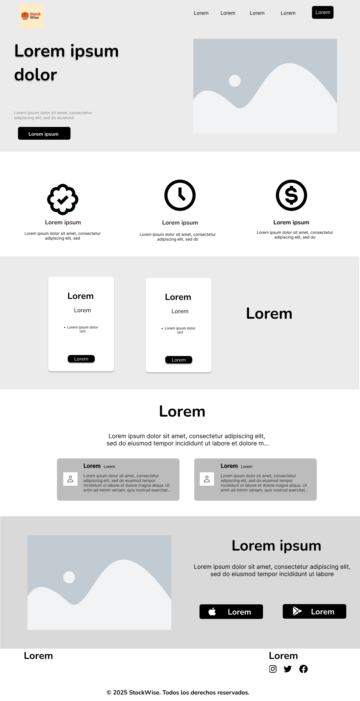 </center>
<br>

*Imagen (N°). Elaboración propia. Realizado en Figma*

**Wireframe Mobile**

En la versión mobile el navbar se reemplaza por un menu desplegable.

<center>  </center>
<br>

*Imagen (N°). Elaboración propia. Realizado en Figma*

#### 3.1.3.2. Landing Page Mock-up
**Wireframe Desktop**
<center> 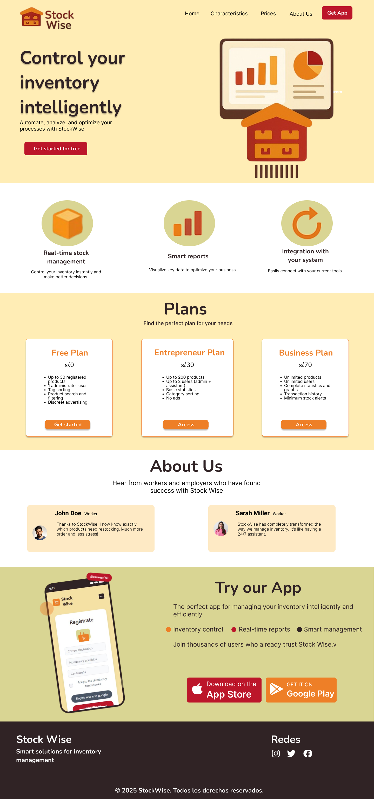 </center>
<br>

*Imagen (N°). Elaboración propia. Realizado en Figma*

**Wireframe Mobile**

En la versión mobile el navbar se reemplaza por un menu desplegable.

<center>  </center>
<br>

*Imagen (N°). Elaboración propia. Realizado en Figma*

### 3.1.4. Mobile Applications UX/UI Design
#### 3.1.4.1. Mobile Applications Wireframes
Los wireframes ayudan a los diseñadores y desarrolladores a planificar la arquitectura y la funcionalidad de la aplicación, permitiendo visualizar cómo los usuarios interactuarán con ella. Son esenciales en las primeras etapas de desarrollo, ya que facilitan la comunicación de ideas, la identificación de problemas potenciales y la alineación de todos los involucrados en el proyecto antes de pasar al diseño detallado y la programación.

**Iniciar sesión**

La siguiente imagen evidencia el wireframe de la sección de “inicio de sesión” desde la vista desktop web browser. En ella, los usuarios deberán ingresar las credenciales necesarias para poder acceder a la aplicación, siempre y cuando posean con una cuenta previamente creada.

<center>  </center>
<br>

*Imagen (N°). Elaboración propia. Realizado en Figma*

**Crear cuenta**

La siguiente imagen presenta la sección de “registro de usuario”, a través de la cual los administradores podrán remitir a la aplicación la información necesaria para crear una cuenta.

<center> 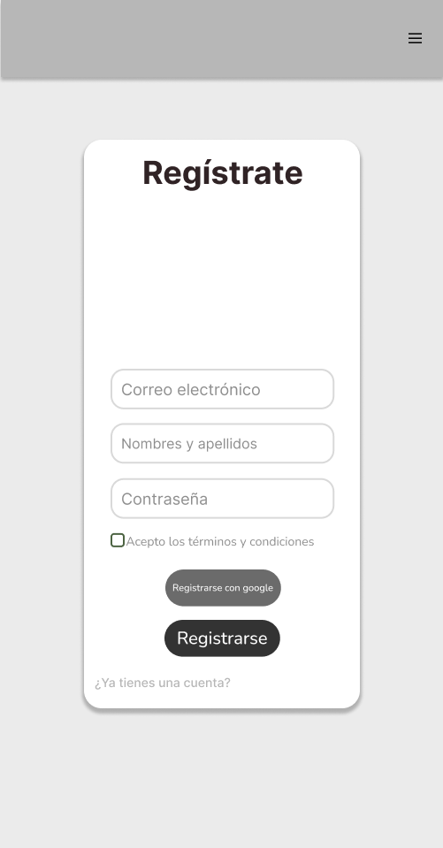 </center>
<br>

*Imagen (N°). Elaboración propia. Realizado en Figma*

**Elegir plan de pago**

La siguiente imagen presenta la sección “Elegir plan de pago”, la cual despliega las categorías de planes disponibles en la plataforma. Los tres planes están diseñados para adaptarse a las necesidades de los administradores de tienda acorde a sus necesidades.

<center>  </center>
<br>

*Imagen (N°). Elaboración propia. Realizado en Figma*

**Pasarela de pagos**

La siguiente imagen corresponde a la sección “Pasarela de pagos” donde los usuarios son dirigidas a un formulario para seleccionar y registrar su método de pago. Una vez que el proceso de pago es completado exitosamente, se notifica al usuario con un mensaje confirmando el vinculo de su tarjeta con la plataforma. Del mismo modo, si el usuario desea retirar su información o actualizar lo podra hacer a travéz de su perfil.

<center> 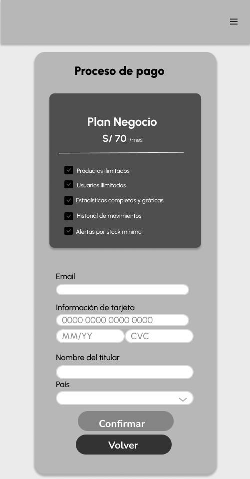 </center>
<br>

*Imagen (N°). Elaboración propia. Realizado en Figma*

**Mi perfil**

La sección titulada “Mi perfil” solicita al usuario que complete información en dos categorías para registrar sus datos. Adicionalmente, la categoría "cambiar cuenta" ofrece la opción de permitir al usuario cambiar de cuenta a una de empleador y utilizar las herramientas de este por la plataforma. Tambien, tiene libertad de cambiar el plan si es necesario.

*Perfil Administrador*

En este perfil, el usuario puede ver a la derecha sus herramientas correpondientes a su cuenta.

<center> 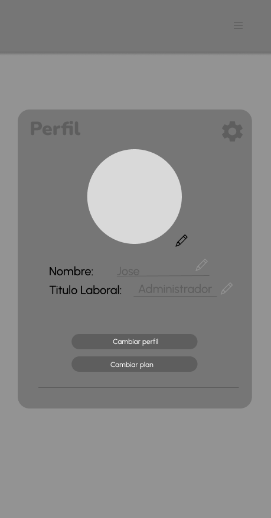 </center>
<br>

*Imagen (N°). Elaboración propia. Realizado en Figma*

<center>  </center>
<br>

*Imagen (N°). Elaboración propia. Realizado en Figma*

**Panel de control (Dashboard)**

Esta pantalla representa el panel de control principal del sistema StockWise. Su objetivo es proporcionar al usuario una vista general del estado del inventario y acceso rápido a funciones clave. Entre sus elementos principales se encuentran:

- Resumen de información:
  - Total de Productos: número total de ítems registrados.
  - Fecha del Último Proveedor: muestra la última fecha de ingreso de productos (por proveedor).
  - Próximos a Caducar: productos con fecha de vencimiento próxima, indicando la fecha y el stock restante.
- Accesos rápidos:
  - Historial de Movimientos: seguimiento de entradas y salidas del inventario.
  - Inventario: acceso directo a la lista completa de productos.
- Botones de acción:
  - Agregar Productos: para registrar nuevos productos en el sistema.
  - Kits de Productos: permite combinar productos individuales en un kit.
  - Devolución de Productos: facilita el registro de productos devueltos por proveedores o clientes.

<center> 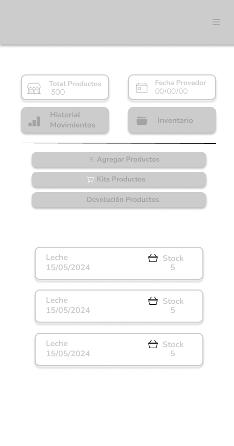 </center>
<br>

*Imagen (N°). Elaboración propia. Realizado en Figma*

**Combinación de Productos en Kits**

Esta sección está dedicada a la funcionalidad de crear kits de productos, una herramienta útil para negocios que venden combos o paquetes predefinidos. Las características principales incluyen:

Buscador de productos: permite al usuario localizar rápidamente productos por nombre.
Listado de productos existentes:
Muestra el nombre, precio y stock disponible de cada producto.
Incluye un botón de acción en cada fila para añadir productos al kit.
Botón “Seleccionar para kit”: una vez seleccionados los productos deseados, el usuario puede avanzar para crear el kit final.
Esta funcionalidad mejora la gestión del stock agrupado y permite optimizar estrategias de venta, como combos promocionales o paquetes de temporada.

<center>  </center>
<br>

*Imagen (N°). Elaboración propia. Realizado en Figma*

**Agregar Producto**

Esta pantalla permite visualizar todos los productos actualmente registrados en el inventario, con acceso rápido para editar o ver más detalles. Las funcionalidades clave incluyen:

- Tarjetas de producto con información relevante:
  - Nombre del producto (ej. Galleta).
  - Categoría/etiqueta (ej. Golosina).
  - Stock disponible.
- Botón “+ Detalle” para ver información adicional o editar.
- Botón “+”: permite agregar un nuevo producto desde cero
- Buscador de productos y opción de filtro por categoría o stock.

<center>  </center>
<br>

*Imagen (N°). Elaboración propia. Realizado en Figma*

**Registro de Nuevo Producto**

Pantalla que aparece al presionar el botón “+”, diseñada para agregar un nuevo producto al sistema. Incluye los siguientes campos:

- Nombre del producto.
- Etiquetas/Categorías (por ejemplo: Golosina, Bebida).
- Precio de compra y de venta.
- Cantidad inicial del producto.
- Número de lote y fecha de caducidad.
- Notas adicionales, si se desea registrar observaciones específicas.

Una vez completado el formulario, se debe presionar "Guardar" para registrar el nuevo ítem.

<center>  </center>
<br>

*Imagen (N°). Elaboración propia. Realizado en Figma*

*Edición Rápida de Producto*

Este modal aparece al hacer clic en “+ Detalle” sobre cualquier tarjeta de producto en la pantalla principal. Permite realizar modificaciones rápidas sobre un producto específico:

- Editar etiquetas.
- Actualizar cantidad.
- Modificar fecha de caducidad.
- Agregar notas.

Incluye botones para “Duplicar” (crear una copia rápida del producto) y “Eliminar” (quitar del sistema).

<center>  </center>
<br>

*Imagen (N°). Elaboración propia. Realizado en Figma*

**Historial de Movimientos**

Esta vista permite al usuario consultar todos los movimientos registrados en el sistema, ya sea por producto individual, por categoría o mediante cálculo del ticket promedio.

- Filtros disponibles:
  - Tipo de gestión: Producto, Categoría o Stock Promedio.
  - Rango de fecha: permite buscar registros por fechas específicas.
- Resultados organizados en tarjetas que muestran:
  - Producto o categoría
  - Fecha del movimiento
  - Precio unitario (si aplica)
  - Cantidad gestionada
  - Total del movimiento
- También cuenta con botones para:
  - Editar un registro
  - Eliminar un registro (con confirmación previa).

<center> 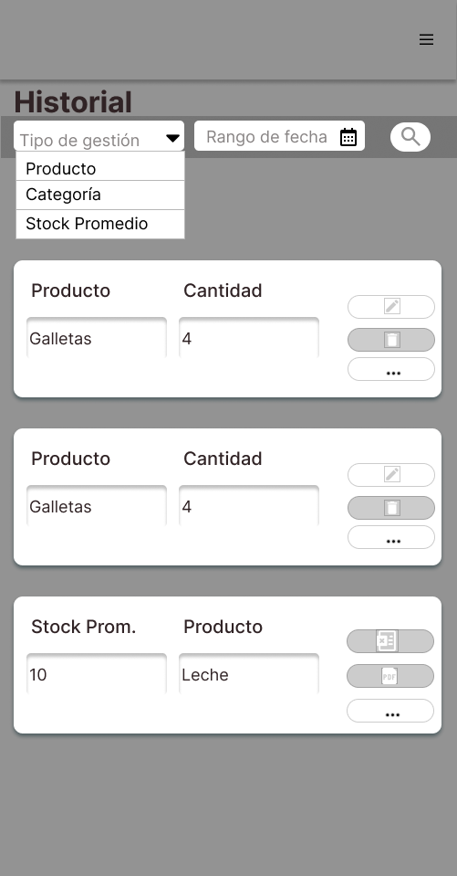 </center>
<br>

*Imagen (N°). Elaboración propia. Realizado en Figma*

*Confirmación de Eliminación*

Al presionar el botón de eliminar, se despliega una ventana emergente de confirmación que advierte al usuario antes de borrar un registro del historial.

<center>  </center>
<br>

*Imagen (N°). Elaboración propia. Realizado en Figma*

**Ticket Promedio**   

Al seleccionar “Stock Promedio” como tipo de gestión, se habilita el acceso al cálculo de Ticket Promedio, que estima el valor promedio de venta por unidad en un rango de fechas. Este recurso permite realizar un análisis financiero rápido sobre el comportamiento de productos específicos.

- Campos del formulario:
  - Rango de fecha.
  - Producto a analizar.
  - Cantidad de ventas.
  - Precio total de ventas.
  - Resultado del ticket promedio (calculado automáticamente).
- Botones:
  - Crear: Guarda el registro del ticket.
  - Cancelar: Cierra el modal sin guardar.

<center>  </center>
<br>

*Imagen (N°). Elaboración propia. Realizado en Figma*

**Pantalla principal de Inventario por Lote**

Esta pantalla permite la visualización y gestión del inventario agrupado por lote de entrada.

- Filtros en la parte superior:
  - Búsqueda por Producto
  - Proveedor
  - Fecha de ingreso
  - Cantidad
  - Precio
- Lista de productos ingresados por lote:
  - Proveedor
  - Producto
  - Fecha de entrada
  - Cantidad por unidad
  - Precio por unidad
  - Unidad de medida
- Botón rojo “Generar Nuevo Lote” ubicado a la derecha, que permite agregar un nuevo registro.

<center>  </center>
<br>

*Imagen (N°). Elaboración propia. Realizado en Figma*

*Busqueda Avanzada* 

<center>  </center>
<br>

*Imagen (N°). Elaboración propia. Realizado en Figma*

*Pantalla de Comentarios del Lote* 

Este modal aparece al hacer clic en el icono de "Comentarios", permite dejar notas asociadas a un producto, útiles para incidencias, condiciones especiales del lote o instrucciones de seguimiento.

- Campos de entrada para seleccionar el Lote y el Producto.
- Área para ingresar el comentario del usuario.
- Botones:
  - “Guardar” (acción de confirmar)
  - “Cancelar” (descartar el comentario)

<center>  </center>
<br>

*Imagen (N°). Elaboración propia. Realizado en Figma*

*Pantalla de Exportación*

Permite obtener un respaldo o trabajar fuera del sistema con los datos del inventario. Al dar click, saldra una ventana emergente con el ícono de exportación. Mostrara un texto “¿Deseas exportar en excel?” y botones de acción: “Volver” y “Continuar”.

<center>  </center>
<br>

*Imagen (N°). Elaboración propia. Realizado en Figma*

**Pantalla de Inventario por Producto**

Visualización clara de todos los productos del inventario, con opción de filtrar por condiciones específicas, lo cual optimiza el control individualizado del stock.

- Filtros:
  - Categoría
  - Productos
  - Rango de Fecha
  - Stock Mínimo.
- Tabla:
  - Categoría
  - Producto
  - Fecha de entrada
  - Cantidad
  - Precio
  - Stock mínimo
  - Unidad de medida.
- Botón: “Generar Nuevo Lote”.

<center>  </center>
<br>

*Imagen (N°). Elaboración propia. Realizado en Figma*

*Edición de Registro*

Facilita la actualización de datos en tiempo real, permitiendo mantener el inventario siempre actualizado y preciso.

- Elementos mostrados:
  - Formulario editable con campos: Categoría, Producto, Cantidad por unidad, Precio por unidad, Unidad de medida.
  - Botones de acción: “Crear” (confirmar edición) y “Cancelar”.

<center>  </center>
<br>

*Imagen (N°). Elaboración propia. Realizado en Figma* 

#### 3.1.4.2. Mobile Applications Wireflow Diagrams
Los Mobile Applications Wireflow Diagrams son una combinación de wireframes y flujos de usuario (user flows) que ilustran no solo la estructura y disposición de las pantallas de una Mobile Application, sino también cómo los usuarios navegarán entre ellas. Estos diagramas proporcionan una visión detallada del recorrido del usuario, mostrando las interacciones clave y las transiciones de una pantalla a otra dentro de la aplicación.

**User Goal: Registrar**

El usuario selecciona la opción "Register", completa los campos solicitados y hace clic en el botón "Registrar". A continuación, se muestra el panel "Add Card", donde debe llenar los campos relacionados con su tarjeta y correo electrónico. Una vez que el proceso de pago se complete exitosamente, se notifica al usuario con un mensaje confirmando el vínculo de su tarjeta con la plataforma. Del mismo modo, si el usuario desea retirar su información o actualizar lo podrá hacer a través de su perfil. Finalmente hacer clic en el botón "Aceptar".

<center> 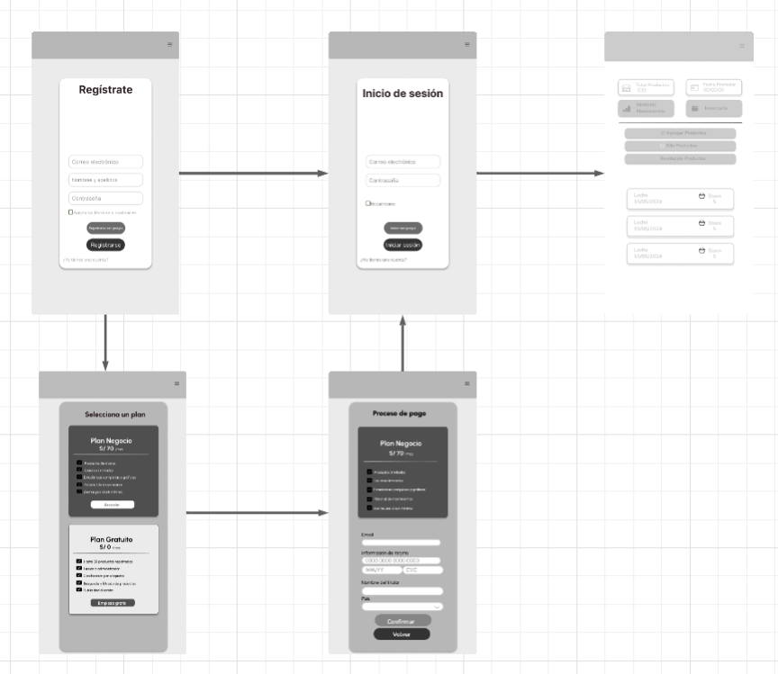 </center>
<br>

*Imagen (N°). Elaboración propia. Realizado en Figma* 

**User Goal: Iniciar sesión**

El usuario introduce su correo y contraseña, luego hace clic en el botón "Log In". Después, se le redirige al panel de perfil, donde podrá editar su información personal y acceder a las herramientas según su perfil "Administrador" o "Empleado".

<center> 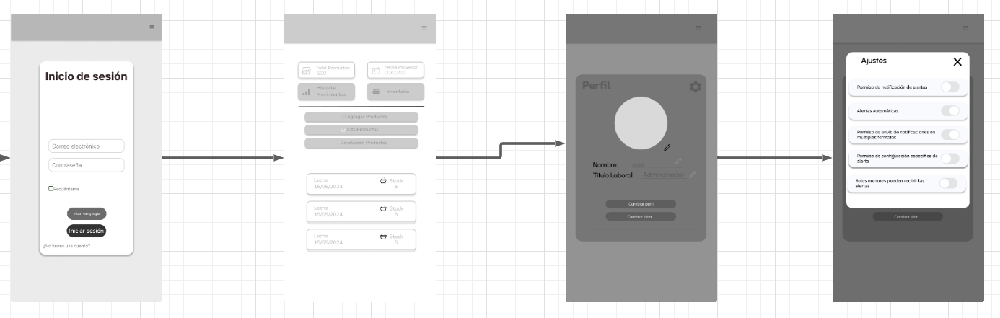 </center>
<br>

*Imagen (N°). Elaboración propia. Realizado en Figma* 

**User Goal: Navegar por el Dashboard**

1. El usuario inicia sesión desde la Landing Page.
2. Ingresa a la vista principal del Dashboard.
3. Visualiza el total de productos registrados y la fecha del último proveedor.
4. Visualiza un resumen de productos próximos a caducar con su respectiva fecha y stock disponible.
5. Accede a botones de acción rápida como “Historial”, “Inventario”, “Añadir Productos”, “Kits” y “Devolución de productos”.

<center> 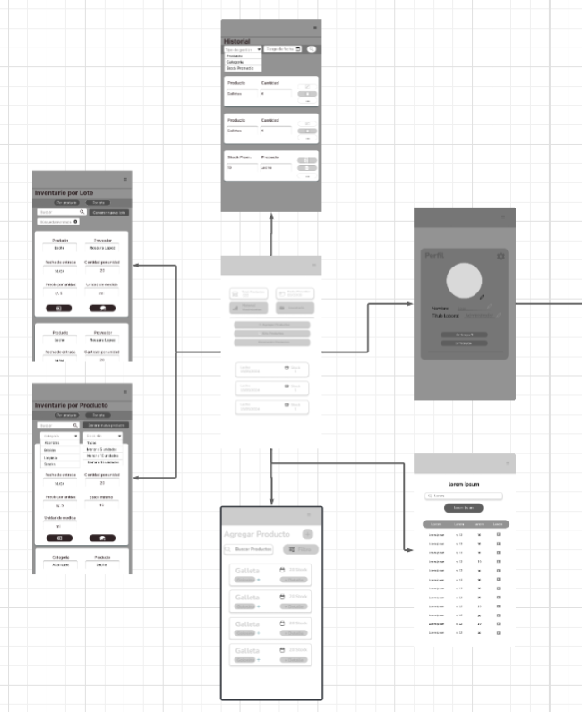 </center>
<br>

*Imagen (N°). Elaboración propia. Realizado en Figma* 

**User Goal: Inventario (Producto / Lote)**

1. Ingresa a la sección de Inventario.
2. Revisa el listado de productos presionando el botón "por producto".
3. Filtra los productos por categoría, nombre del producto, fecha o stock mínimo.
4. Consulta el listado con información clave: fecha de entrada, cantidad por unidad, precio, stock mínimo y unidad de medida.

<center> 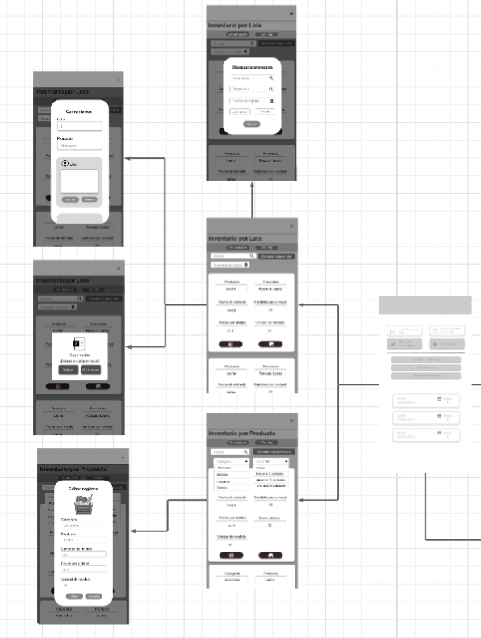 </center>
<br>

*Imagen (N°). Elaboración propia. Realizado en Figma* 

**User Goal: Botones Principales (Agregar Producto y Kits)**

1. Pulsa el botón "Agregar Producto".
2. Rellena los campos solicitados para registrar uno nuevo.
3. Pulsa el botón "Crear Kit".
4. Combina productos existentes para crear un kit nuevo.
5. El usuario pulsa el botón “Añadir Productos” desde el Dashboard.
6. Visualiza una galería de productos existentes y accede a opciones para editarlos o duplicarlos.
7. Puede agregar uno nuevo haciendo clic en el botón “+”, donde se despliega un formulario con campos como nombre,etiquetas, cantidad, lote, precios, fecha de caducidad y notas.
8. Desde el menú principal, también accede a la opción “Kits”.

En esta sección, selecciona productos existentes y los combina mediante el botón “Seleccionar para kit”, indicando cantidad e inventario disponible.

<center> 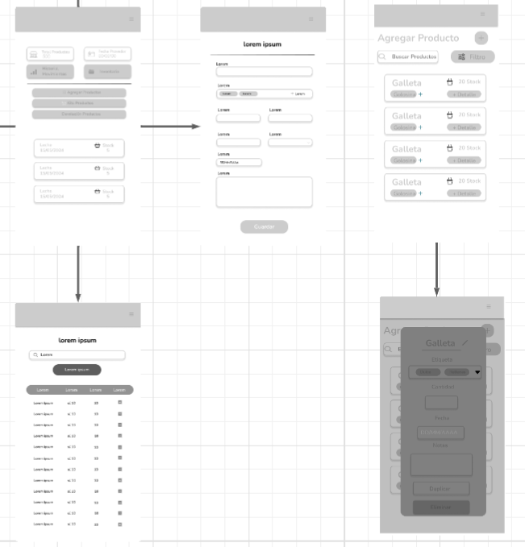 </center>
<br>

*Imagen (N°). Elaboración propia. Realizado en Figma* 

**User Goal: Historial de Movimientos**

1. Navega a la sección de Historial.
2. Visualiza entradas y salidas de productos.
3. Filtra movimientos por fecha, producto o lote.
4. El usuario accede a la sección de Historial desde el panel principal.
5. Filtra los registros por tipo de gestión, categoría, stock promedio y fecha.
6. Visualiza los movimientos realizados, incluyendo datos como nombre del producto, fecha de consulta, precio unitario, cantidad y total.
7. Consulta métricas como el stock promedio, estado del producto y stock ideal.
8. Cuenta con botones para editar o eliminar cada registro y, para los stock promedio, exportar la información y realiza un ticket promedio.

<center> 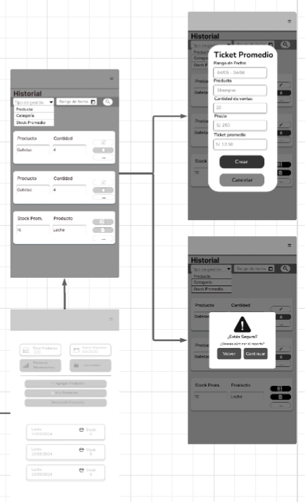 </center>
<br>

*Imagen (N°). Elaboración propia. Realizado en Figma* 


#### 3.1.4.3. Mobile Applications Mock-ups

**Iniciar sesión**
<center>  </center>
<br>

*Imagen (N°). Elaboración propia. Realizado en Figma* 

**Crear cuenta**
<center>  </center>
<br>

*Imagen (N°). Elaboración propia. Realizado en Figma* 

**Elegir plan de pago**
<center>  </center>
<br>

*Imagen (N°). Elaboración propia. Realizado en Figma* 

**Pasarela de pagos**
<center>  </center>
<br>

*Imagen (N°). Elaboración propia. Realizado en Figma* 

**Mi perfil**
*Perfil Administrador*
<center>  </center>
<br>

*Imagen (N°). Elaboración propia. Realizado en Figma* 

<center>  </center>
<br>

*Imagen (N°). Elaboración propia. Realizado en Figma* 

**Panel de control (Dashboard)**
<center>  </center>
<br>

*Imagen (N°). Elaboración propia. Realizado en Figma* 

**Combinación de Productos en Kits**
<center>  </center>
<br>

*Imagen (N°). Elaboración propia. Realizado en Figma* 

**Agregar Producto**
<center>  </center>
<br>

*Imagen (N°). Elaboración propia. Realizado en Figma* 

**Registro de Nuevo Producto**
<center>  </center>
<br>

*Imagen (N°). Elaboración propia. Realizado en Figma* 

*Edición Rápida de Producto*
<center>  </center>
<br>

*Imagen (N°). Elaboración propia. Realizado en Figma* 

**Historial de Movimientos**
<center>  </center>
<br>

*Imagen (N°). Elaboración propia. Realizado en Figma* 

*Confirmación de Eliminación*
<center>  </center>
<br>

*Imagen (N°). Elaboración propia. Realizado en Figma* 

**Ticket Promedio**  
<center>  </center>
<br>

*Imagen (N°). Elaboración propia. Realizado en Figma* 

**Pantalla principal de Inventario por Lote**
<center> 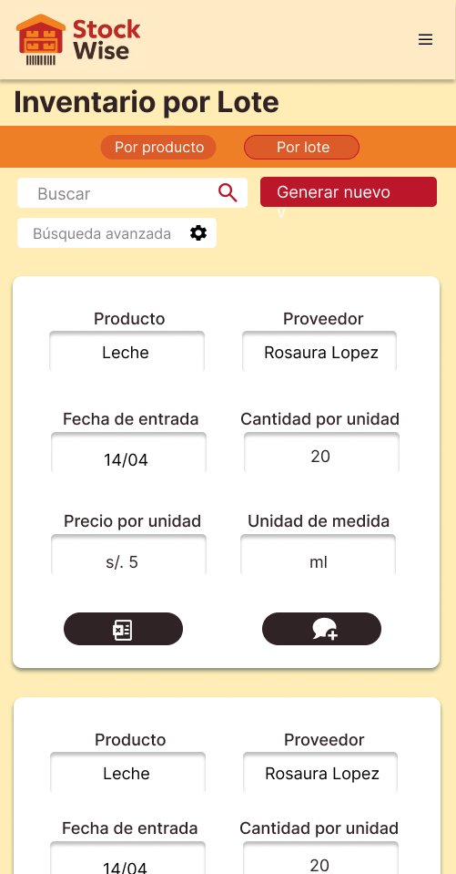 </center>
<br>

*Imagen (N°). Elaboración propia. Realizado en Figma* 

*Busqueda Avanzada*
<center>  </center>
<br>

*Imagen (N°). Elaboración propia. Realizado en Figma* 

*Pantalla de Comentarios del Lote* 
<center>  </center>
<br>

*Imagen (N°). Elaboración propia. Realizado en Figma* 

*Pantalla de Exportación*
<center>  </center>
<br>

*Imagen (N°). Elaboración propia. Realizado en Figma* 

**Pantalla de Inventario por Producto**
<center>  </center>
<br>

*Imagen (N°). Elaboración propia. Realizado en Figma* 

*Edición de Registro*
<center>  </center>
<br>

*Imagen (N°). Elaboración propia. Realizado en Figma* 

#### 3.1.4.4. Mobile Applications User Flow Diagrams

**User Goal: Registrar**

<center> 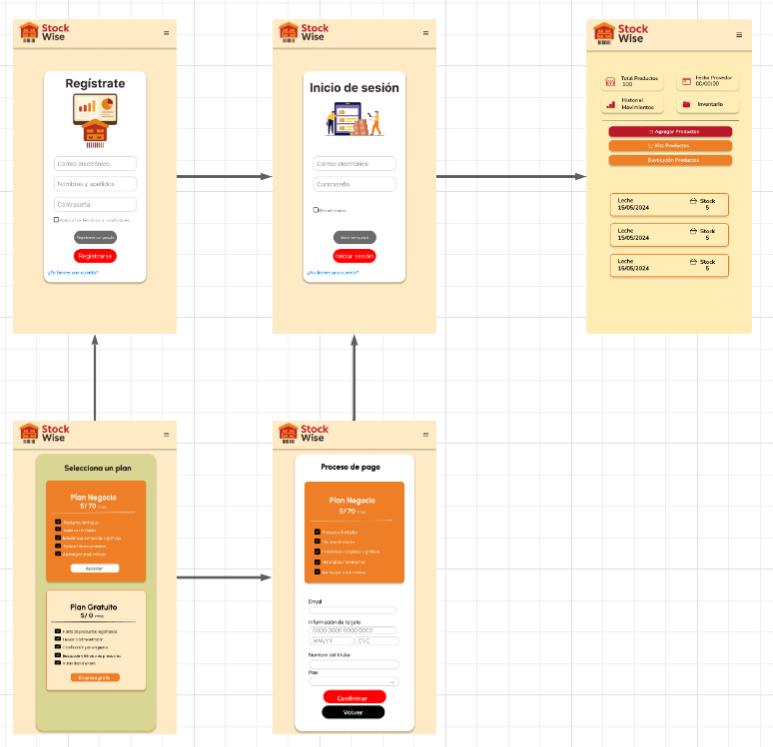 </center>
<br>

*Imagen (N°). Elaboración propia. Realizado en Figma* 

**User Goal: Iniciar sesión**

<center> 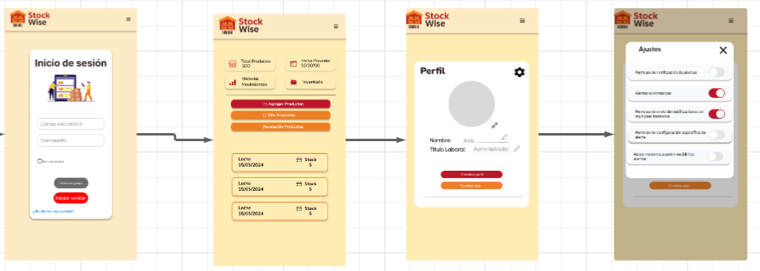 </center>
<br>

*Imagen (N°). Elaboración propia. Realizado en Figma* 

**User Goal: Navegar por el Dashboard**

<center> 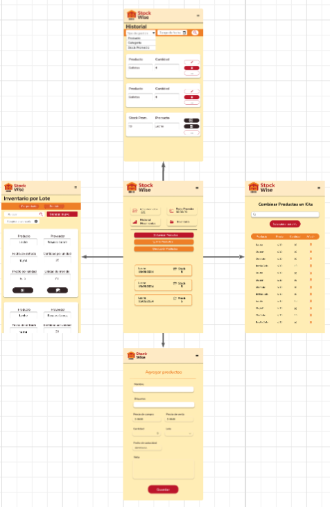 </center>
<br>

*Imagen (N°). Elaboración propia. Realizado en Figma* 

**User Goal: Inventario (Producto / Lote)**

<center> 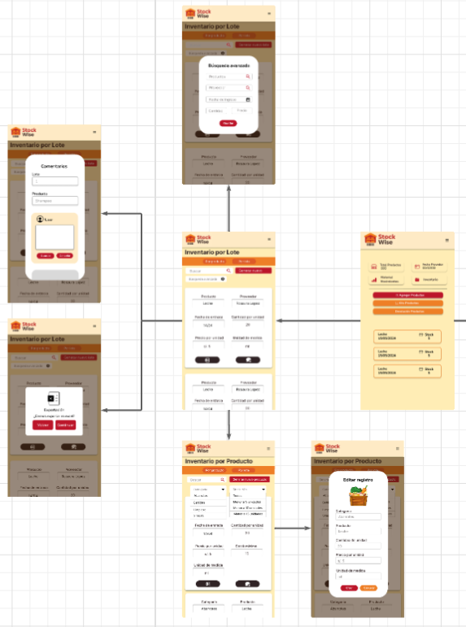 </center>
<br>

*Imagen (N°). Elaboración propia. Realizado en Figma* 

**User Goal: Botones Principales (Agregar Producto y Kits)**

<center> 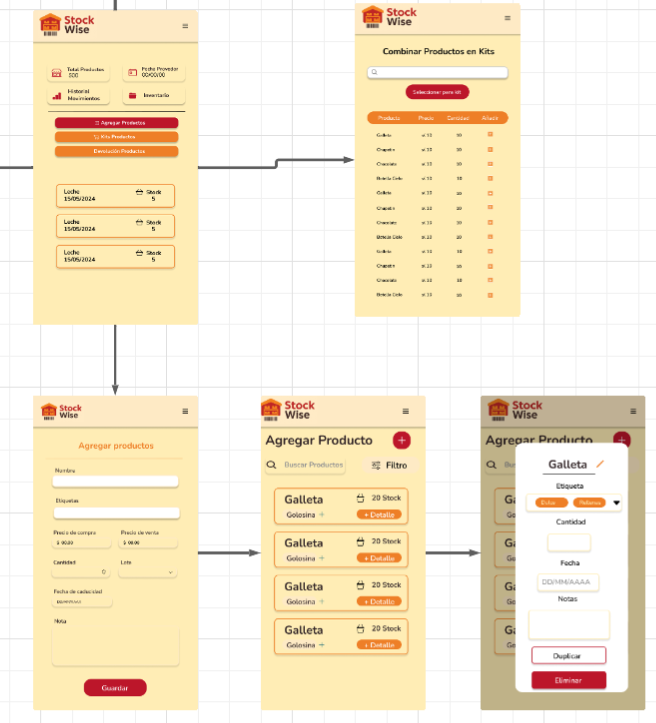 </center>
<br>

*Imagen (N°). Elaboración propia. Realizado en Figma* 

**User Goal: Historial de Movimientos**

<center> 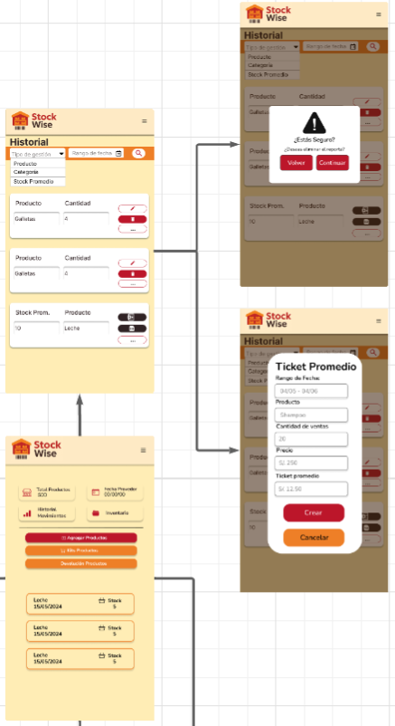 </center>
<br>

*Imagen (N°). Elaboración propia. Realizado en Figma* 

#### 3.1.4.5. Mobile Applications Prototyping
