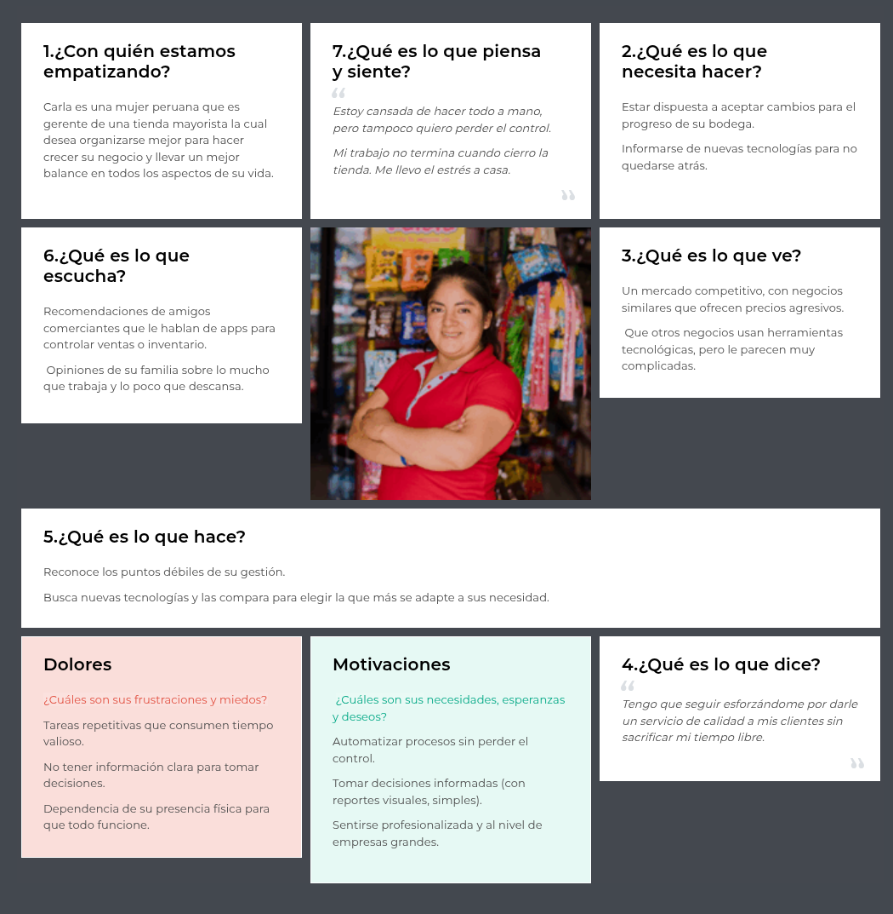

# Capítulo II: Requirements Development and Software Solution Design

## 2.1. Competidores
### 2.1.1. Análisis competitivo
<table border="1" cellspacing="0" cellpadding="6">
  <tr>
    <th colspan="5">
      <b>Objetivo del análisis:</b> Identificar el posicionamiento competitivo de StockWise en el mercado de aplicaciones móviles de gestión de inventarios para pymes, entendiendo las ventajas diferenciales y oportunidades de mejora.
    </th>
  </tr>
  <tr>
    <th></th>
    <th>StockWise </th>
    <th>Zoho Inventory </th>
    <th>Odoo Inventory </th>
    <th>TradeGecko </th>
  </tr>
  <tr>
    <th colspan="5"><b>PERFIL</b></th>
  </tr>
  <tr>
    <td><b>Overview</b></td>
    <td>Solución móvil integral especializada en gestión de inventarios para pymes y emprendedores</td>
    <td>Suite de negocio completa con módulo de inventario como parte de su ecosistema</td>
    <td>Software de gestión open-source con módulo de inventario personalizable</td>
    <td>Plataforma de gestión de inventario centrada en comercio electrónico y retail</td>
  </tr>
  <tr>
    <td><b>Ventaja competitiva</b></td>
    <td>Especialización móvil, interfaz intuitiva, planes funcionales específicos (voz, GPS, IA) y enfoque en pymes</td>
    <td>Integración completa con ecosistema Zoho y terceros, robustez funcional</td>
    <td>Flexibilidad y personalización por ser open-source</td>
    <td>Fuerte integración con canales de e-commerce y plataformas de venta</td>
  </tr>
  <tr>
    <th colspan="5"><b>PERFIL DE MARKETING</b></th>
  </tr>
  <tr>
    <td><b>Mercado objetivo</b></td>
    <td>Pymes, emprendedores, startups y bodegas especializadas</td>
    <td>Medianas empresas y pymes en crecimiento</td>
    <td>Empresas de todos los tamaños que buscan personalización</td>
    <td>Negocios de e-commerce y retail</td>
  </tr>
  <tr>
    <td><b>Estrategias de marketing</b></td>
    <td>Marketing digital, ASO, comunidades de emprendedores, modelo freemium</td>
    <td>Marketing B2B, fuerza de ventas, contenido educativo</td>
    <td>Comunidad open-source, partners de implementación</td>
    <td>Marketing especializado en e-commerce, ferias sectoriales</td>
  </tr>
  <tr>
    <th colspan="5"><b>PERFIL DE PRODUCTO</b></th>
  </tr>
  <tr>
    <td><b>Productos & Servicios</b></td>
    <td>App móvil con: gestión inventory, alertas, reportes, boletas, planes voz/GPS/IA/scanner</td>
    <td>Software web y móvil con: inventory, órdenes venta, envíos, facturación</td>
    <td>Suite modular web/móvil con: inventory, manufactura, ventas, CRM</td>
    <td>Plataforma web/móvil: inventory, pedidos, logística, analytics</td>
  </tr>
  <tr>
    <td><b>Precios & Costos</b></td>
    <td>Modelo freemium con planes premium escalables por funcionalidad</td>
    <td>Planes por volumen de órdenes, desde gratis hasta enterprise</td>
    <td>Freemium modular, costos de implementación y personalización</td>
    <td>Planes premium por volumen de ventas y usuarios</td>
  </tr>
  <tr>
    <td><b>Canales de distribución</b></td>
    <td>Móvil (iOS/Android)</td>
    <td>Web y móvil (iOS/Android)</td>
    <td>Web y móvil (iOS/Android)</td>
    <td>Web y móvil (iOS/Android)</td>
  </tr>

<tr>
    <th colspan="5"><b>Análisis SWOT</b></th>
  </tr>
<tr>
    <td><b>Fortalezas</b></td>
    <td>- Especialización móvil nativa - Interfaz intuitiva - Funcionalidades innovadoras (voz, GPS, IA) - Enfoque específico en pymes</td>
    <td>- Ecosistema integrado - Solución completa - Reconocimiento de marca - Escalabilidad</td>
    <td>- Flexibilidad y personalización - Comunidad activa - Modelo open-source - Múltiples módulos integrados</td>
    <td>- Especialización en e-commerce - Integraciones con plataformas de venta - Analytics avanzado</td>
  </tr>
  <tr>
    <td><b>Debilidades</b></td>
    <td>- Marca desconocida - Ecosistema limitado vs competidores - Recursos limitados vs grandes competidores</td>
    <td>- Curva de aprendizaje más pronunciada - Puede ser complejo para pymes muy pequeñas - Costo elevado para planes avanzados</td>
    <td>- Requiere personalización para funcionar óptimamente - Soporte puede ser limitado en versión community</td>
    <td>- Enfoque muy específico en e-commerce - Menos adaptable a otros modelos de negocio - Precios elevados</td>
  </tr>
  <tr>
    <td><b>Oportunidades</b></td>
    <td>- Crecimiento mercado pymes digitales - Tendencia hacia soluciones móviles - Expansión a Latinoamérica - Alianzas con comunidades de emprendedores</td>
    <td>- Expansión a nuevos mercados - Desarrollo de más integraciones - Consolidación como suite integral</td>
    <td>- Crecimiento de la comunidad de desarrolladores - Expansión de funcionalidades móviles - Alianzas con implementadores</td>
    <td>- Crecimiento del e-commerce global - Expansión a nuevos verticales de retail - Desarrollo de analytics predictivo</td>
  </tr>
  <tr>
    <td><b>Amenazas</b></td>
    <td>- Entrada de competidores establecidos al mercado móvil - Commoditización de funcionalidades básicas - Dificultad para captar usuarios frente a alternativas gratuitas</td>
    <td>- Competencia de soluciones más especializadas - Precios más competitivos de alternativas - Cambios en regulaciones internacionales</td>
    <td>- Fragmentación de la comunidad - Calidad variable de implementaciones - Competencia de soluciones SaaS más pulidas</td>
    <td>- Competencia de plataformas de e-commerce con módulos nativos - Cambios en APIs de plataformas de venta - Consolidación del mercado</td>
  </tr>

</table>

### 2.1.2. Estrategias y tácticas frente a competidores

## Estrategias Generales de Posicionamiento

**1. Especialización en Experiencia Móvil**

**Objetivo:** Diferenciarnos como la solución móvil nativa más intuitiva del mercado.

**Tácticas:**

- Desarrollar funcionalidades exclusivas móviles (voz, GPS, escaneo por cámara)
- Optimizar la interfaz para uso táctil con gestos intuitivos
- Garantizar funcionamiento offline para operaciones críticas
- Implementar notificaciones push contextuales y personalizables

**2. Enfoque en Usabilidad para PYMES**

**Objetivo:** Ofrecer la curva de aprendizaje más corta del mercado.

**Tácticas:**

- Crear sistema de onboarding guiado dentro de la aplicación
- Desarrollar tutoriales interactivos por funcionalidad
- Implementar asistente inteligente para tareas complejas
- Diseñar plantillas preconfiguradas por tipo de negocio

## Estrategias Ofensivas frente a Competidores

**1. Contra Zoho Inventory**

**Debilidad a explotar:** Complejidad para PYMES pequeñas

**Tácticas:**

- Campañas comparativas destacando simplicidad vs complejidad
- Programa de migración asistida desde Zoho
- Planes precio más competitivos para segmento pequeño-mediano
- Funcionalidades "justo lo necesario" sin sobrecarga de opciones

**2. Contra Odoo Inventory**

**Debilidad a explotar:** Requiere personalización e implementación

**Tácticas:**

- Mensajería centrada en "funciona desde el día 1"
- Precios transparentes sin costos ocultos de implementación
- Casos de éxito de implementación en menos de 24 horas
- Servicio de configuración inicial incluido en planes premium

**3. Contra TradeGecko**

**Debilidad a explotar:** Enfoque limitado a e-commerce

**Tácticas:**

- Posicionamiento como solución multi-canal integral
- Funcionalidades para negocios físicos + digitales
- Campañas dirigidas a retail tradicional con interés en digitalizarse
- Precios más accesibles para negocios mixtos

## Estrategias Defensivas

**1. Ante posible commoditización**

**Tácticas:**

- Desarrollo continuo de funcionalidades innovadoras (voz, IA, realidad aumentada)
- Programa de fidelización con beneficios escalables
- Integraciones exclusivas con proveedores locales
- Comunidad de usuarios para feedback y co-creación

**2. Protección frente a entrada de grandes competidores**

**Tácticas:**

- Alianzas estratégicas con asociaciones de PYMES
- Contratos a largo plazo con precios congelados
- Desarrollo de especialización vertical por industria
- Branding fuerte centrado en el enfoque PYME

## 2.2. Entrevistas

La finalidad de realizar entrevistas es obtener un alcance más completo sobre las experiencias, perspectivas y opiniones de los segmentos de mercado definidos. Nuestro objetivo es recolectar información valiosa que nos permita conocer mejor a nuestro público objetivo. Con estas entrevistas se tendrá una visión más clara de las necesidades y expectativas de nuestros usuarios.

### 2.2.1. Diseño de entrevistas

**Segmento #1: Bodegas especializadas por rubro**

**Preguntas principales**

1. ¿Podrías contarme cómo gestionas actualmente el inventario de tu bodega?
2. ¿Cuáles son los mayores retos que enfrentas al momento de organizar tus productos?
3. ¿Has tenido pérdidas o problemas por errores en el inventario? ¿Cómo los resolviste?
4. ¿Qué tan importante es para ti tener un control en tiempo real de tu stock?
5. ¿Utilizas algún sistema o herramienta digital? ¿Cuál y cómo te va con ella?

**Preguntas complementarias**

1. ¿Cómo te enteras cuando falta un producto o está a punto de vencerse?
2. ¿Qué tipo de reportes o información te gustaría tener sobre tu inventario?
3. ¿Qué dispositivos usas más en tu trabajo (laptop, celular, tablet)?
4. ¿Cómo crees que una plataforma digital podría ayudarte a mejorar tu operación?

**Segmento #2: Startups y emprendedores en expansión con necesidades logísticas**

**Preguntas principales**

1. ¿Cómo manejas actualmente el inventario de tu negocio?
2. ¿En qué momentos has sentido que el control del stock te limita o te hace perder tiempo?
3. ¿Cómo llevas el registro de entradas y salidas de productos?
4. ¿Qué te gustaría mejorar de tu proceso logístico actual?
5. ¿Has considerado usar alguna plataforma para gestionar tu inventario? ¿Por qué sí o por qué no?

**Preguntas complementarias**

1. ¿Qué herramientas digitales usas en tu negocio actualmente?
2. ¿Dónde almacenas tus productos?
3. ¿Qué tan seguido necesitas revisar el stock?
4. ¿Qué redes sociales o canales digitales usas para vender?

### 2.2.2. Registro de entrevistas

**Segmento 1: Bodegas especializadas por rubro**

<table border="1">
  <tr>
    <th>Entrevista</th>
    <td>1</td>
    <th>Nombre</th>
    <td>Milagros Almerco</td>
  </tr>
  <tr>
    <th>Edad</th>
    <td>28</td>
    <th>Distrito</th>
    <td>San Martín de Porres</td>
  </tr>
  <tr>
    <th>Captura de la entrevista: </th>
    <td colspan="3">
        En la entrevista, la estudiante Milagros Almerco comenta que lleva el control de su bodega en un cuaderno, anotando manualmente las ventas y compras. Reconoce que su sistema es básico y que a veces se olvida de registrar productos, lo que dificulta llevar un control claro del inventario. Además, le resulta complicado encontrar información específica entre tantas hojas. Señala como uno de sus principales problemas la falta de control sobre las fechas de vencimiento, lo que ha ocasionado pérdidas por productos que no logró vender a tiempo. También menciona que no siempre actualiza los cambios de precio. Para prevenir esto, trata de revisar los estantes y adelantar los productos por vencer. Respecto a herramientas digitales, indica que usa el celular y la calculadora por practicidad. Pero le gustaría contar con un sistema que le avise qué productos están por vencer, cuáles debe reponer y cómo están cambiando los precios. Además, considera importante poder visualizar su inventario en tiempo real. Le gustaría recibir alertas y reportes que le ayuden a organizar mejor su negocio.
    </td>
  </tr>
  <tr>
    <th>URL de la grabación</th>
    <td colspan="3">
      <a href="https://upcedupe-my.sharepoint.com/:v:/g/personal/u20221g068_upc_edu_pe/EWZLjufk66ZGs5HIemlhfY4BUKlkT04Q6fAi_-ly4pIBcg?nav=eyJyZWZlcnJhbEluZm8iOnsicmVmZXJyYWxBcHAiOiJPbmVEcml2ZUZvckJ1c2luZXNzIiwicmVmZXJyYWxBcHBQbGF0Zm9ybSI6IldlYiIsInJlZmVycmFsTW9kZSI6InZpZXciLCJyZWZlcnJhbFZpZXciOiJNeUZpbGVzTGlua0NvcHkifX0&e=7zmUts">
        Ver grabación
      </a>
    </td>
  </tr>
  <tr>
   <th>Timing</th>
    <td colspan="3">
         00:00 -5:48
    </td>
  </tr>
</table>
 

<table border="1">
  <tr>
    <th>Entrevista</th>
    <td>2</td>
    <th>Nombre</th>
    <td>Elvis Aranga Mesa</td>
  </tr>
  <tr>
    <th>Edad</th>
    <td>31</td>
    <th>Distrito</th>
    <td>Santiago de Surco</td>
  </tr>
  <tr>
    <th>Captura de la entrevista: </th>
    <td colspan="3">
        Elvis Aranga Meza, de 31 años y encargado de la administración en su bodega en Santiago de Surco, gestiona el inventario de forma manual, sin un sistema digital, basándose en el control visual y el registro de ventas totales. Reconoce que esta falta de control sistematizado dificulta hacer proyecciones, identificar los productos con mayor rotación o margen de ganancia, y manejar adecuadamente las mermas, especialmente en productos perecibles como frutas y abarrotes. Ha enfrentado pérdidas por productos vencidos y robos, y señala la necesidad de implementar un sistema digital para actualizar precios en tiempo real, controlar vencimientos y facilitar la gestión por parte del personal. Considera que una plataforma digital mejoraría la eficiencia, permitiría delegar tareas y evitar errores en la rotación y precios, aportando mayor libertad y control en la operación diaria.
    </td>
  </tr>
  <tr>
    <th>URL de la grabación</th>
    <td colspan="3">
      <a href="https://upcedupe-my.sharepoint.com/:v:/g/personal/u20221g068_upc_edu_pe/EWZLjufk66ZGs5HIemlhfY4BUKlkT04Q6fAi_-ly4pIBcg?nav=eyJyZWZlcnJhbEluZm8iOnsicmVmZXJyYWxBcHAiOiJPbmVEcml2ZUZvckJ1c2luZXNzIiwicmVmZXJyYWxBcHBQbGF0Zm9ybSI6IldlYiIsInJlZmVycmFsTW9kZSI6InZpZXciLCJyZWZlcnJhbFZpZXciOiJNeUZpbGVzTGlua0NvcHkifX0&e=7zmUts">
        Ver grabación
      </a>
    </td>
  </tr>
  <tr>
   <th>Timing</th>
    <td colspan="3">
         5:48 - 11:47
    </td>
  </tr>
</table>

<table border="1">
  <tr>
    <th>Entrevista</th>
    <td>3</td>
    <th>Nombre</th>
    <td>Catalina Villa Guerra</td>
  </tr>
  <tr>
    <th>Edad</th>
    <td>28</td>
    <th>Distrito</th>
    <td>Breña</td>
  </tr>
  <tr>
    <th>Captura de la entrevista: </th>
    <td colspan="3">
        Catalina Guerra, de 28 años encargada de administrar una bodega familiar en el distrito de breña, ella cuenta que gestiona la bodega de manera manual y lo pasa a una tabla de excel, también nos comenta lo dificil que es tener control de todas las ventas, ella menciona mucho algunas dificultades cuando llega nuevos lotes de productos, ya que no se lleva un control estricto de esto, por otro lado, ella hace enfacis de las perdidas monetarias que enfrenta por no poder gestionar bien las entradas y salidas de productos, en este contexto también nos cuenta sobre los expiración de algunos producto que ella no puede gestionar de manera correcta y por lo cual le va generando muchas perdidas. Ella considera que si tuviera acceso a una plataforma orientada a su rubro de trabajo podría solventar algunos de los problemas ya mencionados anteriormente y también de esta menera dejar de lado el uso de apuntes manuales que es pesado. También dice que le permitiría delegar de mejor manera los inventarios.
    </td>
  </tr>
  <tr>
    <th>URL de la grabación</th>
    <td colspan="3">
      <a href="https://upcedupe-my.sharepoint.com/:v:/g/personal/u20221g068_upc_edu_pe/EWZLjufk66ZGs5HIemlhfY4BUKlkT04Q6fAi_-ly4pIBcg?nav=eyJyZWZlcnJhbEluZm8iOnsicmVmZXJyYWxBcHAiOiJPbmVEcml2ZUZvckJ1c2luZXNzIiwicmVmZXJyYWxBcHBQbGF0Zm9ybSI6IldlYiIsInJlZmVycmFsTW9kZSI6InZpZXciLCJyZWZlcnJhbFZpZXciOiJNeUZpbGVzTGlua0NvcHkifX0&e=7zmUts">
        Ver grabación
      </a>
    </td>
  </tr>
  <tr>
   <th>Timing</th>
    <td colspan="3">
        11:48 - 21:31
    </td>
  </tr>
</table>

**Segmento 2: Startups y emprendedores en expansión con necesidades logísticas**

<table border="1">
  <tr>
    <th>Entrevista</th>
    <td>4</td>
    <th>Nombre</th>
    <td>Juan Carlos Ramírez</td>
  </tr>
  <tr>
    <th>Edad</th>
    <td>49</td>
    <th>Distrito</th>
    <td>Surquillo</td>
  </tr>
  <tr>
    <th>Captura de la entrevista: </th>
    <td colspan="3">
        Juan Carlos Ramírez, emprendedor de 49 años, gestiona su inventario principalmente de forma manual, registrando entradas y salidas mediante boletas y facturas sin un control digital completo. Actualmente está en proceso de digitalizar su sistema con un programa y una máquina POS que escanea códigos de barra, aunque aún no emite boletas ni facturas electrónicas. La revisión del stock se realiza visualmente y las ventas se gestionan principalmente por WhatsApp con entrega a domicilio. Busca mejorar la eficiencia y liberar tiempo mediante la implementación de herramientas digitales más integradas.
    </td>
  </tr>
  <tr>
    <th>URL de la grabación</th>
    <td colspan="3">
      <a href="https://upcedupe-my.sharepoint.com/:v:/g/personal/u20221g068_upc_edu_pe/EWZLjufk66ZGs5HIemlhfY4BUKlkT04Q6fAi_-ly4pIBcg?nav=eyJyZWZlcnJhbEluZm8iOnsicmVmZXJyYWxBcHAiOiJPbmVEcml2ZUZvckJ1c2luZXNzIiwicmVmZXJyYWxBcHBQbGF0Zm9ybSI6IldlYiIsInJlZmVycmFsTW9kZSI6InZpZXciLCJyZWZlcnJhbFZpZXciOiJNeUZpbGVzTGlua0NvcHkifX0&e=7zmUts">
        Ver grabación
      </a>
    </td>
  </tr>
  <tr>
   <th>Timing</th>
    <td colspan="3">
         21:31 - 25:14
    </td>
  </tr>
</table>

<table border="1">
  <tr>
    <th>Entrevista</th>
    <td>5</td>
    <th>Nombre</th>
    <td>Leonardo Gamboa</td></td>
  </tr>
  <tr>
    <th>Edad</th>
    <td>26</td>
    <th>Distrito</th>
    <td>San Miguel</td>
  </tr>
  <tr>
    <th>Captura de la entrevista: </th>
    <td colspan="3">
        Leonardo G., emprendedor, maneja actualmente su inventario de forma manual utilizando principalmente hojas de Excel y, en ocasiones, una libreta para registrar entradas y salidas de productos. La actualización no siempre está al día, lo que le genera retrasos al atender pedidos y, en algunos casos, ventas de productos agotados que afectan la experiencia de sus clientes. Sus ventas se coordinan principalmente a través de WhatsApp, mientras que la promoción la realiza en Facebook e Instagram. Revisa su stock casi a diario debido a la demanda constante y almacena sus productos en un cuarto adaptado en su casa. Aunque ha considerado implementar plataformas digitales para gestionar su inventario, aún no lo hace por temor a los costos y a la complejidad de uso. Su principal objetivo es contar con un sistema más rápido y automático que le avise cuando se esté quedando sin stock y que le permita organizar mejor los pedidos, optimizando así su tiempo y eficiencia.
    </td>
  </tr>
  <tr>
    <th>URL de la grabación</th>
    <td colspan="3">
      <a href="">
        Ver grabación
      </a>
    </td>
  </tr>
  <tr>
   <th>Timing</th>
    <td colspan="3">
         25:14 - 29:36
    </td>
  </tr>
</table>

<table border="1">
  <tr>
    <th>Entrevista</th>
    <td>6</td>
    <th>Nombre</th>
    <td>Gael Rivera</td>
  </tr>
  <tr>
    <th>Edad</th>
    <td>xx</td>
    <th>Distrito</th>
    <td>xx</td>
  </tr>
  <tr>
    <th>Captura de la entrevista: </th>
    <td colspan="3">
        La entrevista trata sobre Eduardo de Rivera Sosa, un emprendedor que importa productos desde Asia para venderlos en Perú. Actualmente, gestiona su inventario manualmente con Excel, lo que le consume mucho tiempo y recursos, generando pérdidas. Busca una solución automatizada y fácil de usar para controlar mejor su stock y evitar la necesidad de estar actualizando constantemente la información. También usa Notion para organizar pedidos y vende a través de Facebook, Instagram y TikTok. En resumen, la entrevista aborda los retos y necesidades en la gestión de inventarios en su negocio de importación y venta.
    </td>
  </tr>
  <tr>
    <th>URL de la grabación</th>
    <td colspan="3">
      <a href="https://upcedupe-my.sharepoint.com/:v:/g/personal/u20221g068_upc_edu_pe/EWZLjufk66ZGs5HIemlhfY4BUKlkT04Q6fAi_-ly4pIBcg?nav=eyJyZWZlcnJhbEluZm8iOnsicmVmZXJyYWxBcHAiOiJPbmVEcml2ZUZvckJ1c2luZXNzIiwicmVmZXJyYWxBcHBQbGF0Zm9ybSI6IldlYiIsInJlZmVycmFsTW9kZSI6InZpZXciLCJyZWZlcnJhbFZpZXciOiJNeUZpbGVzTGlua0NvcHkifX0&e=7zmUts">
        Ver grabación
      </a>
    </td>
  </tr>
  <tr>
   <th>Timing</th>
    <td colspan="3">
       29:36 - 33:36 
    </td>
  </tr>
</table>

### 2.2.3. Análisis de entrevistas

**Segmento 1: Bodegas especializadas por rubro**
Los entrevistados (Milagros, Elvis, Catalina) gestionan inventarios de forma manual, con cuadernos o Excel, lo que dificulta mantener la información precisa y actualizada. Cuando los datos llegan tarde, los productos se vencen sin que nadie lo note y se pierden ventas; además, los cambios de precio no quedan registrados. El problema no es falta de interés por la tecnología, sino que registrar toma tiempo mientras atienden a clientes. Para este grupo la solución debe reducir pasos: registro rápido (por voz en el celular, duplicar fichas o cargar varios productos de una vez), una pantalla que muestre “lo que vence pronto” con avisos simples y la ubicación por estantería para encontrar productos sin perder minutos. Con ello deberían bajar las pérdidas, reducir el tiempo de registro y aumentar la confianza en el sistema.

**Segmento 2: Startups y emprendedores en expansión con necesidades logísticas**

Los entrevistados Juan Carlos, Leonardo y Eduardo manejan inventarios mayormente manuales o semiautomatizados (Excel, cuadernos y sistemas en transición). El reto principal es coordinar más volumen y varios canales (WhatsApp y redes). Muchas salidas no quedan en un solo registro y preparar pedidos demora porque no se ubican los productos con precisión; además, varias personas cambian precios y no se sabe quién hizo qué. Necesitan orden sin un sistema pesado: roles y permisos con historial para saber quién hizo cada cambio, zonas y códigos QR para acelerar el picking, combos que resten insumos automáticamente y reportes simples por canal para ver qué se mueve más. Así pueden crecer sin perder control.

Ambos segmentos comparten el manejo manual, los problemas con perecibles y la falta de visibilidad, por lo que requieren automatización. La diferencia es que las bodegas piden simplicidad inmediata, mientras que las startups necesitan además trazabilidad y velocidad. Por ello se propone empezar con un núcleo fácil de usar (alertas de caducidad, registro rápido, ubicación clara y cambios de precio con historial) y activar, solo si se requiere, funciones de escala como roles, QR, combos y reportes por canal. Si con esto bajan las mermas, disminuye el tiempo de registro y sube la exactitud del stock, la solución será escalable, intuitiva y eficiente, alineada con lo que se recogió en las entrevistas.

## 2.3. Needfinding

En el siguiente apartado, analizaremos a nuestros segmentos objetivos para identificar sus necesidades y en base a esto ofrecerles soluciones óptimas a sus problemas.

### 2.3.1. User Personas

**Segmento 1: Bodegas especializadas por rubro**

_Imagen (N°2). Elaboración propia. Realizado en UXPressia_

**Segmento 2: Startups y emprendedores en expansión con necesidades logísticas**

_Imagen (N°3). Elaboración propia. Realizado en UXPressia_
  <!-- Esto agrega espacio visual en algunas plataformas -->
  <!-- Esto agrega espacio visual en algunas plataformas -->
  <!-- Esto agrega espacio visual en algunas plataformas -->

### 2.3.2. User Task Matrix

**Segmento 1: Bodegas especializadas por rubro**

| **Task Matrix**                                                   | **Frecuencia** | **Importancia** |
| ----------------------------------------------------------------- | -------------- | --------------- |
| Supervisar el stock y revisar niveles de inventario               | Alta           | Alta            |
| Realizar conteos físicos o auditorías manuales                    | Media          | Alta            |
| Negociar precios y coordinar con proveedores                      | Alta           | Alta            |
| Revisar reportes de ventas, rotación y márgenes                   | Media          | Alta            |
| Ingresar datos en Excel o sistemas básicos de control             | Media          | Media           |
| Delegar tareas a sus asistentes o empleados                       | Media          | Alta            |
| Atender clientes en tienda                                        | Alta           | Alta            |
| Coordinar pedidos con mayoristas o distribuidores                 | Alta           | Alta            |
| Capacitarse en nuevas herramientas tecnológicas                   | Baja           | Media           |
| Resolver errores de inventario (_sobrestock_, productos vencidos) | Alta           | Alta            |
| Registrar productos por voz y confirmar datos                     | Media          | Alta            |
| Escanear lotes con cámara rápida y validar                        | Alta           | Alta            |
| Ubicar productos en almacén con QR/mapa                           | Alta           | Alta            |
| Revisar alertas de predicción de stock                            | Media          | Alta            |
| Visualizar sedes y rutas en mapa (GPS)                            | Baja           | Media           |

  <!-- Esto agrega espacio visual en algunas plataformas -->

**Segmento 2: Startups y emprendedores en expansión con necesidades logísticas**

| **Task Matrix**                                                                        | **Frecuencia** | **Importancia** |
| -------------------------------------------------------------------------------------- | -------------- | --------------- |
| Supervisar la producción (propia o con talleres externos)                              | Alta           | Alta            |
| Gestionar inventario de insumos y productos terminados (telas, hilos, prendas)         | Alta           | Alta            |
| Registrar entradas, salidas y devoluciones de productos                                | Media          | Alta            |
| Coordinar pedidos con clientes o puntos de venta                                       | Alta           | Alta            |
| Diseñar nuevas piezas o adaptar modelos a la demanda                                   | Alta           | Alta            |
| Publicar contenido y gestionar redes sociales                                          | Alta           | Media           |
| Empaquetar productos y organizar despachos                                             | Media          | Alta            |
| Analizar qué productos se venden más y qué insumos se usan más                         | Media          | Alta            |
| Actualizar listas de precios, catálogos o colecciones                                  | Media          | Media           |
| Registrar ventas y organizar información contable o administrativa                     | Media          | Alta            |
| Aprender herramientas nuevas para mejorar su operativa (apps, control, automatización) | Media          | Alta            |
| Dictar insumos o productos por voz                                                     | Alta           | Alta            |
| Registrar clientes y entregas con GPS                                                  | Alta           | Alta            |
| Analizar predicciones de producción/ventas                                             | Media          | Alta            |
| Escanear productos en lotes y asignar ubicación                                        | Alta           | Alta            |
| Recibir alertas de sobrestock o quiebre                                                | Media          | Alta            |

  <!-- Esto agrega espacio visual en algunas plataformas -->

### 2.3.3. User Journey Mapping

**Segmento 1: Bodegas especializadas por rubro**

_Imagen (N°4). Elaboración propia. Realizado en UXPressia_

**Segmento 2: Startups y emprendedores en expansión con necesidades logísticas**

_Imagen (N°5). Elaboración propia. Realizado en UXPressia_
  <!-- Esto agrega espacio visual en algunas plataformas -->
  <!-- Esto agrega espacio visual en algunas plataformas -->

### 2.3.4. Empathy Mapping

**Segmento 1: Bodegas especializadas por rubro**

_Imagen (N°6). Elaboración propia. Realizado en UXPressia_

**Segmento 2: Startups y emprendedores en expansión con necesidades logísticas**

_Imagen (N°7). Elaboración propia. Realizado en UXPressia_
  <!-- Esto agrega espacio visual en algunas plataformas -->
  <!-- Esto agrega espacio visual en algunas plataformas -->

### 2.3.5. Ubiquitous Language
El siguiente glosario presenta los términos clave utilizados a lo largo del desarrollo del proyecto StockWise. Este lenguaje común busca asegurar que todos los miembros del equipo (tanto técnicos como no ténicos) compartan una compresnión unificada de los conceptos centrales del sistema, facilitando así la comunicación y el diseño colaborativo.

<table border="1" cellpadding="8" cellspacing="0" style="border-collapse: collapse; width: 100%; font-family: Arial, sans-serif;">
  <thead style="background-color: #f2a654; color: white;">
    <tr>
      <th style="width: 30%;">Palabra</th>
      <th>Descripción</th>
    </tr>
  </thead>
  <tbody>
    <tr>
      <td>Landing Page</td>
      <td>Página principal de presentación al llegar al sitio oficial de StockWise.</td>
    </tr>
    <tr>
      <td>Inventario</td>
      <td>Conjunto de productos almacenados en una bodega con detalles como cantidad, ubicación y fecha de vencimiento.</td>
    </tr>
    <tr>
      <td>Producto</td>
      <td>Artículo registrado en la plataforma con nombre, descripción, stock mínimo, unidades, fecha de vencimiento y categoría.</td>
    </tr>
    <tr>
      <td>Stock</td>
      <td>Cantidad disponible de un producto específico en el inventario.</td>
    </tr>
    <tr>
      <td>Stock bajo</td>
      <td>Estado que indica que la cantidad de un producto está por debajo del mínimo definido por el usuario.</td>
    </tr>
    <tr>
      <td>Panel de Control</td>
      <td>Interfaz principal para visualizar métricas, movimientos y reportes del inventario.</td>
    </tr>
    <tr>
      <td>Movimiento de Inventario</td>
      <td>Registro de cambios en cantidades de productos por compras, ventas, pérdidas o ajustes.</td>
    </tr>
    <tr>
      <td>Reporte</td>
      <td>Documento visual o estadístico que resume información clave del inventario para la toma de decisiones.</td>
    </tr>
    <tr>
      <td>Bodega</td>
      <td>Negocio pequeño con venta de productos de primera necesidad, como alimentos y bebidas.</td>
    </tr>
    <tr>
      <td>Usuario Administrador</td>
      <td>Persona con acceso total que puede gestionar usuarios, configuraciones y datos.</td>
    </tr>
    <tr>
      <td>Emprendedor</td>
      <td>Usuario en etapa de crecimiento que busca profesionalizar la gestión de su negocio.</td>
    </tr>
    <tr>
      <td>Dueña de bodega</td>
      <td>Usuario con experiencia comercial que desea optimizar la gestión operativa con herramientas digitales.</td>
    </tr>
    <tr>
      <td>Versión Freemium</td>
      <td>Modelo que permite acceso gratuito a funciones básicas y pago por funciones premium.</td>
    </tr>
    <tr>
      <td>Onboarding</td>
      <td>Proceso de bienvenida y guía para enseñar a nuevos usuarios a usar la plataforma.</td>
    </tr>
    <tr>
      <td>MVP (Producto Mínimo Viable)</td>
      <td>Versión inicial con funciones mínimas para validar hipótesis clave con usuarios reales.</td>
    </tr>
  </tbody>
</table>

## 2.4. Requirements specification

El siguiente glosario presenta los términos clave utilizados a lo largo del desarrollo del proyecto StockWise. Este lenguaje común busca asegurar que todos los miembros del equipo (tanto técnicos como no ténicos) compartan una compresnión unificada de los conceptos centrales del sistema, facilitando así la comunicación y el diseño colaborativo.

1. **Landing Page:** Página de presentación a la que llegan los usuarios cuando visitan el sitio oficial de stockwise.
2. **Inventario:** Conjunto de productos almacenados en una bodega. Incluye información como cantidad disponible, ubicación, fecha de vencimiento, entre otros.
3. **Producto:** Bien que se registra en la plataforma, con atributos específicos como nombre, descripción, stock mínimo, unidades, fecha de vencimiento, y categoría.
4. **Stock:** Cantidad disponible de un producto exacto en el inventario
5. **Stock bajo:** Estado de un producto que ha superado la mínima cantidad definida por el usuario.
6. **Panel de Control:** Interfaz principal de la plataforma donde el usuario puede visualizar métricas clave del inventario, movimientos y reportes
7. **Movimiento de Inventario:** Registro de cualquier cambio en la cantidad de productos: entrada (nueva compra), salida (venta o pérdida), ajuste manual, etc.
8. **Reporte:** Documento visual o estadístico que resume información clave del inventario
9. **Bodega:** Negocio pequeños donde se venden productos de primera necesidad, como alimentos y bebidas.
10. **Usuario Administrador:** Persona que tiene acceso total a la plataforma, puede crear usuarios, modificar configuraciones y visualizar todos los datos.
11. **Emprendedor:** Usuario que está en proceso de expansión de su negocio, y busca profesionalizar su gestión
12. **Dueña de bodega:** Usuario generalmente con experiencia en el rubro comercial que busca optimizar su gestión operativa con herramientas digitales
13. **Versión Freemium:** Modelo de negocio que permite a los usuarios acceder a funciones básicas de forma gratuita, con la posibilidad de pagar por funciones premium.
14. **Onboarding:** Proceso de bienvenida y guía para nuevos usuarios que les enseña cómo usar la plataforma y aprovechar sus funcionalidades.
15. **MVP (Producto Mínimo Viable):** Versión inicial de la plataforma con las funciones mínimas necesarias para validar hipótesis clave con usuarios reales.
16. **Registro por Voz:** Funcionalidad que permite ingresar datos dictando productos, cantidades o insumos, validados por el sistema.
17. **Escaneo QR:** Proceso de registrar productos o lotes mediante el uso de lector, facilitando la velocidad de captura.
18. **Mapa/GPS:** Herramienta que permite ubicar bodegas, almacenes o rutas de distribución, y registrar entregas.
19. **Alertas de Stock:** Notificaciones automáticas que advierten sobre riesgos de quiebre, sobrestock o vencimiento de productos.
20. **Rotación de Productos:** Indicador que mide la velocidad de venta o uso de un producto en el inventario.
21. **Gestión de Producción:** Capacidad de registrar y controlar procesos productivos.
22. **Contabilidad Básica:** Registro y organización de ventas, costos y márgenes, integrados a reportes financieros simples.

### 2.4.1. User Stories

Las User Stories son clave en metodologías ágiles porque traducen los requisitos funcionales desde la mirada del usuario. Cada historia especifica una necesidad concreta, lo que permite planificar, priorizar y construir el sistema de forma iterativa. Así se asegura que cada función aporte valor real y permanezca alineada con las expectativas del usuario final.

<table border="1" cellspacing="0" cellpadding="8">
  <tr>
    <th>Story ID</th>
    <th>User</th>
    <th>Priority</th>
    <th>Epic</th>
  </tr>
  <tr>
    <td>US01</td>
    <td>Usuario de inventario</td>
    <td>Alta</td>
    <td>EP01 - Funciones básicas de inventario</td>
  </tr>

  <tr>
    <th>Title</th>
    <td colspan="3">Registrar producto nuevo</td>
  </tr>

  <tr>
    <th colspan="4">Description</th>
  </tr>
  <tr>
    <td colspan="4">
      Como usuario, quiero registrar un nuevo producto en mi inventario, para tener un control detallado de su existencia desde el comienzo.
    </td>
  </tr>

  <tr>
    <th colspan="4">Acceptance Criteria</th>
  </tr>
  <tr>
    <td colspan="4">
      
<strong>Escenario 01: Registro exitoso de producto</strong>

      <ul>
        <li>Dado que el sistema recibe datos válidos para un producto,</li>
        <li>Cuando procesa el registro,</li>
        <li>Entonces guarda el producto en la base de datos</li>
        <li>Y lo incluye en el inventario.</li>
      </ul>
        
<strong>Escenario 02: Interno de registro en campos vacíos</strong>

      <ul>
        <li>Dado que el sistema recibe un producto con campos requeridos vacíos,</li>
        <li>Cuando intenta registrar el producto,</li>
        <li>Entonces el sistema rechaza la operación</li>
        <li>Y muestra mensajes de validación sobre los campos faltantes.</li>
      </ul>
    </td>
  </tr>
</table>

<!-- US02 -->
<table border="1" cellspacing="0" cellpadding="8">
  <tr>
    <th>Story ID</th>
    <th>User</th>
    <th>Priority</th>
    <th>Epic</th>
  </tr>
  <tr>
    <td>US02</td>
    <td>Usuario de inventario</td>
    <td>Alta</td>
    <td>EP01 - Funciones básicas de inventario</td>
  </tr>

  <tr>
    <th>Title</th>
    <td colspan="3">Editar información de producto</td>
  </tr>

  <tr>
    <th colspan="4">Description</th>
  </tr>
  <tr>
    <td colspan="4">
      Como usuario, quiero editar la información de un producto registrado, para corregir o actualizar datos.
    </td>
  </tr>

  <tr>
    <th colspan="4">Acceptance Criteria</th>
  </tr>
  <tr>
    <td colspan="4">
      
<strong>Escenario 01: Edición con éxito</strong>

      <ul>
        <li><strong>Dado que</strong> el usuario ya tiene un producto en el inventario</li>
        <li><strong>Cuando</strong> modifica campos de información del producto</li>
        <li><strong>Y</strong> procesa el regitsro adecuadamente</li>
        <li><strong>Entonces</strong> el sistema guarda los cambios</li>
      </ul>
        
<strong>Escenario 02: Edición con datos inválidos</strong>

      <ul>
        <li><strong>Dado que</strong> el usuario está editando información de un producto</li>
        <li><strong>Cuando</strong> ingrese datos inválidos</li>
        <li><strong>Entonces</strong> el sistema le muestra los errores</li>
        <li><strong>Y</strong> no se guardan los cambios</li>
      </ul>
    </td>
  </tr>
</table>

 

<!-- US03 -->
<table border="1" cellspacing="0" cellpadding="8">
  <tr>
    <th>Story ID</th>
    <th>User</th>
    <th>Priority</th>
    <th>Epic</th>
  </tr>
  <tr>
    <td>US03</td>
    <td>Usuario de inventario</td>
    <td>Alta</td>
    <td>EP01 - Funciones básicas de inventario</td>
  </tr>

  <tr>
    <th>Title</th>
    <td colspan="3">Registrar salida de producto</td>
  </tr>

  <tr>
    <th colspan="4">Description</th>
  </tr>
  <tr>
    <td colspan="4">
      Como usuario, quiero registrar la salida de productos del inventario, para mantener actualizado el stock en tiempo real.
    </td>
  </tr>

  <tr>
    <th colspan="4">Acceptance Criteria</th>
  </tr>
  <tr>
    <td colspan="4">
      
<strong>Escenario 01: Registro válido de salida de stock</strong>

      <ul>
        <li><strong>Dado que</strong> un producto tiene suficiente stock disponible</li>
        <li><strong>Cuando</strong> el sistema recibe una salida con cantidad permitida,</li>
        <li><strong>Entonces</strong> descuenta la cantidad del stock</li>
        <li><strong>Y</strong> registra el movimiento. </li>
      </ul>
        
<strong>Escenario 02: Intento de salida mayor al stock disponible</strong>

      <ul>
        <li><strong>Dado que</strong> que el stock actual es menor que la cantidad solicitada</li>
        <li><strong>Cuando</strong> valida la salida</li>
        <li><strong>Entonces</strong> rechaza la operación</li>
        <li><strong>Y</strong> expone el motivo “cantidad supera stock disponible”</li>
      </ul>
    </td>
  </tr>
</table>

<!-- US04 -->
<table border="1" cellspacing="0" cellpadding="8">
  <tr>
    <th>Story ID</th><th>User</th><th>Priority</th><th>Epic</th>
  </tr>
  <tr>
    <td>US04</td><td>Usuario de inventario</td><td>Alta</td><td>EP01 – Funciones básicas de inventario</td>
  </tr>
  <tr>
    <th>Title</th><td colspan="3">Ver historial de movimientos</td>
  </tr>
  <tr>
    <th colspan="4">Description</th>
  </tr>
  <tr>
    <td colspan="4">Como usuario, quiero ver el historial de entrada y salida de mis productos, para rastrear los cambios y movimientos en el inventario.</td>
  </tr>
  <tr>
    <th colspan="4">Acceptance Criteria</th>
  </tr>
  <tr>
    <td colspan="4">
      
<strong>Escenario 01: Visualización del historial completo</strong>

      <ul>
        <li>Dado que el usuario está en la sección historial de un producto</li>
        <li>Cuando este producto tiene movimientos registrados</li>
        <li>Entonces el sistema muestra una lista con toda la información del producto</li>
      </ul>
      
<strong>Escenario 02: Producto sin historial de movimientos</strong>

      <ul>
        <li>Dado que el usuario accede al historial de un producto nuevo o sin registro</li>
        <li>Cuando no hay datos previos</li>
        <li>Entonces el sistema muestra un mensaje indicando que no hay movimientos registrados</li>
      </ul>
    </td>
  </tr>
</table>

 

<!-- US05 -->
<table border="1" cellspacing="0" cellpadding="8">
  <tr>
    <th>Story ID</th><th>User</th><th>Priority</th><th>Epic</th>
  </tr>
  <tr>
    <td>US05</td><td>Usuario de inventario</td><td>Alta</td><td>EP01 - Funciones básicas de inventario</td>
  </tr>
  <tr>
    <th>Title</th><td colspan="3">Generar alertas por bajo stock</td>
  </tr>
  <tr>
    <th colspan="4">Description</th>
  </tr>
  <tr>
    <td colspan="4">Como usuario, quiero recibir alertas cuando un producto está debajo del stock mínimo, para reabastecerme a tiempo.</td>
  </tr>
  <tr>
    <th colspan="4">Acceptance Criteria</th>
  </tr>
  <tr>
    <td colspan="4">
      
<strong>Escenario 01: Activación automática de alerta por stock bajo</strong>

      <ul>
        <li>Dado que un producto tiene un límite mínimo configurado</li>
        <li>Cuando su stock baja por debajo del mínimo</li>
        <li>Entonces el sistema genera una alerta visual y notifica al usuario</li>
      </ul>
      
<strong>Escenario 02: Personalización de la alerta</strong>

      <ul>
        <li>Dado que el usuario desea configurar alertas específicas</li>
        <li>Cuando accede a la edición del producto y define un nuevo valor de stock mínimo</li>
        <li>Entonces el sistema guarda la alerta y la activa con el nuevo valor</li>
      </ul>
    </td>
  </tr>
</table>

 

<!-- US06 -->
<table border="1" cellspacing="0" cellpadding="8">
  <tr>
    <th>Story ID</th><th>User</th><th>Priority</th><th>Epic</th>
  </tr>
  <tr>
    <td>US06</td><td>Usuario de inventario</td><td>Alta</td><td>EP01 - Funciones básicas de inventario</td>
  </tr>
  <tr>
    <th>Title</th><td colspan="3">Buscar productos en inventarios</td>
  </tr>
  <tr>
    <th colspan="4">Description</th>
  </tr>
  <tr>
    <td colspan="4">Como usuario, quiero buscar productos en el inventario por nombre o categoría, para encontrarlo de manera rápida y fácil.</td>
  </tr>
  <tr>
    <th colspan="4">Acceptance Criteria</th>
  </tr>
  <tr>
    <td colspan="4">
      
<strong>Escenario 01: Búsqueda por nombre o código</strong>

      <ul>
        <li>Dado que el usuario está en la sección “Inventario”</li>
        <li>Cuando ingresa el nombre o código de un producto en el buscador</li>
        <li>Entonces se muestran los productos que coinciden con los términos de búsqueda</li>
      </ul>
      
<strong>Escenario 02: Búsqueda sin coincidencias</strong>

      <ul>
        <li>Dado que el usuario realiza una búsqueda con término no registrado</li>
        <li>Cuando busca el producto</li>
        <li>Entonces el sistema muestra el mensaje “No se encontraron resultados”</li>
      </ul>
    </td>
  </tr>
</table>

 

<!-- US07 -->
<table border="1" cellspacing="0" cellpadding="8">
  <tr>
    <th>Story ID</th><th>User</th><th>Priority</th><th>Epic</th>
  </tr>
  <tr>
    <td>US07</td><td>Usuario de inventario</td><td></td><td>EP01 - Funciones básicas de inventario</td>
  </tr>
  <tr>
    <th>Title</th><td colspan="3">Añadir etiquetas para productos</td>
  </tr>
  <tr>
    <th colspan="4">Description</th>
  </tr>
  <tr>
    <td colspan="4">Como usuario, quiero poder clasificar los productos mediante etiquetas, para organizar el stock y agilizar búsquedas.</td>
  </tr>
  <tr>
    <th colspan="4">Acceptance Criteria</th>
  </tr>
  <tr>
    <td colspan="4">
      
<strong>Escenario 01: Añadir etiqueta correctamente</strong>

      <ul>
        <li>Dado que el usuario está en el formulario de “Nuevo producto”</li>
        <li>Cuando escribe una o varias etiquetas personalizadas y lo guarda exitosamente</li>
        <li>Entonces las etiquetas se registran con el producto y son visibles en su detalle</li>
      </ul>
      
<strong>Escenario 02: Usar etiquetas existentes</strong>

      <ul>
        <li>Dado que el usuario comienza a escribir una etiqueta</li>
        <li>Cuando ya existe una similar en el sistema</li>
        <li>Entonces el sistema sugiere etiquetas existentes para evitar duplicados</li>
      </ul>
      
<strong>Escenario 03: Filtrar por etiquetas</strong>

      <ul>
        <li>Dado que el usuario está en el módulo de inventario</li>
        <li>Cuando selecciona una etiqueta desde el filtro</li>
        <li>Entonces se muestran solo los productos que contienen esa etiqueta</li>
      </ul>
    </td>
  </tr>
</table>

 

<!-- US08 -->
<table border="1" cellspacing="0" cellpadding="8">
  <tr>
    <th>Story ID</th><th>User</th><th>Priority</th><th>Epic</th>
  </tr>
  <tr>
    <td>US08</td><td>Usuario de inventario</td><td>Media</td><td>EP02 - Funciones de analítica, reportes y control avanzado</td>
  </tr>
  <tr>
    <th>Title</th><td colspan="3">Generar estadística de productos más vendidos</td>
  </tr>
  <tr>
    <th colspan="4">Description</th>
  </tr>
  <tr>
    <td colspan="4">Como usuario, quiero ver un listado con los productos más vendidos durante un periodo de tiempo, para identificar los de mayor demanda y planificar mejor.</td>
  </tr>
  <tr>
    <th colspan="4">Acceptance Criteria</th>
  </tr>
  <tr>
    <td colspan="4">
      
<strong>Escenario 01: Ver productos más vendidos en un periodo</strong>

      <ul>
        <li>Dado que el usuario accede al módulo de estadísticas</li>
        <li>Cuando selecciona un rango de fechas</li>
        <li>Entonces el sistema muestra un ranking de productos más vendidos y permite ordenarlos por unidades o ingresos</li>
      </ul>
      
<strong>Escenario 02: Exportar reporte</strong>

      <ul>
        <li>Dado que el usuario visualiza el listado</li>
        <li>Cuando solicita la exportación</li>
        <li>Entonces el sistema genera un archivo PDF con el ranking</li>
      </ul>
    </td>
  </tr>
</table>

 

<!-- US09 -->
<table border="1" cellspacing="0" cellpadding="8">
  <tr>
    <th>Story ID</th><th>User</th><th>Priority</th><th>Epic</th>
  </tr>
  <tr>
    <td>US09</td><td>Usuario de inventario</td><td>Media</td><td>EP02 - Funciones de analítica, reportes y control avanzado</td>
  </tr>
  <tr>
    <th>Title</th><td colspan="3">Generar estadística de categoría más vendida</td>
  </tr>
  <tr>
    <th colspan="4">Description</th>
  </tr>
  <tr>
    <td colspan="4">Como usuario, quiero visualizar qué categorías o líneas de productos son las que más se venden, para saber cuál promocionar o reducir del catálogo.</td>
  </tr>
  <tr>
    <th colspan="4">Acceptance Criteria</th>
  </tr>
  <tr>
    <td colspan="4">
      
<strong>Escenario 01: Ver categorías más vendidas</strong>

      <ul>
        <li>Dado que el usuario accede al módulo de estadísticas</li>
        <li>Cuando selecciona un rango de fechas</li>
        <li>Entonces se muestra un gráfico con la participación de cada categoría en las ventas</li>
      </ul>
      
<strong>Escenario 02: Ver detalle de productos por categoría</strong>

      <ul>
        <li>Dado que el usuario visualiza las categorías más vendidas</li>
        <li>Cuando busca en categoría</li>
        <li>Entonces se muestra la lista con los productos que la componen y sus ventas</li>
      </ul>
    </td>
  </tr>
</table>

 

<!-- US10 -->
<table border="1" cellspacing="0" cellpadding="8">
  <tr>
    <th>Story ID</th><th>User</th><th>Priority</th><th>Epic</th>
  </tr>
  <tr>
    <td>US10</td><td>Usuario de inventario</td><td>Media</td><td>EP02 - Funciones de analítica, reportes y control avanzado</td>
  </tr>
  <tr>
    <th>Title</th><td colspan="3">Generar ticket promedio</td>
  </tr>
  <tr>
    <th colspan="4">Description</th>
  </tr>
  <tr>
    <td colspan="4">Como usuario, quiero conocer el ticket promedio de mis ventas para entender cuánto gasta en promedio cada cliente y evaluar la efectividad de los precios.</td>
  </tr>
  <tr>
    <th colspan="4">Acceptance Criteria</th>
  </tr>
  <tr>
    <td colspan="4">
      
<strong>Escenario 01: Visualizar ticket promedio</strong>

      <ul>
        <li>Dado que el usuario accede al módulo de estadísticas</li>
        <li>Cuando selecciona un rango de fechas</li>
        <li>Entonces se muestra el ticket promedio, el total de ingresos y el número de ventas</li>
      </ul>
      
<strong>Escenario 02: Comparar ticket con periodo anterior</strong>

      <ul>
        <li>Dado que el usuario ve el ticket promedio actual</li>
        <li>Cuando habilita la opción de comparación</li>
        <li>Entonces el sistema muestra la variación respecto al periodo anterior</li>
      </ul>
    </td>
  </tr>
</table>

 

<!-- US11 -->
<table border="1" cellspacing="0" cellpadding="8">
  <tr>
    <th>Story ID</th><th>User</th><th>Priority</th><th>Epic</th>
  </tr>
  <tr>
    <td>US11</td><td>Usuario de inventario</td><td>Media</td><td>EP02 - Funciones de analítica, reportes y control avanzado</td>
  </tr>
  <tr>
    <th>Title</th><td colspan="3">Generar estadística de stock promedio</td>
  </tr>
  <tr>
    <th colspan="4">Description</th>
  </tr>
  <tr>
    <td colspan="4">Como usuario, quiero visualizar el promedio de stock disponible para identificar niveles óptimos y evitar quiebres o exceso de stock.</td>
  </tr>
  <tr>
    <th colspan="4">Acceptance Criteria</th>
  </tr>
  <tr>
    <td colspan="4">
      
<strong>Escenario 01: Visualizar stock promedio</strong>

      <ul>
        <li>Dado que el usuario accede al módulo de estadísticas</li>
        <li>Cuando selecciona un producto o categoría y un rango de fechas</li>
        <li>Entonces se muestra el promedio de stock disponible en ese periodo</li>
      </ul>
      
<strong>Escenario 02: Detectar stock por fuera del rango óptimo</strong>

      <ul>
        <li>Dado que el usuario ve el reporte de stock promedio</li>
        <li>Cuando el valor está por debajo o por encima del stock ideal</li>
        <li>Entonces el sistema resalta los productos con riesgo de quiebre o sobrestock y puede sugerir acciones</li>
      </ul>
    </td>
  </tr>
</table>

 

<!-- US12 -->
<table border="1" cellspacing="0" cellpadding="8">
  <tr>
    <th>Story ID</th><th>User</th><th>Priority</th><th>Epic</th>
  </tr>
  <tr>
    <td>US12</td><td>Usuario de inventario</td><td>Media</td><td>EP02 - Funciones de analítica, reportes y control avanzado</td>
  </tr>
  <tr>
    <th>Title</th><td colspan="3">Generar reportes de inventario</td>
  </tr>
  <tr>
    <th colspan="4">Description</th>
  </tr>
  <tr>
    <td colspan="4">Como usuario, quiero generar reportes detallados del inventario para analizar el estado general y tomar decisiones informadas.</td>
  </tr>
  <tr>
    <th colspan="4">Acceptance Criteria</th>
  </tr>
  <tr>
    <td colspan="4">
      
<strong>Escenario 01: Generar reporte completo</strong>

      <ul>
        <li>Dado que el usuario accede al módulo de reportes</li>
        <li>Cuando selecciona parámetros como fecha, información, categorías o stock mínimo</li>
        <li>Entonces el sistema genera un reporte con esa información</li>
      </ul>
      
<strong>Escenario 02: Exportar reporte</strong>

      <ul>
        <li>Dado que el usuario visualiza el reporte generado</li>
        <li>Cuando hace clic en “Exportar”</li>
        <li>Entonces el sistema descarga el reporte en PDF o Excel</li>
      </ul>
    </td>
  </tr>
</table>

 

<!-- US13 -->
<table border="1" cellspacing="0" cellpadding="8">
  <tr>
    <th>Story ID</th><th>User</th><th>Priority</th><th>Epic</th>
  </tr>
  <tr>
    <td>US13</td><td>Usuario de inventario</td><td>Media</td><td>EP02 - Funciones de analítica, reportes y control avanzado</td>
  </tr>
  <tr>
    <th>Title</th><td colspan="3">Controlar productos caducados</td>
  </tr>
  <tr>
    <th colspan="4">Description</th>
  </tr>
  <tr>
    <td colspan="4">Como usuario, quiero identificar productos próximos a caducar o ya caducados, para evitar pérdidas y mantener la calidad del inventario.</td>
  </tr>
  <tr>
    <th colspan="4">Acceptance Criteria</th>
  </tr>
  <tr>
    <td colspan="4">
      
<strong>Escenario 01: Visualizar productos próximos a caducar</strong>

      <ul>
        <li>Dado que el usuario accede al módulo de inventario</li>
        <li>Cuando filtra por fecha de caducidad próxima</li>
        <li>Entonces el sistema muestra una lista con los productos que caducan pronto</li>
      </ul>
      
<strong>Escenario 02: Alerta de productos caducados</strong>

      <ul>
        <li>Dado que un producto está caducado</li>
        <li>Cuando el usuario accede al inventario</li>
        <li>Entonces el sistema muestra una alerta visual destacando esos productos</li>
      </ul>
    </td>
  </tr>
</table>

 

<!-- US14 -->
<table border="1" cellspacing="0" cellpadding="8">
  <tr>
    <th>Story ID</th><th>User</th><th>Priority</th><th>Epic</th>
  </tr>
  <tr>
    <td>US14</td><td>Usuario de inventario</td><td>Media</td><td>EP02 - Funciones de analítica, reportes y control avanzado</td>
  </tr>
  <tr>
    <th>Title</th><td colspan="3">Registrar devolución de productos</td>
  </tr>
  <tr>
    <th colspan="4">Description</th>
  </tr>
  <tr>
    <td colspan="4">Como usuario, quiero registrar devoluciones de productos al inventario, para mantener el stock actualizado y controlar incidencias.</td>
  </tr>
  <tr>
    <th colspan="4">Acceptance Criteria</th>
  </tr>
  <tr>
    <td colspan="4">
      
<strong>Escenario 01: Registro de devolución válida</strong>

      <ul>
        <li>Dado que un producto fue devuelto por un cliente</li>
        <li>Cuando el usuario ingresa la cantidad devuelta y la razón y confirma</li>
        <li>Entonces el sistema incrementa el stock y guarda el movimiento</li>
      </ul>
      
<strong>Escenario 02: Devolución con cantidad inválida</strong>

      <ul>
        <li>Dado que el usuario intenta registrar una devolución con cantidad negativa o mayor a la vendida</li>
        <li>Cuando hace clic en “Guardar”</li>
        <li>Entonces el sistema muestra un error y no registra la devolución</li>
      </ul>
    </td>
  </tr>
</table>

 

<!-- US15 -->
<table border="1" cellspacing="0" cellpadding="8">
  <tr>
    <th>Story ID</th><th>User</th><th>Priority</th><th>Epic</th>
  </tr>
  <tr>
    <td>US15</td><td>Usuario de inventario</td><td>Media</td><td>EP02 - Funciones de analítica, reportes y control avanzado</td>
  </tr>
  <tr>
    <th>Title</th><td colspan="3">Configurar roles y permisos de usuario</td>
  </tr>
  <tr>
    <th colspan="4">Description</th>
  </tr>
  <tr>
    <td colspan="4">Como usuario, quiero definir roles y permisos para los usuarios del sistema.</td>
  </tr>
  <tr>
    <th colspan="4">Acceptance Criteria</th>
  </tr>
  <tr>
    <td colspan="4">
      
<strong>Escenario 01: Crear nuevo rol con permisos específicos</strong>

      <ul>
        <li>Dado que el administrador accede a la configuración de usuarios</li>
        <li>Cuando crea un nuevo rol y asigna permisos</li>
        <li>Entonces el rol se guarda y puede ser asignado</li>
      </ul>
      
<strong>Escenario 02: Asignar rol a usuario</strong>

      <ul>
        <li>Dado que el administrador selecciona un usuario existente</li>
        <li>Cuando asigna un rol específico</li>
        <li>Entonces el sistema muestra los permisos del rol asignado</li>
      </ul>
    </td>
  </tr>
</table>

 

<!-- US16 -->
<table border="1" cellspacing="0" cellpadding="8">
  <tr>
    <th>Story ID</th><th>User</th><th>Priority</th><th>Epic</th>
  </tr>
  <tr>
    <td>US16</td><td>Usuario de inventario</td><td>Alta</td><td>EP01 - Funciones básicas de inventario</td>
  </tr>
  <tr>
    <th>Title</th><td colspan="3">Gestionar proveedores</td>
  </tr>
  <tr>
    <th colspan="4">Description</th>
  </tr>
  <tr>
    <td colspan="4">Como usuario, quiero registrar y gestionar la información de proveedores, para mantener contactos actualizados y facilitar la reposición.</td>
  </tr>
  <tr>
    <th colspan="4">Acceptance Criteria</th>
  </tr>
  <tr>
    <td colspan="4">
      
<strong>Escenario 01: Registro exitoso de proveedor</strong>

      <ul>
        <li>Dado que el usuario está en “Nuevo proveedor”</li>
        <li>Cuando completa los campos obligatorios y guarda</li>
        <li>Entonces el proveedor se registra y aparece en la lista</li>
      </ul>
      
<strong>Escenario 02: Edición de datos de proveedor</strong>

      <ul>
        <li>Dado que el usuario selecciona un proveedor existente</li>
        <li>Cuando modifica la información y guarda</li>
        <li>Entonces el sistema actualiza los datos del proveedor</li>
      </ul>
    </td>
  </tr>
</table>

 

<!-- US17 -->
<table border="1" cellspacing="0" cellpadding="8">
  <tr>
    <th>Story ID</th><th>User</th><th>Priority</th><th>Epic</th>
  </tr>
  <tr>
    <td>US17</td><td>Usuario de inventario</td><td>Alta</td><td>EP01 - Funciones básicas de inventario</td>
  </tr>
  <tr>
    <th>Title</th><td colspan="3">Registrar lote de productos</td>
  </tr>
  <tr>
    <th colspan="4">Description</th>
  </tr>
  <tr>
    <td colspan="4">Como usuario, quiero registrar productos por lote, para controlar el ingreso masivo con un mismo proveedor, fecha y condiciones.</td>
  </tr>
  <tr>
    <th colspan="4">Acceptance Criteria</th>
  </tr>
  <tr>
    <td colspan="4">
      
<strong>Escenario 01: Registro de lote con múltiples productos</strong>

      <ul>
        <li>Dado que el usuario accede a “Nuevo lote”</li>
        <li>Cuando añade varios productos con fecha, proveedor y condiciones</li>
        <li>Entonces el sistema guarda el lote y vincula los productos</li>
      </ul>
      
<strong>Escenario 02: Visualizar lote registrado</strong>

      <ul>
        <li>Dado que el usuario visualiza la lista de productos</li>
        <li>Cuando selecciona “Ver lote”</li>
        <li>Entonces se muestra la información común del lote</li>
      </ul>
    </td>
  </tr>
</table>

 

<!-- US18 -->
<table border="1" cellspacing="0" cellpadding="8">
  <tr>
    <th>Story ID</th><th>User</th><th>Priority</th><th>Epic</th>
  </tr>
  <tr>
    <td>US18</td><td>Usuario de inventario</td><td>Media</td><td>EP02 - Funciones de analítica, reportes y control avanzado</td>
  </tr>
  <tr>
    <th>Title</th><td colspan="3">Visualizar historial de stock</td>
  </tr>
  <tr>
    <th colspan="4">Description</th>
  </tr>
  <tr>
    <td colspan="4">Como usuario, quiero ver el historial de stock de un producto, para analizar su comportamiento y tomar mejores decisiones de compra.</td>
  </tr>
  <tr>
    <th colspan="4">Acceptance Criteria</th>
  </tr>
  <tr>
    <td colspan="4">
      
<strong>Escenario 01: Visualizar historial por producto</strong>

      <ul>
        <li>Dado que el usuario accede a la ficha de un producto</li>
        <li>Cuando selecciona “Ver historial”</li>
        <li>Entonces se muestra una gráfica con variaciones de stock en el tiempo</li>
      </ul>
      
<strong>Escenario 02: Filtro por periodo</strong>

      <ul>
        <li>Dado que el usuario visualiza el historial de stock</li>
        <li>Cuando aplica un filtro por rango de fechas</li>
        <li>Entonces la gráfica se actualiza con el periodo seleccionado</li>
      </ul>
    </td>
  </tr>
</table>

 

<!-- US19 -->
<table border="1" cellspacing="0" cellpadding="8">
  <tr>
    <th>Story ID</th><th>User</th><th>Priority</th><th>Epic</th>
  </tr>
  <tr>
    <td>US19</td><td>Usuario de inventario</td><td>Media</td><td>EP02 - Funciones de analítica, reportes y control avanzado</td>
  </tr>
  <tr>
    <th>Title</th><td colspan="3">Configurar alertas de stock mínimo</td>
  </tr>
  <tr>
    <th colspan="4">Description</th>
  </tr>
  <tr>
    <td colspan="4">Como usuario, quiero configurar alertas cuando un producto alcance su stock mínimo, para poder reabastecerme a tiempo.</td>
  </tr>
  <tr>
    <th colspan="4">Acceptance Criteria</th>
  </tr>
  <tr>
    <td colspan="4">
      
<strong>Escenario 01: Configurar stock mínimo</strong>

      <ul>
        <li>Dado que el usuario accede a la configuración de productos</li>
        <li>Cuando establece un valor de stock mínimo por producto</li>
        <li>Entonces el sistema guarda ese valor para alertas</li>
      </ul>
      
<strong>Escenario 02: Alerta de bajo stock</strong>

      <ul>
        <li>Dado que un producto llega o baja del stock mínimo configurado</li>
        <li>Cuando el usuario accede al panel o inventario</li>
        <li>Entonces se muestra una alerta visual indicando que se debe reponer</li>
      </ul>
    </td>
  </tr>
</table>

 

<!-- US20 -->
<table border="1" cellspacing="0" cellpadding="8">
  <tr>
    <th>Story ID</th><th>User</th><th>Priority</th><th>Epic</th>
  </tr>
  <tr>
    <td>US20</td><td>Usuario de inventario</td><td>Baja</td><td>EP03 - Innovación y valor agregado</td>
  </tr>
  <tr>
    <th>Title</th><td colspan="3">Añadir etiquetas a productos</td>
  </tr>
  <tr>
    <th colspan="4">Description</th>
  </tr>
  <tr>
    <td colspan="4">Como usuario, quiero añadir etiquetas personalizadas a los productos, para facilitar su clasificación y búsqueda.</td>
  </tr>
  <tr>
    <th colspan="4">Acceptance Criteria</th>
  </tr>
  <tr>
    <td colspan="4">
      
<strong>Escenario 01: Etiquetado desde el formulario del producto</strong>

      <ul>
        <li>Dado que el usuario está registrando o editando un producto</li>
        <li>Cuando escribe nuevas etiquetas o selecciona existentes</li>
        <li>Entonces las etiquetas se asocian al producto guardado</li>
      </ul>
      
<strong>Escenario 02: Buscar productos por etiqueta</strong>

      <ul>
        <li>Dado que el usuario está en el módulo de búsqueda o lista</li>
        <li>Cuando ingresa el nombre de una etiqueta</li>
        <li>Entonces se filtran los productos asociados a esa etiqueta</li>
      </ul>
    </td>
  </tr>
</table>

 

<!-- US21 -->
<table border="1" cellspacing="0" cellpadding="8">
  <tr>
    <th>Story ID</th><th>User</th><th>Priority</th><th>Epic</th>
  </tr>
  <tr>
    <td>US21</td><td>Usuario de inventario</td><td>Alta</td><td>EP01 - Funciones básicas de inventario</td>
  </tr>
  <tr>
    <th>Title</th><td colspan="3">Buscar productos en inventario</td>
  </tr>
  <tr>
    <th colspan="4">Description</th>
  </tr>
  <tr>
    <td colspan="4">Como usuario, quiero buscar productos en el inventario por nombre o categoría, para encontrarlos de forma rápida y eficiente.</td>
  </tr>
  <tr>
    <th colspan="4">Acceptance Criteria</th>
  </tr>
  <tr>
    <td colspan="4">
      
<strong>Escenario 01: Búsqueda por nombre</strong>

      <ul>
        <li>Dado que el usuario accede al buscador</li>
        <li>Cuando ingresa parte del nombre del producto</li>
        <li>Entonces se muestran resultados coincidentes en tiempo real</li>
      </ul>
      
<strong>Escenario 02: Búsqueda por categoría</strong>

      <ul>
        <li>Dado que el usuario está en el buscador</li>
        <li>Cuando selecciona una categoría del filtro</li>
        <li>Entonces se muestran solo productos de esa categoría</li>
      </ul>
    </td>
  </tr>
</table>

 

<!-- US22 -->
<table border="1" cellspacing="0" cellpadding="8">
  <tr>
    <th>Story ID</th><th>User</th><th>Priority</th><th>Epic</th>
  </tr>
  <tr>
    <td>US22</td><td>Usuario de inventario</td><td>Baja</td><td>EP03 - Innovación y valor agregado</td>
  </tr>
  <tr>
    <th>Title</th><td colspan="3">Generar alertas por productos caducados</td>
  </tr>
  <tr>
    <th colspan="4">Description</th>
  </tr>
  <tr>
    <td colspan="4">Como usuario, quiero recibir alertas automáticas de productos caducados, para poder retirarlos del inventario a tiempo.</td>
  </tr>
  <tr>
    <th colspan="4">Acceptance Criteria</th>
  </tr>
  <tr>
    <td colspan="4">
      
<strong>Escenario 01: Activar alertas automáticas</strong>

      <ul>
        <li>Dado que el usuario accede a configuración de alertas</li>
        <li>Cuando activa la opción de alerta por caducidad</li>
        <li>Entonces el sistema enviará notificaciones cuando haya productos vencidos</li>
      </ul>
      
<strong>Escenario 02: Visualización de productos vencidos</strong>

      <ul>
        <li>Dado que hay productos caducados en el inventario</li>
        <li>Cuando el usuario accede al sistema</li>
        <li>Entonces se muestra un panel o lista resaltando estos productos</li>
      </ul>
    </td>
  </tr>
</table>

 

<!-- US23 -->
<table border="1" cellspacing="0" cellpadding="8">
  <tr>
    <th>Story ID</th><th>User</th><th>Priority</th><th>Epic</th>
  </tr>
  <tr>
    <td>US23</td><td>Usuario de inventario</td><td>Alta</td><td>EP01 - Funciones básicas de inventario</td>
  </tr>
  <tr>
    <th>Title</th><td colspan="3">Registrar ingreso de productos</td>
  </tr>
  <tr>
    <th colspan="4">Description</th>
  </tr>
  <tr>
    <td colspan="4">Como usuario, quiero registrar el ingreso de productos al inventario, para mantener actualizado el stock disponible.</td>
  </tr>
  <tr>
    <th colspan="4">Acceptance Criteria</th>
  </tr>
  <tr>
    <td colspan="4">
      
<strong>Escenario 01: Ingreso individual de producto</strong>

      <ul>
        <li>Dado que el usuario accede al formulario de ingreso</li>
        <li>Cuando registra los datos del producto y la cantidad recibida</li>
        <li>Entonces el sistema actualiza el stock del producto</li>
      </ul>
      
<strong>Escenario 02: Ingreso masivo por archivo</strong>

      <ul>
        <li>Dado que el usuario cuenta con un archivo de productos</li>
        <li>Cuando carga el archivo en el sistema</li>
        <li>Entonces se actualiza el inventario con los productos del archivo</li>
      </ul>
    </td>
  </tr>
</table>

 

<!-- US24 -->
<table border="1" cellspacing="0" cellpadding="8">
  <tr>
    <th>Story ID</th><th>User</th><th>Priority</th><th>Epic</th>
  </tr>
  <tr>
    <td>US24</td><td>Usuario de inventario</td><td>Media</td><td>EP02 - Funciones de analítica, reportes y control avanzado</td>
  </tr>
  <tr>
    <th>Title</th><td colspan="3">Visualizar resumen de stock por categoría</td>
  </tr>
  <tr>
    <th colspan="4">Description</th>
  </tr>
  <tr>
    <td colspan="4">Como usuario, quiero ver un resumen del stock agrupado por categoría, para conocer el estado general del inventario de forma ordenada.</td>
  </tr>
  <tr>
    <th colspan="4">Acceptance Criteria</th>
  </tr>
  <tr>
    <td colspan="4">
      
<strong>Escenario 01: Visualización del resumen por categoría</strong>

      <ul>
        <li>Dado que el usuario accede al módulo de inventario</li>
        <li>Cuando selecciona “Resumen por categoría”</li>
        <li>Entonces se muestra una tabla con cada categoría, cantidad total de productos y stock promedio</li>
      </ul>
      
<strong>Escenario 02: Acceso al detalle desde el resumen</strong>

      <ul>
        <li>Dado que el usuario visualiza el resumen por categoría</li>
        <li>Cuando hace clic en una categoría</li>
        <li>Entonces se despliega la lista de productos que la conforman</li>
      </ul>
    </td>
  </tr>
</table>

 

<!-- US25 -->
<table border="1" cellspacing="0" cellpadding="8">
  <tr>
    <th>Story ID</th><th>User</th><th>Priority</th><th>Epic</th>
  </tr>
  <tr>
    <td>US25</td><td>Usuario de inventario</td><td>Media</td><td>EP02 - Funciones de analítica, reportes y control avanzado</td>
  </tr>
  <tr>
    <th>Title</th><td colspan="3">Comparar ventas entre periodos</td>
  </tr>
  <tr>
    <th colspan="4">Description</th>
  </tr>
  <tr>
    <td colspan="4">Como usuario, quiero comparar las ventas entre dos periodos, para identificar tendencias y evaluar el impacto de promociones.</td>
  </tr>
  <tr>
    <th colspan="4">Acceptance Criteria</th>
  </tr>
  <tr>
    <td colspan="4">
      
<strong>Escenario 01: Comparación de periodos seleccionados</strong>

      <ul>
        <li>Dado que el usuario accede al módulo de estadísticas</li>
        <li>Cuando selecciona dos periodos a comparar</li>
        <li>Entonces se muestra una gráfica con la diferencia de ventas</li>
      </ul>
      
<strong>Escenario 02: Comparación por categoría o producto</strong>

      <ul>
        <li>Dado que el usuario visualiza la comparación general</li>
        <li>Cuando filtra por categoría o producto</li>
        <li>Entonces la gráfica se actualiza con los datos seleccionados</li>
      </ul>
    </td>
  </tr>
</table>

<!-- US26 – Plan A: Entrada por voz -->
<table border="1" cellspacing="0" cellpadding="8">
  <tr>
    <th>Story ID</th><th>User</th><th>Priority</th><th>Epic</th>
  </tr>
  <tr>
    <td>US26</td><td>Usuario de inventario</td><td>Baja</td><td>EP03 - Innovación y valor agregado</td>
  </tr>
  <tr>
    <th>Title</th><td colspan="3">Registrar productos por voz</td>
  </tr>
  <tr>
    <th colspan="4">Description</th>
  </tr>
  <tr>
    <td colspan="4">
      Como usuario, quiero registrar productos mediante comandos de voz (ej. “Agregar 20 botellas de agua al inventario”), para ganar rapidez y comodidad cuando no pueda usar el teclado.
    </td>
  </tr>
  <tr>
    <th colspan="4">Acceptance Criteria</th>
  </tr>
  <tr>
    <td colspan="4">
      
<strong>Escenario 01: Comando válido</strong>

      <ul>
        <li>Dado que el usuario activa el modo voz,</li>
        <li>Cuando dicta “Agregar &lt;cantidad&gt; &lt;producto&gt; al inventario”,</li>
        <li>Entonces el sistema reconoce cantidad y producto, muestra un resumen y al confirmar registra el movimiento.</li>
      </ul>
      
<strong>Escenario 02: Ambigüedad o error</strong>

      <ul>
        <li>Dado que el audio no es claro o hay varias coincidencias,</li>
        <li>Cuando el sistema no puede identificar el producto,</li>
        <li>Entonces solicita confirmación/sugerencias y permite corregir o escribir manualmente.</li>
      </ul>
      
<strong>Escenario 03: Dictado continuo</strong>

      <ul>
        <li>Dado que el usuario permanece en modo voz,</li>
        <li>Cuando dicta varios comandos consecutivos,</li>
        <li>Entonces el sistema procesa cada ítem y permite “cancelar” o “terminar” por voz.</li>
      </ul>
    </td>
  </tr>
</table>

 

<!-- US27 – Plan B: Geolocalización (GPS) -->
<table border="1" cellspacing="0" cellpadding="8">
  <tr>
    <th>Story ID</th><th>User</th><th>Priority</th><th>Epic</th>
  </tr>
  <tr>
    <td>US27</td><td>Usuario de inventario</td><td>Baja</td><td>EP03 - Innovación y valor agregado</td>
  </tr>
  <tr>
    <th>Title</th><td colspan="3">Registrar geolocalización de productos y entregas</td>
  </tr>
  <tr>
    <th colspan="4">Description</th>
  </tr>
  <tr>
    <td colspan="4">
      Como usuario, quiero integrar GPS para registrar procedencia, puntos de entrega y visualizar en un mapa las sedes vinculadas a la tienda principal, para optimizar trazabilidad y distribución.
    </td>
  </tr>
  <tr>
    <th colspan="4">Acceptance Criteria</th>
  </tr>
  <tr>
    <td colspan="4">
      
<strong>Escenario 01: Captura de ubicación</strong>

      <ul>
        <li>Dado que el usuario registra un movimiento/entrega,</li>
        <li>Cuando concede permisos de ubicación,</li>
        <li>Entonces el sistema guarda latitud/longitud y muestra un pin en el mapa del producto o entrega.</li>
      </ul>
      
<strong>Escenario 02: Mapa de sedes</strong>

      <ul>
        <li>Dado que el usuario abre el mapa,</li>
        <li>Cuando selecciona “Sedes y rutas”,</li>
        <li>Entonces visualiza marcadores por sede y puede filtrar por estado.</li>
      </ul>
      
<strong>Escenario 03: Sin permisos</strong>

      <ul>
        <li>Dado que el usuario deniega GPS,</li>
        <li>Cuando intenta registrar ubicación,</li>
        <li>Entonces el sistema muestra aviso y permite ingresar dirección manual.</li>
      </ul>
    </td>
  </tr>
</table>

 

<!-- US28 – Plan C (Localiza): Mapa + QR en almacén -->
<table border="1" cellspacing="0" cellpadding="8">
  <tr>
    <th>Story ID</th><th>User</th><th>Priority</th><th>Epic</th>
  </tr>
  <tr>
    <td>US28</td><td>Usuario de inventario</td><td>Baja</td><td>EP03 - Innovación y valor agregado</td>
  </tr>
  <tr>
    <th>Title</th><td colspan="3">Localizar productos con mapa y QR</td>
  </tr>
  <tr>
    <th colspan="4">Description</th>
  </tr>
  <tr>
    <td colspan="4">
      Como usuario, quiero ubicar productos dentro del almacén usando un mapa interactivo e integración de códigos QR, para encontrarlos con precisión.
    </td>
  </tr>
  <tr>
    <th colspan="4">Acceptance Criteria</th>
  </tr>
  <tr>
    <td colspan="4">
      
<strong>Escenario 01: Asociar ubicación por QR</strong>

      <ul>
        <li>Dado que el usuario escanea un QR de estantería/pasillo,</li>
        <li>Cuando guarda la ubicación en la ficha del producto,</li>
        <li>Entonces el sistema vincula el producto a ese punto del mapa.</li>
      </ul>
      
<strong>Escenario 02: Búsqueda y ruta</strong>

      <ul>
        <li>Dado que el usuario busca un producto,</li>
        <li>Cuando selecciona “Ver ubicación”,</li>
        <li>Entonces el mapa señala pasillo/estante y puede mostrar ruta sugerida.</li>
      </ul>
      
<strong>Escenario 03: QR inválido</strong>

      <ul>
        <li>Dado que el QR no existe o está dañado,</li>
        <li>Cuando intenta asociarlo,</li>
        <li>Entonces el sistema alerta y permite ingresar ubicación manual.</li>
      </ul>
    </td>
  </tr>
</table>

 

<!-- US29 – Plan C (Predice): Reabastecimiento inteligente -->
<table border="1" cellspacing="0" cellpadding="8">
  <tr>
    <th>Story ID</th><th>User</th><th>Priority</th><th>Epic</th>
  </tr>
  <tr>
    <td>US29</td><td>Usuario de inventario</td><td>Baja</td><td>EP03 - Innovación y valor agregado</td>
  </tr>
  <tr>
    <th>Title</th><td colspan="3">Gestionar predicción de reabastecimiento</td>
  </tr>
  <tr>
    <th colspan="4">Description</th>
  </tr>
  <tr>
    <td colspan="4">
      Como usuario, quiero recibir sugerencias de cuándo y cuánto reponer según patrones de ventas y stock mínimo, para evitar quiebres y sobrestock.
    </td>
  </tr>
  <tr>
    <th colspan="4">Acceptance Criteria</th>
  </tr>
  <tr>
    <td colspan="4">
      
<strong>Escenario 01: Sugerencia de compra</strong>

      <ul>
        <li>Dado que el sistema analiza histórico y lead time,</li>
        <li>Cuando el stock proyectado cae bajo el nivel objetivo,</li>
        <li>Entonces propone fecha y cantidad de reabastecimiento y permite aceptarla/editarla.</li>
      </ul>
      
<strong>Escenario 02: Alerta de quiebre inminente</strong>

      <ul>
        <li>Dado que el consumo supera la previsión,</li>
        <li>Cuando se detecta riesgo de quiebre,</li>
        <li>Entonces se muestra alerta prioritaria y recomendaciones de acción.</li>
      </ul>
      
<strong>Escenario 03: Parámetros ajustables</strong>

      <ul>
        <li>Dado que el usuario abre “Predicción”,</li>
        <li>Cuando ajusta stock mínimo, tiempo de reposición y estacionalidad,</li>
        <li>Entonces el modelo recalcula y actualiza las sugerencias.</li>
      </ul>
    </td>
  </tr>
</table>

 

<!-- US30 – Plan D: Escaneo por lotes con cámara rápida (visión) -->
<table border="1" cellspacing="0" cellpadding="8">
  <tr>
    <th>Story ID</th><th>User</th><th>Priority</th><th>Epic</th>
  </tr>
  <tr>
    <td>US30</td><td>Usuario de inventario</td><td>Baja</td><td>EP03 - Innovación y valor agregado</td>
  </tr>
  <tr>
    <th>Title</th><td colspan="3">Escanear por lotes con cámara rápida</td>
  </tr>
  <tr>
    <th colspan="4">Description</th>
  </tr>
  <tr>
    <td colspan="4">
      Como usuario, quiero registrar lotes tomando una foto del producto/lote para que una API de visión devuelva etiquetas genéricas; luego confirmar producto exacto y cantidad y ver su ubicación en el almacén virtual.
    </td>
  </tr>
  <tr>
    <th colspan="4">Acceptance Criteria</th>
  </tr>
  <tr>
    <td colspan="4">
      
<strong>Escenario 01: Registro por visión</strong>

      <ul>
        <li>Dado que el usuario abre “Escaneo rápido”,</li>
        <li>Cuando toma una foto del lote,</li>
        <li>Entonces la API (p.ej., ML Kit) devuelve etiquetas; el usuario elige el producto, ingresa cantidad y confirma el registro del lote.</li>
      </ul>
      
<strong>Escenario 02: Etiquetas ambiguas</strong>

      <ul>
        <li>Dado que la API devuelve varias opciones o no encuentra coincidencias,</li>
        <li>Cuando el usuario revisa sugerencias,</li>
        <li>Entonces puede seleccionar/corregir manualmente y continuar sin perder el flujo.</li>
      </ul>
      
<strong>Escenario 03: Ubicación en almacén virtual</strong>

      <ul>
        <li>Dado que el lote quedó registrado,</li>
        <li>Cuando el usuario finaliza,</li>
        <li>Entonces el sistema muestra o permite elegir la ubicación del lote en el mapa del almacén.</li>
      </ul>
    </td>
  </tr>
</table>

### Technical Stories

En esta sección se describen las historias técnicas que desarrollamos para implementar las funcionalidades clave. Cada historia define tareas específicas que el equipo de desarrollo debe realizar, como crear endpoints, manejar validaciones, controlar el stock, generar reportes, entre otros.

<!-- TS01 --> <table border="1" cellspacing="0" cellpadding="8"> <tr> <th>Story ID</th><th>User</th><th>Priority</th><th>Epic</th> </tr> <tr> <td>TS01</td><td>Developer</td><td>Alta</td><td>EP04 - Cuentas y seguridad</td> </tr> <tr> <th>Title</th><td colspan="3">API Registro de usuarios</td> </tr> <tr> <th colspan="4">Description</th> </tr> <tr> <td colspan="4">Como desarrollador, necesito exponer endpoints para registrar nuevos usuarios, asegurando validaciones y persistencia correcta en el backend.</td> </tr> <tr> <th colspan="4">Acceptance Criteria</th> </tr> <tr> <td colspan="4"> <strong>Escenario 01: Registro exitoso</strong>  Dado que el endpoint de registro está disponible y la app valida email/contraseña,  Cuando el usuario envía datos válidos desde el móvil,  Entonces el backend crea la cuenta (201), retorna token y la app lo guarda de forma segura (Keychain/Keystore).   <strong>Escenario 02: Datos inválidos o duplicados</strong>  Dado el endpoint de registro,  Cuando el email ya existe o los campos no cumplen las reglas (formato/fortaleza),  Entonces se responde 400/409 con mensaje claro y la app muestra los errores sin duplicar el envío. </td> </tr> </table>  

<!-- TS02 --> <table border="1" cellspacing="0" cellpadding="8"> <tr> <th>Story ID</th><th>User</th><th>Priority</th><th>Epic</th> </tr> <tr> <td>TS02</td><td>Developer</td><td>Alta</td><td>EP04 - Cuentas y seguridad</td> </tr> <tr> <th>Title</th><td colspan="3">API Autenticación de usuarios</td> </tr> <tr> <th colspan="4">Description</th> </tr> <tr> <td colspan="4">Como desarrollador, necesito implementar endpoints de autenticación para que la app móvil inicie sesión de forma segura (emisión y validación de tokens).</td> </tr> <tr> <th colspan="4">Acceptance Criteria</th> </tr> <tr> <td colspan="4"> <strong>Escenario 01: Login válido</strong>  Dado el endpoint de autenticación,  Cuando se envían credenciales válidas desde la app,  Entonces se retorna 200 con access/refresh token y datos mínimos del perfil; la app inicia sesión persistente y puede habilitar biometría.   <strong>Escenario 02: Login inválido</strong>  Dado el endpoint de autenticación,  Cuando las credenciales son incorrectas o el usuario está inactivo,  Entonces se retorna 401/403 con mensaje adecuado y la app ofrece “recuperar contraseña”. </td> </tr> </table>  

<!-- TS03 --> <table border="1" cellspacing="0" cellpadding="8"> <tr> <th>Story ID</th><th>User</th><th>Priority</th><th>Epic</th> </tr> <tr> <td>TS03</td><td>Developer</td><td>Alta</td><td>EP01 - Funciones básicas de inventario</td> </tr> <tr> <th>Title</th><td colspan="3">API Creación de productos</td> </tr> <tr> <th colspan="4">Description</th> </tr> <tr> <td colspan="4">Como desarrollador, necesito exponer endpoints para registrar productos con validaciones de campos requeridos y unicidad.</td> </tr> <tr> <th colspan="4">Acceptance Criteria</th> </tr> <tr> <td colspan="4"> <strong>Escenario 01: Producto creado</strong>  Dado que la app permite capturar foto/código de barras,  Cuando se envían datos correctos desde el móvil,  Entonces el backend crea el producto (201) y la app sincroniza la imagen en segundo plano.   <strong>Escenario 02: Datos inválidos</strong>  Dado el endpoint de productos,  Cuando el código está duplicado o faltan campos requeridos,  Entonces se retorna 400/409 con detalle y la app resalta los campos a corregir. </td> </tr> </table>  

<!-- TS04 --> <table border="1" cellspacing="0" cellpadding="8"> <tr> <th>Story ID</th><th>User</th><th>Priority</th><th>Epic</th> </tr> <tr> <td>TS04</td><td>Developer</td><td>Alta</td><td>EP01 - Funciones básicas de inventario</td> </tr> <tr> <th>Title</th><td colspan="3">API Consulta de productos</td> </tr> <tr> <th colspan="4">Description</th> </tr> <tr> <td colspan="4">Como desarrollador, necesito listar productos con soporte de paginación y orden para su visualización en la app móvil.</td> </tr> <tr> <th colspan="4">Acceptance Criteria</th> </tr> <tr> <td colspan="4"> <strong>Escenario 01: Lista disponible</strong>  Dado que la app lista con “infinite scroll”,  Cuando consulta el endpoint,  Entonces se retorna colección paginada (200) mostrando placeholders y usando caché local si no hay conexión.   <strong>Escenario 02: Sin registros</strong>  Dado el endpoint de consulta,  Cuando no existen productos,  Entonces se retorna 200 con lista vacía y la app muestra estado vacío con CTA para crear. </td> </tr> </table>  

 <!-- TS05 --> <table border="1" cellspacing="0" cellpadding="8"> <tr> <th>Story ID</th><th>User</th><th>Priority</th><th>Epic</th> </tr> <tr> <td>TS05</td><td>Developer</td><td>Alta</td><td>EP01 - Funciones básicas de inventario</td> </tr> <tr> <th>Title</th><td colspan="3">API Productos por categoría</td> </tr> <tr> <th colspan="4">Description</th> </tr> <tr> <td colspan="4">Como desarrollador, necesito filtrar productos por categoría para agilizar búsquedas desde la app.</td> </tr> <tr> <th colspan="4">Acceptance Criteria</th> </tr> <tr> <td colspan="4"> <strong>Escenario 01: Categoría existente</strong>  Dado que el usuario selecciona una categoría (chips/filtros),  Cuando se consulta el endpoint con la categoría,  Entonces se retorna 200 con resultados ignorando mayúsculas/acentos y la app recuerda el filtro.   <strong>Escenario 02: Sin coincidencias</strong>  Dado el filtro por categoría,  Cuando no hay productos asociados,  Entonces se retorna 200 con lista vacía y la app permite limpiar filtros. </td> </tr> </table>  

 <!-- TS06 --> <table border="1" cellspacing="0" cellpadding="8"> <tr> <th>Story ID</th><th>User</th><th>Priority</th><th>Epic</th> </tr> <tr> <td>TS06</td><td>Developer</td><td>Alta</td><td>EP01 - Funciones básicas de inventario</td> </tr> <tr> <th>Title</th><td colspan="3">API Productos por etiqueta</td> </tr> <tr> <th colspan="4">Description</th> </tr> <tr> <td colspan="4">Como desarrollador, necesito permitir la consulta de productos por etiqueta para mejorar la organización y búsqueda.</td> </tr> <tr> <th colspan="4">Acceptance Criteria</th> </tr> <tr> <td colspan="4"> <strong>Escenario 01: Etiqueta válida</strong>  Dado que la app ofrece autocompletado de etiquetas recientes,  Cuando el usuario selecciona una etiqueta y consulta,  Entonces el backend retorna los productos (200) y la app permite combinar con otros filtros activos.   <strong>Escenario 02: Etiqueta sin resultados</strong>  Dado que se consulta por una etiqueta inexistente o sin datos,  Cuando el backend no encuentra coincidencias,  Entonces responde 200 con lista vacía y la app sugiere etiquetas relacionadas. </td> </tr> </table>  

 <!-- TS07 --> <table border="1" cellspacing="0" cellpadding="8"> <tr> <th>Story ID</th><th>User</th><th>Priority</th><th>Epic</th> </tr> <tr> <td>TS07</td><td>Developer</td><td>Alta</td><td>EP01 - Funciones básicas de inventario</td> </tr> <tr> <th>Title</th><td colspan="3">API Registro de inventario</td> </tr> <tr> <th colspan="4">Description</th> </tr> <tr> <td colspan="4">Como desarrollador, necesito endpoints para registrar movimientos/stock de inventario con validaciones de negocio.</td> </tr> <tr> <th colspan="4">Acceptance Criteria</th> </tr> <tr> <td colspan="4"> <strong>Escenario 01: Registro válido</strong>  Dado que la app permite escanear código/QR,  Cuando se registra una entrada o salida con cantidad válida,  Entonces el backend guarda el movimiento (201) y retorna el stock actualizado para mostrar en la app.   <strong>Escenario 02: Registro inválido</strong>  Dado el endpoint de inventario,  Cuando la cantidad es negativa o la salida supera el stock,  Entonces se retorna 400 con detalle y la app resalta el campo con error. </td> </tr> </table>  

 <!-- TS08 --> <table border="1" cellspacing="0" cellpadding="8"> <tr> <th>Story ID</th><th>User</th><th>Priority</th><th>Epic</th> </tr> <tr> <td>TS08</td><td>Developer</td><td>Alta</td><td>EP02 - Funciones de analítica, reportes y control avanzado</td> </tr> <tr> <th>Title</th><td colspan="3">API Inventarios por precio</td> </tr> <tr> <th colspan="4">Description</th> </tr> <tr> <td colspan="4">Como desarrollador, necesito consultar inventarios filtrados por rango de precio para análisis desde la app.</td> </tr> <tr> <th colspan="4">Acceptance Criteria</th> </tr> <tr> <td colspan="4"> <strong>Escenario 01: Rango válido</strong>  Dado que el usuario ajusta un rango (slider),  Cuando se consulta el endpoint con la moneda/locale del dispositivo,  Entonces se retornan resultados (200) y pueden ordenarse por precio asc/desc.   <strong>Escenario 02: Sin resultados</strong>  Dado un rango sin coincidencias,  Cuando el backend no encuentra registros,  Entonces retorna 200 con lista vacía y la app sugiere ampliar el rango. </td> </tr> </table>  

 <!-- TS09 --> <table border="1" cellspacing="0" cellpadding="8"> <tr> <th>Story ID</th><th>User</th><th>Priority</th><th>Epic</th> </tr> <tr> <td>TS09</td><td>Developer</td><td>Alta</td><td>EP02 - Funciones de analítica, reportes y control avanzado</td> </tr> <tr> <th>Title</th><td colspan="3">API Inventario por producto</td> </tr> <tr> <th colspan="4">Description</th> </tr> <tr> <td colspan="4">Como desarrollador, necesito consultar el inventario de un producto específico para mostrar su disponibilidad.</td> </tr> <tr> <th colspan="4">Acceptance Criteria</th> </tr> <tr> <td colspan="4"> <strong>Escenario 01: Producto existente</strong>  Dado que la app escanea o selecciona un producto,  Cuando se consulta por su ID,  Entonces el backend retorna 200 con stock actual y últimos movimientos.   <strong>Escenario 02: Producto inexistente</strong>  Dado el endpoint por producto,  Cuando el ID no existe o está inactivo,  Entonces se retorna 404 con mensaje “no encontrado” y la app ofrece buscar otro producto. </td> </tr> </table>  

 <!-- TS10 --> <table border="1" cellspacing="0" cellpadding="8"> <tr> <th>Story ID</th><th>User</th><th>Priority</th><th>Epic</th> </tr> <tr> <td>TS10</td><td>Developer</td><td>Alta</td><td>EP02 - Funciones de analítica, reportes y control avanzado</td> </tr> <tr> <th>Title</th><td colspan="3">API Inventarios por fecha de ingreso</td> </tr> <tr> <th colspan="4">Description</th> </tr> <tr> <td colspan="4">Como desarrollador, necesito filtrar inventarios por fecha de ingreso para consultas cronológicas desde la app.</td> </tr> <tr> <th colspan="4">Acceptance Criteria</th> </tr> <tr> <td colspan="4"> <strong>Escenario 01: Fecha con registros</strong>  Dado que el usuario selecciona un rango con el date picker del móvil,  Cuando la app consulta con la zona horaria del dispositivo,  Entonces el backend retorna 200 con los registros del período.   <strong>Escenario 02: Fecha sin registros</strong>  Dado el endpoint por fecha,  Cuando el rango no tiene datos,  Entonces se retorna 200 con lista vacía y la app propone rangos cercanos. </td> </tr> </table>  

 <!-- TS11 --> <table border="1" cellspacing="0" cellpadding="8"> <tr> <th>Story ID</th><th>User</th><th>Priority</th><th>Epic</th> </tr> <tr> <td>TS11</td><td>Developer</td><td>Alta</td><td>EP02 - Funciones de analítica, reportes y control avanzado</td> </tr> <tr> <th>Title</th><td colspan="3">API Inventarios por cantidad</td> </tr> <tr> <th colspan="4">Description</th> </tr> <tr> <td colspan="4">Como desarrollador, necesito consultar inventarios por cantidad exacta o rango para monitorear niveles críticos o excedentes.</td> </tr> <tr> <th colspan="4">Acceptance Criteria</th> </tr> <tr> <td colspan="4"> <strong>Escenario 01: Rango/cantidad válida</strong>  Dado que la app permite filtrar por cantidad o rango,  Cuando se consulta el endpoint,  Entonces se retornan productos (200) e indicadores de “bajo stock” si están bajo el mínimo configurado.   <strong>Escenario 02: Sin coincidencias</strong>  Dado el filtro por cantidad/rango,  Cuando no hay resultados,  Entonces se retorna 200 con lista vacía y la app permite guardar el filtro. </td> </tr> </table>  

 <!-- TS12 --> <table border="1" cellspacing="0" cellpadding="8"> <tr> <th>Story ID</th><th>User</th><th>Priority</th><th>Epic</th> </tr> <tr> <td>TS12</td><td>Developer</td><td>Alta</td><td>EP02 - Funciones de analítica, reportes y control avanzado</td> </tr> <tr> <th>Title</th><td colspan="3">API Inventarios por proveedor</td> </tr> <tr> <th colspan="4">Description</th> </tr> <tr> <td colspan="4">Como desarrollador, necesito consultar inventarios asociados a un proveedor para análisis y gestión.</td> </tr> <tr> <th colspan="4">Acceptance Criteria</th> </tr> <tr> <td colspan="4"> <strong>Escenario 01: Proveedor existente</strong>  Dado que el usuario selecciona un proveedor en la app,  Cuando se consulta el endpoint con su identificador,  Entonces retorna 200 con la lista paginada de inventarios.   <strong>Escenario 02: Proveedor sin productos</strong>  Dado el endpoint por proveedor,  Cuando no hay inventarios vinculados,  Entonces se retorna 200 con lista vacía y la app muestra un estado informativo. </td> </tr> </table>  

 <!-- TS13 --> <table border="1" cellspacing="0" cellpadding="8"> <tr> <th>Story ID</th><th>User</th><th>Priority</th><th>Epic</th> </tr> <tr> <td>TS13</td><td>Developer</td><td>Alta</td><td>EP05 - Alertas y notificaciones</td> </tr> <tr> <th>Title</th><td colspan="3">API Registro de alertas</td> </tr> <tr> <th colspan="4">Description</th> </tr> <tr> <td colspan="4">Como desarrollador, necesito registrar alertas del sistema (p.ej., bajo stock) para su notificación en la app móvil.</td> </tr> <tr> <th colspan="4">Acceptance Criteria</th> </tr> <tr> <td colspan="4"> <strong>Escenario 01: Alerta registrada</strong>  Dado un evento de bajo stock detectado en la app o backend,  Cuando se envía la alerta con datos válidos al endpoint,  Entonces se registra (201) y la app puede disparar notificación local/push.   <strong>Escenario 02: Datos inválidos</strong>  Dado el endpoint de alertas,  Cuando el tipo es inválido o faltan campos requeridos,  Entonces se retorna 400 con detalle de validaciones. </td> </tr> </table>  

 <!-- TS14 --> <table border="1" cellspacing="0" cellpadding="8"> <tr> <th>Story ID</th><th>User</th><th>Priority</th><th>Epic</th> </tr> <tr> <td>TS14</td><td>Developer</td><td>Alta</td><td>EP05 - Alertas y notificaciones</td> </tr> <tr> <th>Title</th><td colspan="3">API Consulta de alertas</td> </tr> <tr> <th colspan="4">Description</th> </tr> <tr> <td colspan="4">Como desarrollador, necesito listar alertas para su visualización y seguimiento en la aplicación móvil.</td> </tr> <tr> <th colspan="4">Acceptance Criteria</th> </tr> <tr> <td colspan="4"> <strong>Escenario 01: Listado disponible</strong>  Dado que la app muestra un feed con “pull to refresh”,  Cuando consulta el endpoint,  Entonces se retornan alertas paginadas (200) ordenadas por severidad/fecha y se pueden marcar como leídas.   <strong>Escenario 02: Sin alertas</strong>  Dado el endpoint de consulta de alertas,  Cuando no existen registros,  Entonces se retorna 200 con lista vacía y la app ofrece ir a configuración de alertas. </td> </tr> </table>  

 <!-- TS15 --> <table border="1" cellspacing="0" cellpadding="8"> <tr> <th>Story ID</th><th>User</th><th>Priority</th><th>Epic</th> </tr> <tr> <td>TS15</td><td>Developer</td><td>Alta</td><td>EP01 - Funciones básicas de inventario</td> </tr> <tr> <th>Title</th><td colspan="3">API Registro de combos</td> </tr> <tr> <th colspan="4">Description</th> </tr> <tr> <td colspan="4">Como desarrollador, necesito endpoints para registrar combos de productos respetando reglas de composición.</td> </tr> <tr> <th colspan="4">Acceptance Criteria</th> </tr> <tr> <td colspan="4"> <strong>Escenario 01: Combo registrado</strong>  Dado que el usuario arma un combo en la app seleccionando productos y cantidades,  Cuando envía la creación,  Entonces el backend valida reglas (stock mínimo, no repetidos) y crea el combo (201) de forma atómica.   <strong>Escenario 02: Datos inválidos</strong>  Dado el endpoint de combos,  Cuando la composición es inválida o hay productos inexistentes,  Entonces se retorna 400 con detalle y la app conserva la selección para corregir. </td> </tr> </table>  

 <!-- TS16 --> <table border="1" cellspacing="0" cellpadding="8"> <tr> <th>Story ID</th><th>User</th><th>Priority</th><th>Epic</th> </tr> <tr> <td>TS16</td><td>Developer</td><td>Alta</td><td>EP01 - Funciones básicas de inventario</td> </tr> <tr> <th>Title</th><td colspan="3">API Consulta de combos</td> </tr> <tr> <th colspan="4">Description</th> </tr> <tr> <td colspan="4">Como desarrollador, necesito consultar combos registrados para mostrarlos como opciones agrupadas en la app móvil.</td> </tr> <tr> <th colspan="4">Acceptance Criteria</th> </tr> <tr> <td colspan="4"> <strong>Escenario 01: Listado de combos</strong>  Dado que la app lista combos con imágenes y precio total,  Cuando consulta el endpoint,  Entonces el backend retorna 200 con lista paginada y la app permite ordenar y guardar favoritos.   <strong>Escenario 02: Sin combos</strong>  Dado el endpoint de combos,  Cuando no existen registros,  Entonces se retorna 200 con lista vacía y la app muestra un estado sin datos con botón para crear combo. </td> </tr> </table>

### Spike Story

<!-- SPK01 --> <table border="1" cellspacing="0" cellpadding="8"> <tr> <th>Story ID</th><th>User</th><th>Priority</th><th>Epic</th> </tr> <tr> <td>SPK01</td><td>Equipo de desarrollo</td><td>Baja</td><td>EP03 - Innovación y valor agregado</td> </tr> <tr> <th>Title</th><td colspan="3">Entrada por voz: comandos estructurados e interpretación</td> </tr> <tr> <th colspan="4">Description</th> </tr> <tr> <td colspan="4">Como equipo de desarrollo, investiga gramática mínima y extracción de entidades (cantidad, producto) para registrar movimientos por voz con manejo de ambigüedad.</td> </tr> <tr> <th colspan="4">Acceptance Criteria</th> </tr> <tr> <td colspan="4"> 
<strong>Escenario 01: Extracción de entidades con confianza mínima</strong>
 <ul> <li>Dado que se recibe un comando válido,</li> <li>Cuando procesa audio o texto,</li> <li>Entonces extrae cantidad y referencia de producto con un umbral de confianza definido.</li> </ul> 
<strong>Escenario 02: Manejo de ambigüedad</strong>
 <ul> <li>Dado que existen múltiples coincidencias,</li> <li>Cuando detecta ambigüedad,</li> <li>Entonces solicita desambiguación dentro del flujo técnico.</li> </ul> 
<strong>Escenario 03: Dictado consecutivo</strong>
 <ul> <li>Dado que el usuario dicta varios comandos,</li> <li>Cuando los recibe en secuencia,</li> <li>Entonces procesa cada uno y conserva estado hasta terminación.</li> </ul> </td> </tr> </table>  

<!-- SPK02 --> <table border="1" cellspacing="0" cellpadding="8"> <tr> <th>Story ID</th><th>User</th><th>Priority</th><th>Epic</th> </tr> <tr> <td>SPK02</td><td>Equipo de desarrollo</td><td>Alta</td><td>EP04 - Cuentas y seguridad</td> </tr> <tr> <th>Title</th><td colspan="3">Roles y permisos en API</td> </tr> <tr> <th colspan="4">Description</th> </tr> <tr> <td colspan="4">Como equipo de desarrollo, investiga un modelo RBAC con matriz rol permiso y puntos de control en API para operaciones de inventario y administración.</td> </tr> <tr> <th colspan="4">Acceptance Criteria</th> </tr> <tr> <td colspan="4"> 
<strong>Escenario 01: Autorización según política</strong>
 <ul> <li>Dado que un rol tiene permisos definidos,</li> <li>Cuando solicita una operación restringida,</li> <li>Entonces autoriza o rechaza de acuerdo con la política.</li> </ul> 
<strong>Escenario 02: Intentos no autorizados</strong>
 <ul> <li>Dado que un usuario carece del permiso,</li> <li>Cuando intenta modificar recursos,</li> <li>Entonces rechaza la acción y registra el intento.</li> </ul> 
<strong>Escenario 03: Efecto de cambios de rol</strong>
 <ul> <li>Dado que se actualizan las asignaciones de rol,</li> <li>Cuando el cambio entra en vigor,</li> <li>Entonces aplica permisos vigentes sin inconsistencias.</li> </ul> </td> </tr> </table>  

<!-- SPK3 --> <table border="1" cellspacing="0" cellpadding="8"> <tr> <th>Story ID</th><th>User</th><th>Priority</th><th>Epic</th> </tr> <tr> <td>SPK03</td><td>Equipo de desarrollo</td><td>Baja</td><td>EP03 - Innovación y valor agregado</td> </tr> <tr> <th>Title</th><td colspan="3">Geolocalización y modelo de ubicación (GPS y QR)</td> </tr> <tr> <th colspan="4">Description</th> </tr> <tr> <td colspan="4">Como equipo de desarrollo, investiga captura de lat/long, precisión, almacenamiento, permisos y asociación de ubicación por QR para productos y entregas.</td> </tr> <tr> <th colspan="4">Acceptance Criteria</th> </tr> <tr> <td colspan="4"> 
<strong>Escenario 01: Persistencia de coordenadas</strong>
 <ul> <li>Dado que los permisos de ubicación están concedidos,</li> <li>Cuando captura la ubicación,</li> <li>Entonces persiste coordenadas con precisión y timestamp.</li> </ul> 
<strong>Escenario 02: Flujo sin permisos</strong>
 <ul> <li>Dado que los permisos son denegados,</li> <li>Cuando se requiere ubicación,</li> <li>Entonces documenta flujo de entrada manual de dirección o coordenadas.</li> </ul> 
<strong>Escenario 03: Asociación por QR</strong>
 <ul> <li>Dado que se dispone de un QR válido,</li> <li>Cuando asocia la ubicación,</li> <li>Entonces vincula el producto al punto definido y lo hace consultable.</li> </ul> </td> </tr> </table>  

<!-- SPK04 --> <table border="1" cellspacing="0" cellpadding="8"> <tr> <th>Story ID</th><th>User</th><th>Priority</th><th>Epic</th> </tr> <tr> <td>SPK04</td><td>Equipo de desarrollo</td><td>Baja</td><td>EP03 - Innovación y valor agregado</td> </tr> <tr> <th>Title</th><td colspan="3">Predicción de reabastecimiento</td> </tr> <tr> <th colspan="4">Description</th> </tr> <tr> <td colspan="4">Como equipo de desarrollo, investiga una fórmula base (media móvil + lead time) con parámetros ajustables para sugerir fecha y cantidad de reabastecimiento.</td> </tr> <tr> <th colspan="4">Acceptance Criteria</th> </tr> <tr> <td colspan="4"> 
<strong>Escenario 01: Sugerencia con supuestos explícitos</strong>
 <ul> <li>Dado que existe histórico de ventas y stock mínimo,</li> <li>Cuando calcula demanda proyectada,</li> <li>Entonces sugiere fecha y cantidad con supuestos explícitos.</li> </ul> 
<strong>Escenario 02: Recalculo por parámetros</strong>
 <ul> <li>Dado que los parámetros son ajustables,</li> <li>Cuando actualiza valores,</li> <li>Entonces recalcula sugerencias con trazabilidad de versiones.</li> </ul> 
<strong>Escenario 03: Detección de quiebre inminente</strong>
 <ul> <li>Dado que el consumo supera la previsión,</li> <li>Cuando se detecta desvío relevante,</li> <li>Entonces marca riesgo de quiebre y registra recomendación prioritaria.</li> </ul> </td> </tr> </table>  

<!-- SPK05 -->
<table border="1" cellspacing="0" cellpadding="8">
  <tr><th>Story ID</th><th>User</th><th>Priority</th><th>Epic</th></tr>
  <tr><td>SPK05</td><td>Equipo de desarrollo</td><td>Baja</td><td>EP03 - Innovación y valor agregado</td></tr>
  <tr><th>Title</th><td colspan="3">Escaneo por lotes con cámara rápida (visión ML)</td></tr>
  <tr><th colspan="4">Description</th></tr>
  <tr><td colspan="4">La app toma una foto al lote; una API de visión (p.ej., Google ML Kit) devuelve etiquetas genéricas. El usuario confirma producto exacto y cantidad antes de registrar; se puede saltar a su ubicación en el almacén virtual.</td></tr>
  <tr><th colspan="4">Acceptance Criteria</th></tr>
  <tr><td colspan="4">
    
<strong>Escenario 01: Etiquetado y confirmación</strong>

    <ul><li>Dado una imagen de lote,</li><li>Cuando el servicio devuelve top-N etiquetas,</li><li>Entonces el usuario selecciona producto y define cantidad en un paso.</li></ul>
    
<strong>Escenario 02: Registro por lotes</strong>

    <ul><li>Dado múltiples fotos consecutivas,</li><li>Cuando procesa cada captura,</li><li>Entonces registra movimientos en cola con feedback de éxito/error por ítem.</li></ul>
    
<strong>Escenario 03: Acceso a ubicación</strong>

    <ul><li>Dado un producto confirmado,</li><li>Cuando el usuario lo solicita,</li><li>Entonces navega a su ubicación (QR o GPS) en el mapa del almacén.</li></ul>
  </td></tr>
</table>

### 2.4.2. Impact Mapping

### Segmento Objetivo 1: Bodegas especializadas por rubro

_Imagen (N°12). Elaboración propia. Realizado en UXPRESSIA_

### Segmento Objetivo 2: Startups y emprendedores en expansión con necesidades logísticas

_Imagen (N°13). Elaboración propia. Realizado en UXPRESSIA_

### 2.4.3. Product Backlog

<table border="1" cellpadding="8" cellspacing="0" style="border-collapse: collapse; width: 100%; font-family: Arial, sans-serif;">
  <thead style="background-color: #f2a654; color: white;">
    <tr>
      <th>#</th>
      <th>User Story ID</th>
      <th>Título</th>
      <th>Story Points</th>
    </tr>
  </thead>
  <tbody>
    <tr><td>1</td><td>US01</td><td>Registrar producto nuevo</td><td>5</td></tr>
    <tr><td>2</td><td>US05</td><td>Generar alertas por bajo stock</td><td>5</td></tr>
    <tr><td>3</td><td>US07</td><td>Añadir etiquetas para productos</td><td>5</td></tr>
    <tr><td>4</td><td>US08</td><td>Generar estadística de productos más vendidos</td><td>5</td></tr>
    <tr><td>5</td><td>US09</td><td>Generar estadística de categoría más vendida</td><td>5</td></tr>
    <tr><td>6</td><td>US11</td><td>Generar estadística de stock promedio</td><td>5</td></tr>
    <tr><td>7</td><td>US15</td><td>Configurar roles y permisos</td><td>5</td></tr>
    <tr><td>8</td><td>US17</td><td>Registrar lote de productos</td><td>5</td></tr>
    <tr><td>9</td><td>US20</td><td>Añadir etiquetas a productos</td><td>5</td></tr>
    <tr><td>10</td><td>US26</td><td>Registrar productos por voz</td><td>5</td></tr>
    <tr><td>11</td><td>US27</td><td>Registrar geolocalización de productos y entregas</td><td>5</td></tr>
    <tr><td>12</td><td>US28</td><td>Localizar productos con mapa y QR</td><td>5</td></tr>
    <tr><td>13</td><td>US02</td><td>Editar información de producto</td><td>3</td></tr>
    <tr><td>14</td><td>US03</td><td>Registrar salida de producto</td><td>3</td></tr>
    <tr><td>15</td><td>US04</td><td>Ver historial de movimientos</td><td>3</td></tr>
    <tr><td>16</td><td>US06</td><td>Buscar productos en inventario</td><td>3</td></tr>
    <tr><td>17</td><td>US10</td><td>Generar ticket promedio</td><td>3</td></tr>
    <tr><td>18</td><td>US12</td><td>Generar reportes de inventario</td><td>3</td></tr>
    <tr><td>19</td><td>US13</td><td>Controlar productos caducados</td><td>3</td></tr>
    <tr><td>20</td><td>US14</td><td>Registrar devolución de productos</td><td>3</td></tr>
    <tr><td>21</td><td>US16</td><td>Gestionar proveedores</td><td>3</td></tr>
    <tr><td>22</td><td>US18</td><td>Visualizar historial de stock</td><td>3</td></tr>
    <tr><td>23</td><td>US19</td><td>Configurar alertas de stock mínimo</td><td>3</td></tr>
    <tr><td>24</td><td>US21</td><td>Buscar productos en inventario</td><td>3</td></tr>
    <tr><td>25</td><td>US22</td><td>Generar alertas por productos caducados</td><td>3</td></tr>
    <tr><td>26</td><td>US23</td><td>Registrar ingreso de productos</td><td>3</td></tr>
    <tr><td>27</td><td>US25</td><td>Comparar ventas entre periodos</td><td>3</td></tr>
    <tr><td>28</td><td>US29</td><td>	Gestionar predicción de reabastecimiento</td><td>3</td></tr>
    <tr><td>30</td><td>TS03</td><td>Generar API Creación de productos</td><td>3</td></tr>
    <tr><td>29</td><td>TS06</td><td>Generar API Productos por etiqueta</td><td>3</td></tr>
    <tr><td>31</td><td>TS07</td><td>Generar API Registro de inventario</td><td>3</td></tr>
    <tr><td>32</td><td>US30</td><td>Escanear por lotes con cámara rápida</td><td>3</td></tr>
    <tr><td>33</td><td>TS14</td><td>Generar API Consulta de alertas</td><td>3</td></tr>
    <tr><td>34</td><td>US24</td><td>Visualizar resumen de stock por categoría</td><td>2</td></tr>
    

  </tbody>
</table>

### Gestión del producto Backlog

  

Trello del Product Backlog: https://trello.com/invite/b/68d9c7c26edf04fc488ca657/ATTIe2ace23b94bb268e8de0b90039ed6ef756FAD28C/stoq-product-backlog

## 2.5. Strategic-Level Domain-Driven Design

En esta sección se describe el proceso utilizado en las decisiones del negocio, aplicando el enfoque de Domain Driven Design. A través de esta metodología, se busca identificar y definir los distintos Bounded Contexts que conforman el sistema, es decir, subconjuntos con límites lógicos y naturales en función del dominio del problema. Para lograrlo, el equipo emplea herramientas como EventStorming y el Bounded Context Canvas, las cuales permiten visualizar, analizar y delimitar las responsabilidades, flujos de eventos y relaciones clave dentro del sistema.

### 2.5.1. EventStorming

En este apartado se documenta el proceso del Event Storming, una herramienta clave para construir una primera aproximación al modelado general del dominio del negocio. Esta técnica colaborativa permite identificar eventos relevantes, actors, commands y aggregates dentro del sistema. Con ello, el objetivo principal es explorar nuestro dominio para descubrir patrones de software relevantes, límites y conexiones claras entre nuestros bounded context y sentar las bases para una buena arquitectura. Para ello, se realizaron los siguientes pasos en la herramienta Lucidchart bajo la normativa del DDD Estratégico. https://miro.com/app/board/uXjVJIfQcmY=/?share_link_id=739758304264

#### 2.5.1.1. Candidate Context Discovery

A continuación se detalla el proceso y la evolución final del event storming.

### Step 1: Unstructured exploration

Primero tuvimos una lluvia de ideas en la cual nos propusimos identificar exhaustivamente todos los eventos que ocurrirán en nuestro aplicativo, para asegurarnos de abarcar una amplia gama de posibilidades y ofrecer una experiencia completa y satisfactoria a nuestros usuarios.

A continuación, se presentan una serie de figuras que evidencian este proceso de exploración inicial.

 
 En esta figura se aprecia un mural con todos los eventos del dominio que fueron rescatados de la lluvia de ideas que realizó el equipo. 

### Step 2 : Timeline construction

Una vez identificados los eventos, organizamos la secuencia cronológica en la que estos ocurren dentro del flujo del sistema. Esto nos permitió identificar la secuencia natural del negocio y clarificar la narrativa del dominio.
A continuación, se presentan una serie de capturas de pantalla que ilustran cómo estructuramos esta línea temporal.

    

  

  

    

  

#### Step 3: Pain Points

En este paso identificamos los puntos críticos que requieren especial atención dentro de nuestro dominio, ya sea por su nivel de impacto en el negocio, riesgo potencial o complejidad. Para facilitar su análisis y visualización, se ha elaborado un diagrama colaborativo que refleja dichos puntos críticos.

A continuación, se presentan una serie de figuras que evidencian el proceso realizado durante la identificación y análisis de los puntos críticos del dominio. Estas capturas complementan el diagrama general elaborado en Miro y permiten observar con mayor detalle los elementos clave identificados.

 En esta imagen se aprecia la identificación de incertidumbres sobre cómo manejar la verificación (canal, reintentos, expiración y fallback) y cuándo activar la cuenta si el código no llega o falla. Al resolver estas interrogantes —reenvío OTP, cambio de canal, rate-limit y soporte— mejoraremos el alta de usuarios y reduciremos abandonos.  

 En esta imagen se aprecia la identificación de incertidumbres sobre de dónde salen los valores por defecto, si son obligatorios y cómo impactan las alertas. Al imponer validación y defaults por categoría, habilitamos reposición oportuna y alertas útiles sin fricción para el usuario.  

 En esta imagen se aprecia la identificación de incertidumbres sobre cómo cerrar una alerta: si se exige confirmación de atención o escalamiento previo, quién puede marcarla como “vista/resuelta”, y cómo tratar estados como ignorada o urgente cuando hay alertas por stock bajo, vencimiento o sobrestock; además, hay dudas sobre la creación de alertas personalizadas y el procesamiento por lotes al final del día.  

 En esta imagen se aprecia la identificación de incertidumbres sobre qué datos “validados” deben alimentar la auditoría y los reportes (para evitar inconsistencias), así como el alcance y filtros de los informes (ventas semanales, tendencias, métricas como stock promedio) y quién puede exportar/compartir (Excel, correo) según el plan  

 En esta imagen se aprecia la identificación de incertidumbres sobre cómo garantizar que un “ajuste de stock” refleje la realidad y no oculte errores o maniobras: cuándo corresponde usar ajuste versus quitar stock por venta o baja por daño, qué evidencias (motivo, usuario, documento/foto) y doble validación exigir, cómo conciliar el conteo físico sin duplicar salidas previas, cómo impactar lotes y reservas (p. ej., liberar reservas ya innecesarias) y cómo disparar alertas por umbral después de cada movimiento. 

#### Step 4: Pivotal Points

En esta sección se marcaron los puntos clave que denotan transiciones significativas dentro del proceso de desarrollo, especialmente aquellos eventos o decisiones que implican un cambio en el comportamiento del sistema o en la forma en que los distintos Bounded Contexts interactúan entre sí. Como se puede observar, los pivotal points son sumamente importantes. Por ello, para poder comprender y apreciar el diseño realizado en este paso, se muestran las siguientes imágenes.

  

  

#### Step 5: Commands

En este paso se definen los comandos que representan las acciones que los usuarios pueden ejecutar en el sistema. Estos comandos son fundamentales para desencadenar eventos y modificar el estado del sistema, y deben estar alineados con los eventos identificados previamente. A continuación, se muestran los comandos relevantes para nuestro dominio.

 Crear cuenta de usuario registra la cuenta y dispara la verificación (SMS/Email); Iniciar sesión autentica factores y abre una sesión válida; Cambiar plan de suscripción solicita upgrade/downgrade, coordina el cobro y aplica el plan activo tras confirmación; Cerrar sesión invalida la sesión/token en curso.   

 Agregar producto da de alta un ítem con sus datos base; Actualizar producto modifica atributos (nombre, descripción, imágenes, etc.); Cambiar la categoría de producto reasigna su clasificación; Archivar producto cambia el estado a “archivado” cuando no existen existencias ni reservas activas.   

 Registrar lote ingresa stock por lote (cantidad, almacén, vencimiento); Definir stock establece umbrales mínimo/máximo para alertas y reposición; Ajuste de stock corrige existencias con doble validación cuando procede; Liberar reserva de stock devuelve a disponible las cantidades apartadas que ya no se necesitan.   

 Generar alerta crea una alerta con severidad y canales según reglas; Marcar alerta como resuelta cierra el caso tras confirmación de atención; Marcar como urgente eleva prioridad y canal; Ignorar alerta cambia el estado cuando aplica (con trazabilidad).   

 Generar reporte ejecuta una consulta/KPI sobre datos validados; Exportar reporte materializa el resultado (Excel/PDF) con sello/firma; Enviar/Compartir reporte distribuye el archivo por correo o canal elegido y registra la entrega.   
 
#### Step 6: Policies
En este paso se describen políticas que rigen decisiones y acciones dentro del sistema, asegurando que este se alinie con las necesidades del usuario y los objetivos del negocio.
Los siguientes frames contienen políticas que indican diferentes restricciones o condiciones descritas a continuación:

-Validar contacto antes de activar la cuenta. El correo o teléfono debe confirmarse (OTP) antes de permitir inicio de sesión o uso de la app. 
-Un solo plan activo por cuenta. La suscripción vigente es única (Free o Premium) y el cambio de plan solo se aplica cuando el pago está confirmado. 
-Producto con datos mínimos obligatorios. Todo producto debe tener categoría y precio; además se definen umbrales de stock min/máx para integrarse con inventario. 
-No archivar con stock/Reserva. Prohibido archivar si existen existencias o reservas; primero se libera/traslada el stock. 
-Perecibles con fecha de vencimiento. Lotes de productos perecibles deben registrar expiryDate. 
-Ajuste con doble validación. Cualquier ajuste de inventario requiere aprobación en un segundo paso. 
-No reservar más que disponible. Las reservas nunca pueden exceder el stock disponible. 
-Críticas en < 1 minuto. Las alertas de alta severidad (stock bajo, vencimiento) deben generarse y enviarse en menos de un minuto. 
-ACK obligatorio antes de cerrar. El usuario debe reconocer/escalar una alerta antes de marcarla como resuelta. 
-Reportes solo con datos validados. Los informes se generan a partir de eventos confirmados (inventario/catálogo). 
-Exportos con firma/sello. Los archivos exportados (Excel/PDF) deben incluir firma digital o sello de autenticidad. 

   

   

   

   

  

#### Step 7 & 8: Read Models & External Systems

Estos dos pasos conforman la aparición de los read models y los external systems respectivamente. Por un lado, los read models son proyecciones que representan vistas personalizadas, dashboards, o reportes. Por otro lado, los external systems en DDD representan aquellos componentes o servicios externos con los que el sistema necesita interactuar, como pasarelas de pago, servicios de autenticación, sistemas de terceros, o integraciones con otras plataformas empresariales.

   

   

  

#### Step 9 & 10: Aggregates & Bounded Contexts

En los pasos 9 y 10 se introducen dos conceptos clave del Domain-Driven Design: Aggregates y Bounded Contexts. Los aggregates representan unidades de consistencia dentro del modelo de dominio, agrupando entidades y objetos de valor que deben mantenerse coherentes bajo una misma raíz (aggregate root). Por otro lado, los bounded contexts definen límites en los cuales un modelo tiene significado y coherencia, estableciendo una frontera clara para evitar ambigüedades conceptuales.

 Bounded Context: IAM 

  
 Bounded Context: Product catalog 

  
 Bounded Context: Inventory 

  
 Bounded Context: Alerts 

  
 Bounded Context: AuditReport 

  

#### 2.5.1.2. Domain Message Flows Modeling

En los siguientes gráficos, se representa el proceso seguido para visualizar cómo deben colaborar los bounded contexts para resolver distintos escenarios que pueden presentarse en el negocio.

  
Este es un escenario de creación e inicio/cierre de sesión para nuestra app de bodega: primero, el usuario registra su cuenta en la Web App enviando su correo o teléfono; la aplicación remite el comando a IAM, que coordina con el proveedor OTP/SMS/Email para verificar el contacto y, una vez confirmado, publica el evento “Nuevo usuario ingresado” dejando la cuenta activa. A continuación, el usuario solicita iniciar sesión; la Web App envía el comando a IAM, que valida credenciales/OTP y emite “Sesión iniciada”, habilitando el acceso a las demás funciones. Finalmente, cuando el usuario decide salir, la Web App manda “Cerrar sesión” a IAM, que invalida el token/sesión y concluye el ciclo de autenticación. 

  
Este es un escenario de archivado de producto con validación de stock: el Admin solicita en Product Catalog el comando Archivar producto y, antes de ejecutar el cambio, el catálogo consulta a Inventory el estado de existencias y reservas. Con la Consulta de stock, Inventory responde si hay unidades o reservas activas; si aún existe stock o reservas, desde la Web App se genera la notificación correspondiente y se envía a Alerts (Alerta generada) para informar y bloquear la acción. Si el resultado confirma stock=0 y sin reservas, el catálogo procede a completar la operación y se publica el evento Producto archivado, quedando el ítem fuera de publicación. 

  
Este es un escenario de recepción de lote: el admin, a través de la Web App, envía a Inventory el comando Registrar lote con productId, lotId, qty y expiryDate; Inventory valida la política de perecibles (exigir fecha de vencimiento) y confirma la alta con el evento Lote registrado; a partir de ese hecho aplica sus reglas: si el lote es perecible y cae dentro del umbral, detecta “Próximo a vencer” y ordena en Alerts el comando Generar Alerta para notificar al usuario; en paralelo, registra la trazabilidad de la operación en AuditReport mediante el evento Movimiento registrado en historial, dejando el ingreso listo para reportes e indicadores. 

  
Este es un escenario de cambio de plan (Subscription): el usuario solicita en el Website el comando Cambio de plan, que es atendido por el BC IAM; IAM coordina con la pasarela de pagos para capturar el cobro y, una vez confirmado, publica los eventos “Cambio de plan realizado” y “Pasa a plan premium”, los cuales habilitan capacidades en los demás contextos: Alerts reconfigura sus canales (por ejemplo, activa SMS para notificaciones críticas) y Report registra el movimiento de suscripción en la auditoría; como efecto visible, el Website recibe el permiso de exportar reportes (gating por plan) y el usuario continúa operando con las nuevas funcionalidades asociadas a su plan activo.. 

#### 2.5.1.3. Bounded Context Canvases

El Bounded Context Canvas es una herramienta visual del Domain-Driven Design (DDD) que permite definir, entender y comunicar de forma clara los límites, responsabilidades y elementos clave de un Bounded Context. Ayuda a alinear al equipo en torno a una visión compartida del dominio, identificando entidades, eventos, comandos y relaciones externas. Además, elaborar un diseño modular del sistema de manera coherente es posible gracias a las nomenclaturas establecidas por un Bounded Context Canvas

 Bounded Context: IAM 

  
 Bounded Context: Product catalog 

  
 Bounded Context: Inventory 

  
 Bounded Context: Alerts 

  
 Bounded Context: AuditReport 

  

### 2.5.2. Context Mapping

### 2.5.3. Software Architecture

#### 2.5.3.1. Software Architecture Context Level Diagrams

  

#### 2.5.3.2. Software Architecture Container Level Diagrams

  

#### 2.5.3.3. Software Architecture Deployment Diagrams

  

## 2.6. Tactical-Level Domain-Driven Design

### 2.6.1. Bounded Context: AlertStockManagement Context

### 2.6.1.1. Domain Layer  

| Clase/Interfaz | Tipo | Propósito | Atributos / Métodos |
|----------------|------|-----------|----------------------|
| **StockAlertItem** | Aggregate Root (Entity) | Representa una alerta de stock para un producto | ProductName, Quantity, MinStock, EntryDate, IsLowStock |
| **StockAlertQuery** | Query | Criterio de consulta de alertas de stock | IncludeLowStock |
| **IStockAlertQueryService** | Domain Service (Interface) | Define contrato para consultas de alertas de stock | GetAlertsAsync(StockAlertQuery): Task<IEnumerable<StockAlertItem>> |
| **IInventoryReadRepository** | Repository (Interface) | Lectura de inventario para generar alertas | GetStockAlertsAsync(StockAlertQuery): Task<List<StockAlertItem>> |
| **IStockAlertReadRepository** | Repository (Interface) | Lectura de alertas de stock ya calculadas | GetStockAlertsAsync(StockAlertQuery): Task<List<StockAlertItem>> |

---

### 2.6.1.2. Application Layer  

| Clase/Interfaz | Tipo | Propósito | Atributos / Métodos |
|----------------|------|-----------|----------------------|
| **StockAlertQueryService** | Application Service | Implementa consultas de alertas de stock contra inventario | repository, GetAlertsAsync(StockAlertQuery): Task<List<StockAlertItem>> |
| **IStockAlertQueryService** | Application Service (Interface) | Contrato de aplicación para consultas de alertas de stock | GetAlertsAsync(StockAlertQuery): Task<List<StockAlertItem>> |

---

### 2.6.1.3. Interface Layer  

| Clase/Interfaz | Tipo | Propósito | Atributos / Métodos |
|----------------|------|-----------|----------------------|
| **StockAlertResource** | Resource (DTO) | Representa alerta de stock en respuestas REST | ProductName, Quantity, MinStock, EntryDate, IsLowStock |
| **StockAlertTransform** | Assembler | Convierte entidad StockAlertItem en DTO | ToResource(StockAlertItem): StockAlertResource |
| **StockAlertController** | REST Controller | Expone endpoints para consultar alertas de stock | _service, GetAlerts(): Task<IActionResult> |

---

### 2.6.1.4. Infrastructure Layer  

| Clase | Tipo | Propósito | Atributos / Métodos |
|-------|------|-----------|----------------------|
| **InventoryReadRepository** | Repository Implementation | Implementación EF Core para leer stock y generar alertas | context, GetStockAlertsAsync(StockAlertQuery): Task<List<StockAlertItem>> |

#### 2.6.1.5. Bounded Context Software Architecture Component Level Diagrams

  

#### 2.6.1.6. Bounded Context Software Architecture Code Level Diagrams

##### 2.6.1.6.1. Bounded Context Domain Layer Class Diagrams

  

### 2.6.2. Bounded Context: Iam Context

### 2.6.2.1. Domain Layer  

| Clase/Interfaz | Tipo | Propósito | Atributos / Métodos |
|----------------|------|-----------|----------------------|
| **User** | Aggregate Root (Entity) | Representa un usuario dentro del sistema IAM | Id, Name, LastName, Email, Password, Role, User(), User(SignInCommand), User(SignUpCommand) |
| **UserRole** | Enum (Value Object) | Define los roles posibles de usuario | Employee, Administrator |
| **SignUpCommand** | Command | Solicitud para registrar un nuevo usuario | Name, LastName, Email, Password |
| **SignInCommand** | Command | Solicitud para iniciar sesión | Email, Password |
| **ChangeUserRoleCommand** | Command | Solicitud para cambiar el rol de un usuario | UserId, NewRole |
| **GetUserByIdQuery** | Query | Consulta para obtener un usuario por ID | Id |
| **IUserCommandService** | Domain Service (Interface) | Define el contrato de servicios para manejar comandos de usuario | Handle(SignUpCommand), Handle(SignInCommand), Handle(ChangeUserRoleCommand) |
| **IUserQueryService** | Domain Service (Interface) | Define el contrato de servicios para consultas de usuario | Handle(GetUserByIdQuery) |
| **IUserRepository** | Repository (Interface) | Acceso abstracto a la persistencia de usuarios | FindByEmailAsync, FindByIdAsync, AddAsync, UpdateUserRoleAsync |

---

### 2.6.2.2. Interface Layer  

| Clase | Tipo | Propósito | Atributos / Métodos |
|-------|------|-----------|----------------------|
| **SignUpResource** | Resource (DTO) | Representa los datos de entrada para registrarse | Name, LastName, Email, Password |
| **SignInResource** | Resource (DTO) | Representa los datos de entrada para iniciar sesión | Email, Password |
| **UserResource** | Resource (DTO) | Representa un usuario simplificado en respuesta | Id, Name, Email |
| **AuthenticatedUserResource** | Resource (DTO) | Representa un usuario autenticado junto con token | Id, Name, LastName, Token, Role |
| **ChangeUserRoleResource** | Resource (DTO) | Datos de entrada para cambiar el rol de un usuario | UserId, NewRole |
| **SignUpCommandFromResourceAssembler** | Assembler | Convierte un recurso en un comando de dominio | ToCommandFromResource(SignUpResource) |
| **SignInCommandFromResourceAssembler** | Assembler | Convierte un recurso en un comando de dominio | ToCommandFromResource(SignInResource) |
| **UserResourceFromEntityAssembler** | Assembler | Convierte una entidad en un recurso DTO | ToResourceFromEntity(User) |
| **ChangeUserRoleCommandFromResourceAssembler** | Assembler | Convierte un recurso en un comando de dominio | ToCommandFromResource(ChangeUserRoleResource) |
| **AuthenticatedUserResourceFromEntityAssembler** | Assembler | Convierte entidad y token en recurso de autenticación | ToResourceFromEntity(User, Token) |
| **AuthenticationController** | REST Controller | Expone endpoints de autenticación y gestión de usuario | SignUp(SignUpResource), SignIn(SignInResource), ChangeUserRole(ChangeUserRoleResource) |

---

### 2.6.2.3. Application Layer  

| Clase/Interfaz | Tipo | Propósito | Atributos / Métodos |
|----------------|------|-----------|----------------------|
| **UserCommandService** | Application Service | Implementa los servicios de comando de usuarios | userRepository, tokenService, hashingService, unitOfWork, Handle(SignUpCommand), Handle(SignInCommand), Handle(ChangeUserRoleCommand) |
| **UserQueryService** | Application Service | Implementa los servicios de consulta de usuarios | userRepository, GetAllAsync(), FindByIdAsync(int) |
| **ITokenService** | Outbound Service (Interface) | Define generación y validación de tokens | GenerateToken(User), ValidateToken(string) |
| **IHashingService** | Outbound Service (Interface) | Define operaciones de hashing de contraseñas | GenerateHash(string), VerifyHash(string, string) |

---

### 2.6.2.4. Infrastructure Layer  

| Clase | Tipo | Propósito | Atributos / Métodos |
|-------|------|-----------|----------------------|
| **UserRepository** | Repository (Implementation) | Implementación de acceso a datos de usuarios | context, FindByEmailAsync, FindByIdAsync, AddAsync, UpdateUserRoleAsync |
| **TokenService** | Outbound Service Implementation | Implementación de generación y validación de tokens JWT | GenerateToken(User), ValidateToken(string) |
| **HashingService** | Outbound Service Implementation | Implementación de hashing de contraseñas con BCrypt | GenerateHash(string), VerifyHash(string, string) |
| **TokenSettings** | Configuration | Configuración de secret key para JWT | Secret |
| **AuthorizeRolesAttribute** | Authorization Filter | Atributo para restringir acceso por roles en controllers | _roles, OnAuthorization(AuthorizationFilterContext) |

#### 2.6.2.5. Bounded Context Software Architecture Component Level Diagrams

  

#### 2.6.2.6. Bounded Context Software Architecture Code Level Diagrams

##### 2.6.2.6.1. Bounded Context Domain Layer Class Diagrams

  

##### 2.6.2.6.2. Bounded Context Database Design Diagram

  

### 2.6.3. Bounded Context: Inventory Context
### 2.6.3.1. Domain Layer  

| Clase/Interfaz | Tipo | Propósito | Atributos / Métodos |
|----------------|------|-----------|----------------------|
| **InventoryByProduct** | Aggregate Root (Entity) | Representa inventario por producto | Id, Categoria, Producto, FechaEntrada, Cantidad, Precio, StockMinimo, UnidadMedida, InventoryByProduct(), InventoryByProduct(...) |
| **InventoryByBatch** | Aggregate Root (Entity) | Representa inventario por lotes | Id, Proveedor, Producto, FechaEntrada, Cantidad, Precio, Unidad, Total, InventoryByBatch(), InventoryByBatch(...) |
| **Cantidad** | Value Object | Representa una cantidad | Value, Cantidad(int) |
| **Precio** | Value Object | Representa un precio monetario | Value, Precio(decimal) |
| **StockMinimo** | Value Object | Define el stock mínimo de un producto | Value, StockMinimo(int) |
| **Unidad** | Value Object | Representa la unidad de medida | Value, Unidad(string) |
| **CreateInventoryByProductCommand** | Command | Crear inventario por producto | Categoria, Producto, FechaEntrada, Cantidad, Precio, StockMinimo, UnidadMedida |
| **CreateInventoryByBatchCommand** | Command | Crear inventario por lote | Proveedor, Producto, FechaEntrada, Cantidad, Precio, Unidad |
| **GetInventoryByBatchQuery** | Query | Consultar todos los inventarios por lote | - |
| **GetInventoryByProductQuery** | Query | Consultar todos los inventarios por producto | - |
| **GetInventoryByProductByIdQuery** | Query | Consultar inventario por producto por Id | Id |
| **GetInventoryByBatchByIdQuery** | Query | Consultar inventario por lote por Id | Id |
| **GetGeneralInventoryQuery** | Query | Consultar inventario general | - |
| **IInventoryByProductCommandService** | Domain Service (Interface) | Define contrato para comandos de inventario por producto | Handle(CreateInventoryByProductCommand), DeleteAsync(int) |
| **IInventoryByProductQueryService** | Domain Service (Interface) | Define contrato para consultas de inventario por producto | GetAllAsync(), GetByIdAsync(int) |
| **IInventoryByBatchCommandService** | Domain Service (Interface) | Define contrato para comandos de inventario por lote | Handle(CreateInventoryByBatchCommand), DeleteAsync(int) |
| **IInventoryByBatchQueryService** | Domain Service (Interface) | Define contrato para consultas de inventario por lote | Handle(GetInventoryByBatchQuery) |
| **IInventoryByProductRepository** | Repository (Interface) | Acceso abstracto a inventarios por producto | ListAsync(), FindByIdAsync(int), AddAsync(InventoryByProduct), DeleteAsync(int) |
| **IInventoryByBatchRepository** | Repository (Interface) | Acceso abstracto a inventarios por lote | ListAsync(), FindByIdAsync(int), AddAsync(InventoryByBatch), DeleteAsync(int) |

---

### 2.6.3.2. Application Layer  

| Clase | Tipo | Propósito | Atributos / Métodos |
|-------|------|-----------|----------------------|
| **InventoryByProductCommandService** | Application Service | Implementa comandos de inventario por producto | repository, unitOfWork, Handle(CreateInventoryByProductCommand), DeleteAsync(int) |
| **InventoryByBatchCommandService** | Application Service | Implementa comandos de inventario por lote | repository, unitOfWork, Handle(CreateInventoryByBatchCommand), DeleteAsync(int) |
| **InventoryByProductQueryService** | Application Service | Implementa consultas de inventario por producto | repository, GetAllAsync(), GetByIdAsync(int) |
| **InventoryByBatchQueryService** | Application Service | Implementa consultas de inventario por lote | repository, Handle(GetInventoryByBatchQuery) |

---

### 2.6.3.3. Interface Layer  

| Clase | Tipo | Propósito | Atributos / Métodos |
|-------|------|-----------|----------------------|
| **InventoryGeneralResource** | Resource (DTO) | Representa el inventario general (productos y lotes) | Productos, Lotes |
| **InventoryByProductResource** | Resource (DTO) | Representa inventario por producto en respuestas | Id, Categoria, Producto, FechaEntrada, Cantidad, Precio, StockMinimo, UnidadMedida |
| **InventoryByBatchResource** | Resource (DTO) | Representa inventario por lote en respuestas | Id, Proveedor, Producto, FechaEntrada, Cantidad, Precio, Unidad, Total |
| **InventoryTransform** | Assembler | Convierte entidades de inventario a recursos DTO | ToResourceFromEntity(InventoryByProduct), ToResourceFromEntity(InventoryByBatch) |
| **InventoryController** | REST Controller | Expone endpoints de inventarios | GetAllInventory() |

---

### 2.6.3.4. Infrastructure Layer  

| Clase | Tipo | Propósito | Atributos / Métodos |
|-------|------|-----------|----------------------|
| **InventoryByProductRepository** | Repository Implementation | Implementación acceso a inventario por producto (EF Core) | context, ListAsync(), FindByIdAsync(int), AddAsync(InventoryByProduct), DeleteAsync(int) |
| **InventoryByBatchRepository** | Repository Implementation | Implementación acceso a inventario por lote (EF Core) | context, ListAsync(), FindByIdAsync(int), AddAsync(InventoryByBatch), DeleteAsync(int) |

#### 2.6.3.5. Bounded Context Software Architecture Component Level Diagrams

  

#### 2.6.3.6. Bounded Context Software Architecture Code Level Diagrams

##### 2.6.3.6.1. Bounded Context Domain Layer Class Diagrams

###### Domain: Model

  

###### Domain: Services

  

##### 2.6.3.6.2. Bounded Context Database Design Diagram

  

### 2.6.4.1. Domain Layer  

| Clase/Interfaz | Tipo | Propósito | Atributos / Métodos |
|----------------|------|-----------|----------------------|
| **Product** | Aggregate Root (Entity) | Representa un producto dentro del sistema | Id, Name, Description, PurchasePrice, SalePrice, InternalNotes, CategoryId, UnitId, Category, Unit, ProductTags, Product(), Product(...), Product(CreateProductCommand), UpdateProduct(...), AddTag(int), RemoveTag(int) |
| **Category** | Entity | Agrupa productos por categoría | Id, Name, Products, Category(), Category(string), UpdateName(string) |
| **Unit** | Entity | Representa la unidad de medida de un producto | Id, Name, Abbreviation, Products, Unit(), Unit(string, string), UpdateUnit(string, string) |
| **ProductTag** | Entity (Join) | Relaciona productos con etiquetas | ProductId, TagId, ProductTag(int, int) |
| **Tag** | Entity | Representa una etiqueta asociada a productos | Id, Name, Description, Tag(), Tag(string, string), UpdateTag(string, string) |
| **Combo** | Entity | Representa un combo de productos | Id, Name, Description, Price, ComboItems, Combo(), Combo(...), UpdateCombo(...) |
| **ComboItem** | Entity | Relaciona un producto con un combo | Id, ComboId, ProductId, Quantity, Combo, Product, ComboItem(), ComboItem(int, int, int), UpdateQuantity(int) |
| **ProductId** | Value Object | Identificador de producto | Value |
| **UnitId** | Value Object | Identificador de unidad | Value |
| **TagId** | Value Object | Identificador de etiqueta | Value |
| **CategoryId** | Value Object | Identificador de categoría | Value |
| **CreateProductCommand** | Command | Crear un nuevo producto | Name, Description, PurchasePrice, SalePrice, InternalNotes, CategoryId, UnitId, TagIds |
| **UpdateProductCommand** | Command | Actualizar datos de un producto | Id, Name, Description, PurchasePrice, SalePrice, InternalNotes, CategoryId, UnitId |
| **DeleteProductCommand** | Command | Eliminar un producto | Id |
| **CreateComboCommand** | Command | Crear un combo | Name, Description, Price |
| **UpdateComboCommand** | Command | Actualizar datos de un combo | Id, Name, Description, Price |
| **CreateComboItemCommand** | Command | Crear ítem en un combo | ComboId, ProductId, Quantity |
| **UpdateComboItemCommand** | Command | Actualizar ítem de un combo | Id, Quantity |
| **DeleteComboItemCommand** | Command | Eliminar ítem de un combo | Id |
| **DeleteComboCommand** | Command | Eliminar un combo | Id |
| **GetProductByIdQuery** | Query | Consultar producto por Id | Id |
| **GetAllProductsQuery** | Query | Consultar todos los productos | - |
| **GetProductsByCategoryQuery** | Query | Consultar productos por categoría | CategoryId |
| **GetProductsByTagQuery** | Query | Consultar productos por etiqueta | TagId |
| **GetProductsByPriceRangeQuery** | Query | Consultar productos por rango de precios | MinPrice, MaxPrice |
| **GetComboByIdQuery** | Query | Consultar combo por Id | Id |
| **GetAllCombosQuery** | Query | Consultar todos los combos | - |
| **GetComboItemByIdQuery** | Query | Consultar ítem de combo por Id | Id |
| **GetComboItemsByComboIdQuery** | Query | Consultar ítems de un combo | ComboId |
| **IProductCommandService** | Domain Service (Interface) | Define el contrato para manejar comandos de productos | Handle(CreateProductCommand), Handle(UpdateProductCommand), Handle(DeleteProductCommand) |
| **IProductQueryService** | Domain Service (Interface) | Define el contrato para consultas de productos | Handle(GetProductByIdQuery), Handle(GetAllProductsQuery), Handle(GetProductsByCategoryQuery), Handle(GetProductsByTagQuery), Handle(GetProductsByPriceRangeQuery) |
| **IComboCommandService** | Domain Service (Interface) | Define el contrato para comandos de combos | Handle(CreateComboCommand), Handle(UpdateComboCommand) |
| **IComboQueryService** | Domain Service (Interface) | Contrato para consultas de combos | GetAllAsync() |
| **IUnitQueryService** | Domain Service (Interface) | Contrato para consultas de unidades | GetAllAsync() |
| **ITagQueryService** | Domain Service (Interface) | Contrato para consultas de etiquetas | GetAllAsync() |
| **IProductRepository** | Repository (Interface) | Acceso abstracto a productos | FindProductByNameAsync, FindAllProductsAsync, FindProductsByCategoryAsync, FindProductsByTagAsync, FindProductsByPriceRangeAsync, FindProductWithRelationsAsync |
| **ICategoryRepository** | Repository (Interface) | Acceso abstracto a categorías | FindCategoryByNameAsync, FindAllCategoriesAsync |
| **IUnitRepository** | Repository (Interface) | Acceso abstracto a unidades | FindUnitByNameAsync, FindAllUnitsAsync |
| **ITagRepository** | Repository (Interface) | Acceso abstracto a etiquetas | FindTagByNameAsync, FindAllTagsAsync, FindTagsByIdsAsync |
| **IComboRepository** | Repository (Interface) | Acceso abstracto a combos | FindComboByNameAsync, FindAllCombosAsync |

---

### 2.6.4.2. Application Layer  

| Clase | Tipo | Propósito | Atributos / Métodos |
|-------|------|-----------|----------------------|
| **ProductCommandService** | Application Service | Implementa comandos de producto | productRepository, tagRepository, unitOfWork, Handle(CreateProductCommand), Handle(UpdateProductCommand) |
| **ProductQueryService** | Application Service | Implementa consultas de productos | productRepository, Handle(GetProductByIdQuery), Handle(GetAllProductsQuery), Handle(GetProductsByCategoryQuery), Handle(GetProductsByTagQuery), Handle(GetProductsByPriceRangeQuery) |
| **ComboCommandService** | Application Service | Implementa comandos de combos | comboRepository, unitOfWork, Handle(CreateComboCommand), Handle(UpdateComboCommand) |
| **ComboQueryService** | Application Service | Consultas sobre combos | comboRepository, GetAllAsync() |
| **UnitQueryService** | Application Service | Consultas sobre unidades | unitRepository, GetAllAsync() |
| **TagQueryService** | Application Service | Consultas sobre etiquetas | tagRepository, GetAllAsync() |

---

### 2.6.4.3. Interface Layer  

| Clase | Tipo | Propósito | Atributos / Métodos |
|-------|------|-----------|----------------------|
| **CreateProductResource** | Resource (DTO) | Datos de entrada para crear producto | Name, Description, PurchasePrice, SalePrice, InternalNotes, CategoryId, UnitId, TagIds |
| **UpdateProductResource** | Resource (DTO) | Datos de entrada para actualizar producto | Id, Name, Description, PurchasePrice, SalePrice, InternalNotes, CategoryId, UnitId |
| **ProductResource** | Resource (DTO) | Representa un producto completo en respuesta | Id, Name, Description, PurchasePrice, SalePrice, InternalNotes, CategoryId, UnitId, Category, Unit, Tags |
| **CategoryResource** | Resource (DTO) | Representa una categoría | Id, Name |
| **UnitResource** | Resource (DTO) | Representa una unidad | Id, Name, Abbreviation |
| **TagResource** | Resource (DTO) | Representa una etiqueta | Id, Name, Description |
| **ComboResource** | Resource (DTO) | Representa un combo | Id, Name, Description, Price |
| **CreateComboResource** | Resource (DTO) | Datos de entrada para crear combo | Name, Description, Price |
| **CreateProductCommandFromResourceAssembler** | Assembler | Convierte recurso a comando | ToCommandFromResource(CreateProductResource) |
| **UpdateProductCommandFromResourceAssembler** | Assembler | Convierte recurso a comando | ToCommandFromResource(UpdateProductResource) |
| **ProductResourceFromEntityAssembler** | Assembler | Convierte entidad a recurso DTO | ToResourceFromEntity(Product) |
| **ProductsController** | REST Controller | Expone endpoints de productos | GetProductById, CreateProduct, GetAllProducts, GetProductsByCategory, GetProductsByTag |
| **UnitsController** | REST Controller | Expone endpoints de unidades | GetAllUnits |
| **TagsController** | REST Controller | Expone endpoints de etiquetas | GetAllTags |
| **CombosController** | REST Controller | Expone endpoints de combos | GetComboById, CreateCombo, GetAllCombos |

---

### 2.6.4.4. Infrastructure Layer  

| Clase | Tipo | Propósito | Atributos / Métodos |
|-------|------|-----------|----------------------|
| **ProductRepository** | Repository Implementation | Implementación acceso a productos (EF Core) | context, FindProductByNameAsync, FindAllProductsAsync, FindProductsByCategoryAsync, FindProductsByTagAsync, FindProductsByPriceRangeAsync, FindProductWithRelationsAsync |
| **CategoryRepository** | Repository Implementation | Implementación acceso a categorías (EF Core) | context, FindCategoryByNameAsync, FindAllCategoriesAsync |
| **UnitRepository** | Repository Implementation | Implementación acceso a unidades (EF Core) | context, FindUnitByNameAsync, FindAllUnitsAsync |
| **TagRepository** | Repository Implementation | Implementación acceso a etiquetas (EF Core) | context, FindTagByNameAsync, FindAllTagsAsync, FindTagsByIdsAsync |
| **ComboRepository** | Repository Implementation | Implementación acceso a combos (EF Core) | context, FindComboByNameAsync, FindAllCombosAsync |

#### 2.6.4.5. Bounded Context Software Architecture Component Level Diagrams

  

#### 2.6.4.6. Bounded Context Software Architecture Code Level Diagrams

##### 2.6.4.6.1. Bounded Context Domain Layer Class Diagrams

  

###### Domain: Model

  

###### Domain: Services

  

##### 2.6.4.6.2. Bounded Context Database Design Diagram

### 2.6.5. Bounded Context: Reports Context

### 2.6.5.1. Domain Layer  

| Clase/Interfaz | Tipo | Propósito | Atributos / Métodos |
|----------------|------|-----------|----------------------|
| **CategoryReport** | Aggregate Root (Entity) | Reporte de productos por categoría | Id, Categoria, Producto, FechaConsulta, PrecioUnitario, Cantidad, Total, CategoryReport(), CategoryReport(...), UpdateCantidad(int), UpdatePrecio(decimal) |
| **StockAverageReport** | Aggregate Root (Entity) | Reporte de stock promedio por producto y categoría | Id, StockPromedio, Categoria, Producto, FechaConsulta, StockIdeal, Estado, StockAverageReport(...) |
| **ReportType** | Enum | Define el tipo de reporte | Category, StockAverage |
| **ReportDate** | Value Object | Fecha de un reporte | Value, ReportDate(DateTime) |
| **StockStatus** | Value Object | Estado de stock | Value, StockStatus(string) |
| **ProductName** | Value Object | Nombre del producto | Value, ProductName(string) |
| **CategoryName** | Value Object | Nombre de la categoría | Value, CategoryName(string) |
| **CreateCategoryReportCommand** | Command | Crear reporte por categoría | Categoria, Producto, FechaConsulta, PrecioUnitario, Cantidad |
| **CreateStockAverageReportCommand** | Command | Crear reporte de stock promedio | StockPromedio, Categoria, Producto, FechaConsulta, StockIdeal, Estado |
| **GetAllCategoryReportsQuery** | Query | Consultar todos los reportes de categoría | - |
| **GetCategoryReportsByDateQuery** | Query | Consultar reportes de categoría por fecha | FechaConsulta |
| **GetCategoryReportByIdQuery** | Query | Consultar reporte de categoría por Id | Id |
| **GetAllStockAverageReportsQuery** | Query | Consultar todos los reportes de stock promedio | - |
| **GetStockAverageReportsByDateQuery** | Query | Consultar reportes de stock promedio por fecha | FechaConsulta |
| **GetStockAverageReportByIdQuery** | Query | Consultar reporte de stock promedio por Id | Id |
| **ICategoryReportCommandService** | Domain Service (Interface) | Define contrato para comandos de reportes de categoría | Handle(CreateCategoryReportCommand) |
| **ICategoryReportQueryService** | Domain Service (Interface) | Define contrato para consultas de reportes de categoría | Handle(GetAllCategoryReportsQuery), Handle(GetCategoryReportsByDateQuery), Handle(GetCategoryReportByIdQuery) |
| **IStockAverageReportCommandService** | Domain Service (Interface) | Define contrato para comandos de reportes de stock promedio | Handle(CreateStockAverageReportCommand) |
| **IStockAverageReportQueryService** | Domain Service (Interface) | Define contrato para consultas de reportes de stock promedio | Handle(GetAllStockAverageReportsQuery), Handle(GetStockAverageReportsByDateQuery) |
| **ICategoryReportRepository** | Repository (Interface) | Acceso a reportes de categoría | FindAllAsync(), FindByDateAsync(DateTime), AddAsync(CategoryReport), FindByIdAsync(int) |
| **IStockAverageReportRepository** | Repository (Interface) | Acceso a reportes de stock promedio | FindAllAsync(), FindByDateAsync(DateTime), AddAsync(StockAverageReport), FindByIdAsync(int) |

---

### 2.6.5.2. Application Layer  

| Clase | Tipo | Propósito | Atributos / Métodos |
|-------|------|-----------|----------------------|
| **CategoryReportCommandService** | Application Service | Implementa comandos de reportes de categoría | repository, unitOfWork, Handle(CreateCategoryReportCommand) |
| **StockAverageReportCommandService** | Application Service | Implementa comandos de reportes de stock promedio | repository, unitOfWork, Handle(CreateStockAverageReportCommand) |
| **CategoryReportQueryService** | Application Service | Implementa consultas de reportes de categoría | repository, Handle(GetAllCategoryReportsQuery), Handle(GetCategoryReportsByDateQuery), Handle(GetCategoryReportByIdQuery) |
| **StockAverageReportQueryService** | Application Service | Implementa consultas de reportes de stock promedio | repository, Handle(GetAllStockAverageReportsQuery), Handle(GetStockAverageReportsByDateQuery) |

---

### 2.6.5.3. Interface Layer  

| Clase | Tipo | Propósito | Atributos / Métodos |
|-------|------|-----------|----------------------|
| **GeneralReportResource** | Resource (DTO) | Representa todos los reportes (categoría y stock promedio) | CategoryReports, StockAverageReports |
| **CategoryReportResource** | Resource (DTO) | Representa reporte de categoría en respuestas | Id, Categoria, Producto, FechaConsulta, PrecioUnitario, Cantidad, Total |
| **StockAverageReportResource** | Resource (DTO) | Representa reporte de stock promedio en respuestas | Id, StockPromedio, Categoria, Producto, FechaConsulta, StockIdeal, Estado |
| **CreateCategoryReportResource** | Resource (DTO) | Datos de entrada para crear un reporte de categoría | Categoria, Producto, FechaConsulta, PrecioUnitario, Cantidad |
| **CreateStockAverageReportResource** | Resource (DTO) | Datos de entrada para crear un reporte de stock promedio | StockPromedio, Categoria, Producto, FechaConsulta, StockIdeal, Estado |
| **CategoryReportResourceAssembler** | Assembler | Convierte entidad CategoryReport en DTO | ToResource(CategoryReport) |
| **StockAverageReportResourceAssembler** | Assembler | Convierte entidad StockAverageReport en DTO | ToResource(StockAverageReport) |
| **CreateCategoryReportCommandAssembler** | Assembler | Convierte recurso en comando | ToCommand(CreateCategoryReportResource) |
| **CreateStockAverageReportCommandAssembler** | Assembler | Convierte recurso en comando | ToCommand(CreateStockAverageReportResource) |
| **ReportController** | REST Controller | Expone endpoints para reportes | GetAllReports(), CreateCategory(CreateCategoryReportResource), GetAllCategoryReports(), GetCategoryReportById(int), GetCategoryByDate(DateTime), CreateStockAverage(CreateStockAverageReportResource), GetAllStockAverageReports(), GetStockAverageReportById(int), GetStockAverageByDate(DateTime) |

---

### 2.6.5.4. Infrastructure Layer  

| Clase | Tipo | Propósito | Atributos / Métodos |
|-------|------|-----------|----------------------|
| **CategoryReportRepository** | Repository Implementation | Implementación EF Core para reportes de categoría | context, FindAllAsync(), FindByDateAsync(DateTime), AddAsync(CategoryReport), FindByIdAsync(int) |
| **StockAverageReportRepository** | Repository Implementation | Implementación EF Core para reportes de stock promedio | context, FindAllAsync(), FindByDateAsync(DateTime), AddAsync(StockAverageReport), FindByIdAsync(int) |

#### 2.6.5.5. Bounded Context Software Architecture Component Level Diagrams

  

#### 2.6.5.6. Bounded Context Software Architecture Code Level Diagrams

##### 2.6.5.6.1. Bounded Context Domain Layer Class Diagrams

###### Domain: Model

  

###### Domain: Services

  

##### 2.6.5.6.2. Bounded Context Database Design Diagram

  

